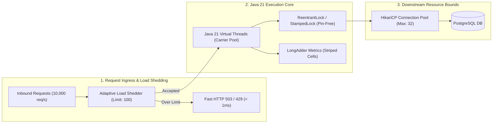

# Module 15: Concurrency & Backpressure

Master production-grade concurrency, multi-threading, and flow control: Java Memory Model (JMM), lock-free atomics (`LongAdder`), `ThreadPoolExecutor` queue mechanics, explicit locking (`StampedLock`), `CompletableFuture` async scatter-gather, Java 21 Virtual Threads (Project Loom / JEP 444), and Adaptive Load Shedding.

---

## 🗺️ Master Concurrency & Flow Control Architecture

---

## 📚 Curriculum Lessons

| # | Lesson | Core Focus & Mechanics |
|:---:|---|---|
| **01** | [`01-java-threads-memory-model-and-atomics.md`](./01-java-threads-memory-model-and-atomics.md) | Platform threads (1MB stack), JMM visibility & ordering barriers, `volatile`, hardware CAS, and `LongAdder` cache line striping. |
| **02** | [`02-thread-pools-executors-and-queue-saturation.md`](./02-thread-pools-executors-and-queue-saturation.md) | `ThreadPoolExecutor` queue-first mechanics, avoiding unbounded queue OOMs, CPU/IO sizing formulas, and `CallerRunsPolicy` backpressure. |
| **03** | [`03-synchronization-locks-and-concurrent-collections.md`](./03-synchronization-locks-and-concurrent-collections.md) | `synchronized` monitors, `ReentrantLock`, `StampedLock` optimistic reads ($< 2\text{ns}$), `Semaphore` throttling, and `ConcurrentHashMap` bucket locking. |
| **04** | [`04-asynchronous-programming-completablefuture.md`](./04-asynchronous-programming-completablefuture.md) | Async pipelines (`thenApply`/`thenCompose`/`thenCombine`), scatter-gather `allOf()`, `.orTimeout()`, and dedicated thread pool isolation. |
| **05** | [`05-virtual-threads-project-loom-internals.md`](./05-virtual-threads-project-loom-internals.md) | Virtual threads (JEP 444), carrier thread unmounting, heap stack continuations, thread pinning hazards (`synchronized`), and Spring Boot 3 activation. |
| **06** | [`06-backpressure-load-shedding-and-concurrency-limits.md`](./06-backpressure-load-shedding-and-concurrency-limits.md) | Little's Law, bufferbloat collapse, Netflix Adaptive Concurrency Limits (Vegas/Gradient), and shedding overload via HTTP 503. |

---

## ⚡ Key Production Takeaways

1. **Never Use Unbounded Queues**: Always bound `ThreadPoolExecutor` queues to prevent JVM heap OutOfMemoryErrors.
2. **Prevent Thread Pinning**: Never execute blocking I/O inside `synchronized` blocks on Virtual Threads; always use `ReentrantLock`.
3. **Use `CallerRunsPolicy`**: Apply natural backpressure to saturated thread pools by forcing submitter threads to execute excess tasks.
4. **Use `LongAdder` for High Contention**: Replace `AtomicLong` with `LongAdder` to eliminate CPU cache line bouncing.
5. **Shed Load Early**: Reject excess traffic with fast HTTP 503s rather than allowing requests to buffer and timeout across downstream services.
