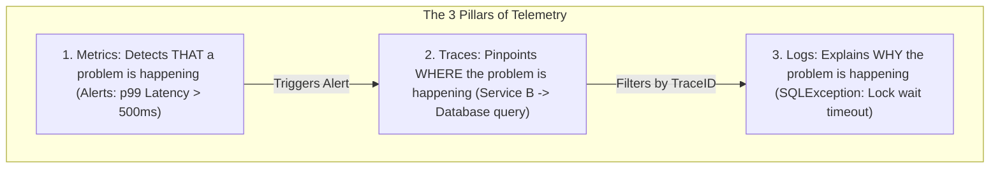
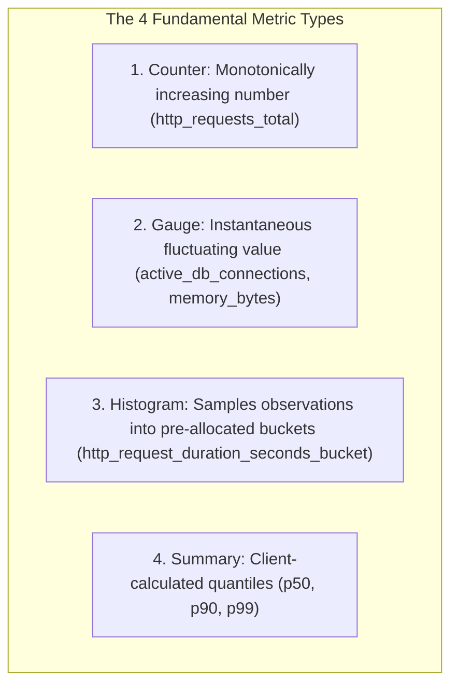

# The Three Pillars of Observability: Structured Logs, Metrics, and Traces

---

## 1. What Is It?
**Observability** is the measure of how accurately you can infer the internal execution state and health of a distributed software system solely based on its external outputs. 

The **Three Pillars of Observability** are:
1. **Logs**: Discrete, timestamped, immutable event records detailing what occurred at a specific instant.
2. **Metrics**: Numerically aggregated data points measured over fixed time intervals, representing real-time system performance and resource utilization.
3. **Distributed Traces**: End-to-end representations of a single request's path as it traverses distributed network boundaries across microservices, queues, and databases.

---

## 2. Why Does It Exist?
In a monolithic application, debugging a bug required reading a single stack trace in a local log file.

In a distributed microservice mesh:
- A single user checkout request touches **12 different services, 4 databases, and 2 Kafka topics**.
- Plain-text unstructured logs (`log.info("Processing order for user")`) are scattered across 50 Kubernetes pods with zero common identifiers.
- When p99 latency spikes to $5\text{ seconds}$, finding which specific database query or network hop caused the slowdown is mathematically impossible without unified telemetry.

---

## 3. Mental Model: The Telemetry Triad



---

## 4. How Does It Work?

### 1. Structured JSON Logging & MDC (Mapped Diagnostic Context)
Never log unstructured string concatenation (`log.info("User " + id + " failed")`). 

In production, all logs are output as **Structured JSON lines** containing contextual key-value pairs stored in SLF4J's **MDC (ThreadLocal context)**:
```json
{
  "timestamp": "2026-09-01T14:32:01.402Z",
  "level": "ERROR",
  "service": "order-service",
  "traceId": "4bf92f3577b34da6a3ce929d0e0e4736",
  "spanId": "00f067aa0ba902b7",
  "userId": 10482,
  "orderId": 98214,
  "message": "Payment authorization rejected by upstream bank",
  "exception": "com.bank.BankTimeoutException: Read timed out after 3000ms",
  "stack_trace": "com.bank.BankClient.charge(BankClient.java:42)..."
}
```

---

### 2. The 4 Metric Types



---

### 3. The Cardinality Explosion Hazard
- **Metric Cardinality** is the total number of unique time series generated by combining all label/tag values:

$$\text{Cardinality} = \text{Unique(Service)} \times \text{Unique(Endpoint)} \times \text{Unique(StatusCode)}$$

- **The Disaster**: Adding dynamic identifiers (like `user_id`, `order_id`, or `email`) as Prometheus labels generates **millions of distinct time series**, consuming gigabytes of memory and crashing the Prometheus server.

$$\textbf{Production Invariant: } \text{NEVER use high-cardinality values (UserIDs, UUIDs, Timestamps) as Metric Labels! Keep them strictly in Logs and Traces.}$$

---

## 5. Implementation: Structured MDC Logging in Spring Boot

```java
package com.backend.engineering.observability.logging;

import jakarta.servlet.*;
import jakarta.servlet.http.HttpServletRequest;
import org.slf4j.MDC;
import org.springframework.core.Ordered;
import org.springframework.core.annotation.Order;
import org.springframework.stereotype.Component;

import java.io.IOException;
import java.util.UUID;

@Component
@Order(Ordered.HIGHEST_PRECEDENCE)
public class MdcCorrelationFilter implements Filter {

    public static final String CORRELATION_ID_HEADER = "X-Correlation-ID";
    public static final String MDC_CORRELATION_ID_KEY = "correlationId";

    @Override
    public void doFilter(ServletRequest request, ServletResponse response, FilterChain chain)
            throws IOException, ServletException {

        HttpServletRequest httpRequest = (HttpServletRequest) request;
        String correlationId = httpRequest.getHeader(CORRELATION_ID_HEADER);

        if (correlationId == null || correlationId.isBlank()) {
            correlationId = UUID.randomUUID().toString();
        }

        // Bind correlation ID to current ThreadLocal MDC
        MDC.put(MDC_CORRELATION_ID_KEY, correlationId);
        MDC.put("clientIp", request.getRemoteAddr());

        try {
            chain.doFilter(request, response);
        } finally {
            // ALWAYS CLEAR MDC TO PREVENT LEAKS ACROSS REUSED THREAD POOL WORKERS!
            MDC.clear();
        }
    }
}
```

---

## 6. Performance

| Telemetry Type | Storage Overhead | Query Speed | Retention Window |
|---|---|---|---|
| Metrics (Prometheus) | Low ($\approx 1 - 2\text{ bytes/sample}$) | **Instantaneous ($< 50\text{ms}$)** | Long ($30 - 365\text{ days}$) |
| Traces (OpenTelemetry/Jaeger) | Medium (Requires sampling) | Fast (Key lookup by trace ID) | Short ($7 - 14\text{ days}$) |
| Logs (Elasticsearch/Loki) | High ($\approx 500\text{ bytes/line}$) | Moderate (Full-text index scan) | Medium ($14 - 30\text{ days}$) |

---

## 7. Interview Questions

### Q1: Why must MDC (Mapped Diagnostic Context) always be cleared in a `finally` block in Java web applications?
<details>
<summary>Reveal Answer</summary>

**Answer**:
SLF4J's `MDC` stores contextual diagnostic data inside a **`ThreadLocal`** map bound to the executing thread.
In modern Java servers (like Tomcat, Netty, or ThreadPoolExecutors), threads are **not destroyed after processing a request**; they are returned to a **shared worker thread pool** to be reused by future incoming requests.
If you do not call `MDC.clear()` in a `finally` block:
1. The `ThreadLocal` context persists on the worker thread.
2. When the thread is subsequently assigned to process a completely different request for a different customer, it will log the previous customer's `userId` and `correlationId` (**Data Leakage & Context Pollution**).
3. If objects stored in MDC hold classloaders, it causes permanent JVM memory leaks preventing garbage collection.
</details>

---

## 8. Quick Revision
- **Metrics**: Detect anomalies (Counters, Gauges, Histograms).
- **Traces**: Pinpoint exact bottlenecks across distributed services.
- **Logs**: Structured JSON with MDC context explaining root cause.
- **Cardinality Rule**: Never put UUIDs or UserIDs into metric labels.
- **MDC Hygiene**: Always execute `MDC.clear()` in a `finally` block.
