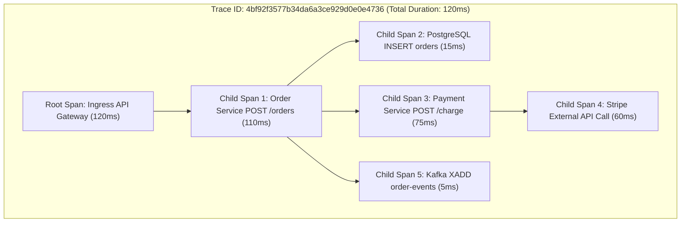
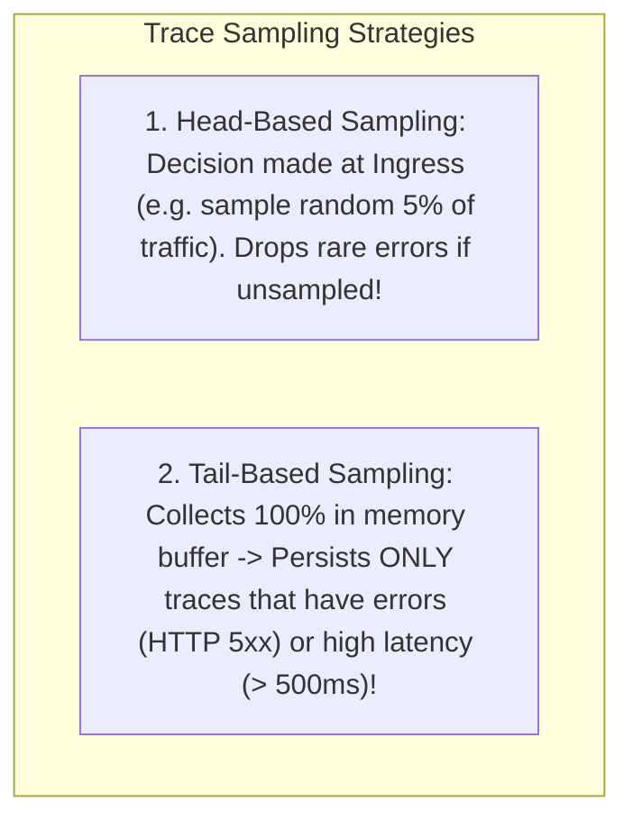

# Distributed Tracing, OpenTelemetry, and W3C Trace Context

---

## 1. What Is It?
**Distributed Tracing** is an observability methodology that tracks the end-to-end execution flow of a single user request as it traverses across multiple distributed services, messaging brokers, and database engines.

**OpenTelemetry (OTel)** is the vendor-neutral Cloud Native Computing Foundation (CNCF) standard providing unified APIs, SDKs, and wire protocols for distributed tracing.

---

## 2. Anatomy of a Distributed Trace



- **Trace**: The complete distributed execution tree representing the entire request.
- **Trace ID**: A globally unique 128-bit hexadecimal identifier shared across all services for that request.
- **Span**: A single contiguous unit of work within a specific service (has name, start timestamp, end timestamp, status, and tags/attributes).
- **Span ID**: A unique 64-bit hexadecimal identifier for that individual span.
- **Parent Span ID**: Points to the calling span that spawned it, establishing the call graph hierarchy.

---

## 3. The W3C Trace Context Standard (`traceparent`)

To propagate trace context across HTTP, gRPC, and Kafka headers without vendor lock-in, the W3C standardized the **`traceparent`** HTTP header:

$$\texttt{traceparent: 00-4bf92f3577b34da6a3ce929d0e0e4736-00f067aa0ba902b7-01}$$

```text
+---------+----------------------------------+------------------+-------------+
| Version | Trace ID (128-bit / 32 hex chars)| Parent Span ID   | Trace Flags |
| (00)    | 4bf92f3577b34da6a3ce929d0e0e4736 | 00f067aa0ba902b7 | 01 (Sampled)|
+---------+----------------------------------+------------------+-------------+
```

---

## 4. End-to-End Context Propagation Flow

```mermaid
sequenceDiagram
    autonumber
    actor Client
    participant Ingress as API Gateway (Nginx / Envoy)
    participant OrderSvc as Order Service (Spring Boot)
    participant DB as PostgreSQL Database
    participant Kafka as Kafka Broker (Topic: orders)
    participant PaymentSvc as Payment Consumer

    Client->>Ingress: 1. POST /api/v1/orders
    Note over Ingress: Generates Trace ID: 4bf9... and Span ID: 001
    Ingress->>OrderSvc: 2. Forward with Header: traceparent: 00-4bf9...-001-01
    
    Note over OrderSvc: Extracts context; Starts Child Span: 002
    OrderSvc->>DB: 3. Execute SQL (DB Span: 003)
    DB-->>OrderSvc: Result
    
    OrderSvc->>Kafka: 4. Publish Event with Kafka Header: traceparent: 00-4bf9...-002-01
    OrderSvc-->>Ingress: 200 OK
    Ingress-->>Client: 200 OK

    Note over PaymentSvc: 5. Consumer extracts traceparent from Kafka Header!
    Kafka->>PaymentSvc: Poll Record
    Note over PaymentSvc: Child Span: 004 continues the EXACT same Trace ID!
```

---

## 5. Trace Sampling Strategies

Tracing $100\%$ of requests in a system processing $500,000\text{ req/sec}$ generates petabytes of trace telemetry, saturating networks and storage.



$$\textbf{Production Best Practice: } \text{Use OpenTelemetry Collector with Tail-Based Sampling to capture } \mathbf{100\%} \text{ of errors and slow traces while sampling only } 1\% \text{ of normal traffic.}$$

---

## 6. Implementation: Manual OpenTelemetry Span Creation in Java 21

```java
package com.backend.engineering.observability.tracing;

import io.opentelemetry.api.GlobalOpenTelemetry;
import io.opentelemetry.api.trace.Span;
import io.opentelemetry.api.trace.StatusCode;
import io.opentelemetry.api.trace.Tracer;
import io.opentelemetry.context.Scope;
import org.springframework.stereotype.Service;

@Service
public class OrderFulfillmentTracingService {

    private final Tracer tracer = GlobalOpenTelemetry.getTracer("com.backend.order-fulfillment");

    public void fulfillOrder(Long orderId, int amountCents) {
        // 1. Start a custom Span
        Span span = tracer.spanBuilder("FulfillOrderBusinessLogic")
                .setAttribute("order.id", orderId)
                .setAttribute("order.amount_cents", (long) amountCents)
                .startSpan();

        // 2. Set current span in ThreadLocal Scope
        try (Scope scope = span.makeCurrent()) {
            // Business logic execution
            executePaymentDeduction(orderId, amountCents);
            
            // Add custom span event
            span.addEvent("inventory.reserved");

        } catch (Exception ex) {
            // Record exception and set error status on the trace span
            span.recordException(ex);
            span.setStatus(StatusCode.ERROR, "Order fulfillment failed: " + ex.getMessage());
            throw ex;
        } finally {
            // ALWAYS END THE SPAN IN FINALLY BLOCK!
            span.end();
        }
    }

    private void executePaymentDeduction(Long orderId, int amountCents) {
        // Payment processing
    }
}
```

---

## 7. Performance

| Tracing Configuration | Network Egress Overhead | CPU Instrumentation Cost |
|---|---|---|
| $100\%$ Unsampled Tracing | Massive ($> 50\text{MB/s}$) | $3 - 6\%$ CPU overhead |
| **$5\%$ Head-Based Sampling** | Low ($< 2\text{MB/s}$) | $< 0.5\%$ CPU overhead |
| **OTel Collector Tail-Based Sampling** | **Optimal ($100\%$ errors, $1\%$ success)** | **$< 1\%$ CPU overhead** |

---

## 8. Interview Questions

### Q1: What is the W3C `traceparent` header and how does it prevent vendor lock-in?
<details>
<summary>Reveal Answer</summary>

**Answer**:
Before the W3C standard, distributed tracing vendors used incompatible, proprietary HTTP headers to propagate trace context (e.g. Zipkin used `X-B3-TraceId`, AWS X-Ray used `X-Amzn-Trace-Id`, and Jaeger used `uber-trace-id`). This created vendor lock-in and prevented microservices written in different frameworks from tracing requests across common boundaries.
The **W3C Trace Context specification** standardized the single `traceparent` header across all cloud providers and frameworks:
$$\texttt{traceparent: 00-\{trace-id\}-\{parent-id\}-\{trace-flags\}}$$
All modern API gateways, message brokers, and tracing libraries (OpenTelemetry, Spring Cloud Sleuth/Micrometer) natively parse and propagate this header, enabling seamless end-to-end tracing across heterogeneous multi-cloud architectures.
</details>

---

## 9. Quick Revision
- **Trace**: Complete request tree composed of individual **Spans**.
- **`traceparent`**: W3C standard header (`version-traceId-spanId-flags`).
- **Context Propagation**: Forwarding trace headers across HTTP, Kafka, and gRPC.
- **Tail-Based Sampling**: Retains 100% of errors and high latency traces while discarding mundane successes.
- **Span Hygiene**: Always invoke `span.end()` inside a `finally` block.
