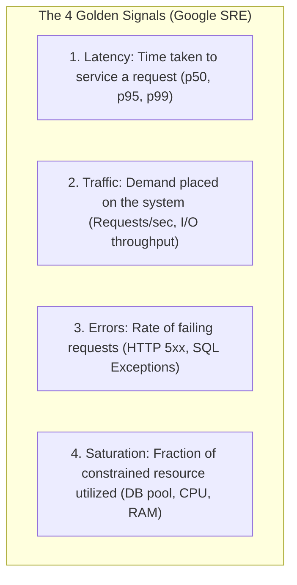

# Metrics Instrumentation, Micrometer, Prometheus, and PromQL

---

## 1. What Is It?
**Metrics Instrumentation** is the programmatic recording of quantitative numerical measurements from running application code. 

**Micrometer** is the vendor-neutral metrics facade for JVM applications (the "SLF4J for metrics"), and **Prometheus** is the industry-standard time-series database that scrapes, stores, and evaluates alert rules against exposed metrics endpoints (`/actuator/prometheus`).

---

## 2. The 4 Golden Signals of Observability (Google SRE)



---

## 3. How Does It Work?

### Spring Boot 3 Micrometer Architecture
- Spring Boot Actuator automatically instruments common infrastructure (HikariCP, Tomcat, JVM Memory, Kafka, HTTP endpoints).
- Micrometer formats data into Prometheus exposition text format:
```text
# HELP http_server_requests_seconds Duration of HTTP server request handling
# TYPE http_server_requests_seconds histogram
http_server_requests_seconds_bucket{method="POST",status="200",uri="/api/v1/orders",le="0.05"} 1420
http_server_requests_seconds_bucket{method="POST",status="200",uri="/api/v1/orders",le="0.1"} 1980
http_server_requests_seconds_bucket{method="POST",status="200",uri="/api/v1/orders",le="+Inf"} 2000
http_server_requests_seconds_count{method="POST",status="200",uri="/api/v1/orders"} 2000
http_server_requests_seconds_sum{method="POST",status="200",uri="/api/v1/orders"} 82.41
```

---

## 4. Implementation: Custom Metrics Instrumentation in Java 21

```java
package com.backend.engineering.observability.metrics;

import io.micrometer.core.instrument.Counter;
import io.micrometer.core.instrument.DistributionSummary;
import io.micrometer.core.instrument.MeterRegistry;
import io.micrometer.core.instrument.Timer;
import org.springframework.stereotype.Service;

import java.util.concurrent.TimeUnit;

@Service
public class OrderBusinessMetricsService {

    private final Counter successfulOrdersCounter;
    private final Counter paymentFailuresCounter;
    private final Timer orderProcessingTimer;
    private final DistributionSummary orderValueSummary;

    public OrderBusinessMetricsService(MeterRegistry registry) {
        // 1. Monotonic Counter for Business Events
        this.successfulOrdersCounter = Counter.builder("business.orders.completed.total")
                .description("Total number of successfully placed customer orders")
                .tag("service", "order-service")
                .register(registry);

        this.paymentFailuresCounter = Counter.builder("business.orders.payment_failed.total")
                .description("Total number of orders rejected due to payment failures")
                .tag("reason", "insufficient_funds")
                .register(registry);

        // 2. Timer: Records both count and latency distribution
        this.orderProcessingTimer = Timer.builder("business.orders.processing.duration")
                .description("End-to-end execution time of order processing workflow")
                .publishPercentiles(0.5, 0.95, 0.99) // Calculates p50, p95, p99 on JVM client!
                .register(registry);

        // 3. Distribution Summary: Measures value distributions (e.g. order dollar amounts)
        this.orderValueSummary = DistributionSummary.builder("business.orders.value.dollars")
                .description("Distribution of total order checkout amounts")
                .baseUnit("dollars")
                .register(registry);
    }

    public void recordOrderPlaced(double orderValueDollars, long durationMillis) {
        successfulOrdersCounter.increment();
        orderValueSummary.record(orderValueDollars);
        orderProcessingTimer.record(durationMillis, TimeUnit.MILLISECONDS);
    }

    public void recordPaymentFailure() {
        paymentFailuresCounter.increment();
    }
}
```

---

## 5. Master PromQL Production Query Patterns

### 1. Error Rate Percentage (Alert if $> 1\%$)
$$\texttt{sum(rate(http\_server\_requests\_seconds\_count\{status=\~"5.."\} [5m])) / sum(rate(http\_server\_requests\_seconds\_count [5m])) * 100}$$

---

### 2. High-Accuracy p99 Latency (Prometheus Histograms)
$$\texttt{histogram\_quantile(0.99, sum(rate(http\_server\_requests\_seconds\_bucket [5m])) by (le))}$$

---

### 3. Database Connection Pool Saturation (Alert if $> 85\%$)
$$\texttt{hikaricp\_connections\_active / (hikaricp\_connections\_active + hikaricp\_connections\_idle) * 100}$$

---

## 6. Failure Scenarios

1. **Prometheus Scraping Freeze via High Cardinality**:
   - *Failure*: An engineer records HTTP paths including raw primary keys: `/orders/101`, `/orders/102`. Prometheus scrapes 10,000,000 distinct time-series lines. The Prometheus scraper times out, and Grafana graphs show flat lines across all metrics.
   - *Mitigation*: Ensure URI templates are normalized in Actuator (`/orders/{id}`).

---

## 7. Interview Questions

### Q1: Why should you never use `rate()` on a Gauge metric in PromQL?
<details>
<summary>Reveal Answer</summary>

**Answer**:
- **Counters** are monotonically increasing values that reset only on server restart (e.g. `http_requests_total`). The `rate()` function calculates the per-second rate of increase over a time window by taking the delta between samples and handling counter resets gracefully.
- **Gauges** represent instantaneous numerical values that can naturally **fluctuate up and down** (e.g. `jvm_memory_used_bytes` or `active_threads`).
If you apply `rate()` to a Gauge, whenever the gauge drops (e.g. memory is freed after a garbage collection sweep), `rate()` interprets the drop as a **Counter Reset** and calculates an absurd, wildly incorrect positive spike, corrupting alert rules and Grafana dashboards. For Gauges, use `deriv()`, `predict_linear()`, or direct raw aggregations (`avg_over_time`).
</details>

---

## 8. Quick Revision
- **The 4 Golden Signals**: Latency, Traffic, Errors, Saturation.
- **Metric Types**: Counter (monotonically up), Gauge (up/down), Timer (duration), DistributionSummary (payload size).
- **p99 Calculation**: `histogram_quantile(0.99, sum(rate(..._bucket[5m])) by (le))`.
- **HikariCP Saturation**: Monitor `active_connections / max_connections`.
- **Cardinality Guard**: Never use dynamic UUIDs as metric tag labels.
