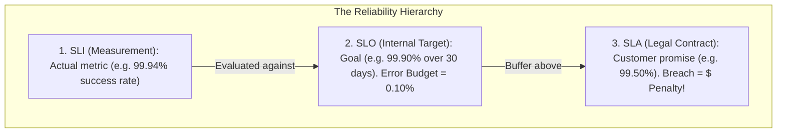
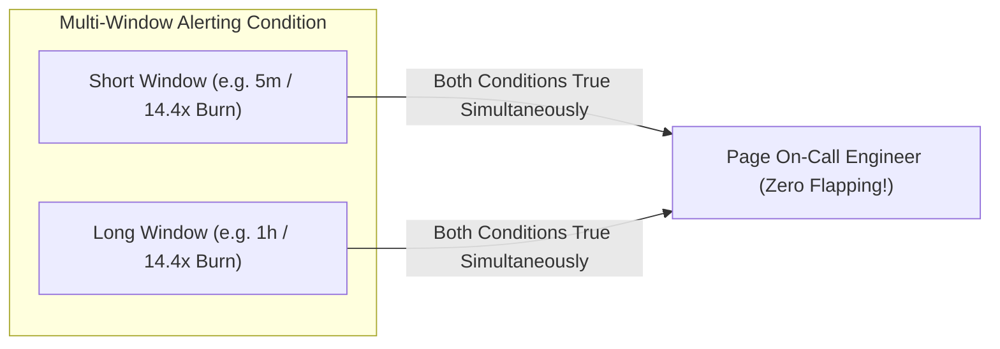

# Site Reliability Engineering: SLIs, SLOs, SLAs, Error Budgets, and Burn-Rate Alerts

---

## 1. What Is It?
In Site Reliability Engineering (SRE):
- **SLI (Service Level Indicator)**: A carefully defined quantitative metric measuring service level performance in real time (e.g. *Ratio of successful HTTP requests*).
- **SLO (Service Level Objective)**: The internal target reliability percentage agreed upon by engineering and product teams (e.g. *$99.9\%$ of successful requests over a rolling 30-day window*).
- **SLA (Service Level Agreement)**: The external legal contract with paying customers promising a minimum reliability level, backed by financial penalties or service credits.
- **Error Budget**: The maximum allowable unreliability ($1.0 - \text{SLO}$) that an engineering team can "spend" on feature velocity, risky deployments, and experimental changes.

---

## 2. Why Does It Exist?
Aiming for $100\%$ availability is mathematically impossible and commercially irrational:
- The cost to move from $99.99\%$ to $99.999\%$ reliability increases exponentially.
- Without an **Error Budget**, product managers push for non-stop feature releases until the system becomes unstable, while developers resist all deployments to protect uptime.

The Error Budget creates a **shared metric-driven contract**:
- If Error Budget $> 0\% \longrightarrow$ Ship features rapidly.
- If Error Budget is exhausted ($0\%$) $\longrightarrow$ **Feature freeze!** All engineering effort shifts to reliability, refactoring, and stability.

---

## 3. Mental Model: SLI $\longrightarrow$ SLO $\longrightarrow$ SLA Hierarchy



---

## 4. The Downtime Calculus (Nines of Availability)

| Target Availability | Permitted Downtime / Year | Permitted Downtime / Month | Permitted Downtime / Week |
|---|---|---|---|
| **$99\%$ (Two 9s)** | $3.65\text{ days}$ | $7.30\text{ hours}$ | $1.68\text{ hours}$ |
| **$99.9\%$ (Three 9s)** | $8.76\text{ hours}$ | $\mathbf{43.8\text{ minutes}}$ | $\mathbf{10.1\text{ minutes}}$ |
| **$99.99\%$ (Four 9s)** | $\mathbf{52.6\text{ minutes}}$ | $\mathbf{4.38\text{ minutes}}$ | $\mathbf{1.01\text{ minutes}}$ |
| **$99.999\%$ (Five 9s)** | $\mathbf{5.26\text{ minutes}}$ | $\mathbf{26.3\text{ seconds}}$ | $\mathbf{6.05\text{ seconds}}$ |

---

## 5. Multi-Window Multi-Burn-Rate Alerting (Google SRE)

Traditional alerts (e.g. "Page if error rate $> 1\%$ for 5 minutes") suffer from frequent **False Positives** during minor traffic dips and **Delayed Pages** during catastrophic outages.

Google SRE standardized **Burn Rate Alerting**:
- **Burn Rate ($1\times$)**: Consumes exactly $100\%$ of the error budget over the 30-day window.
- **Burn Rate ($14.4\times$)**: Consumes $2\%$ of the error budget in **1 hour** $\longrightarrow$ **Immediate SEV-1 PagerDuty Page!**
- **Burn Rate ($6\times$)**: Consumes $5\%$ of the error budget in **6 hours** $\longrightarrow$ **SEV-2 Ticket / On-Call Notification**.



---

## 6. Incident Severity Classification (SEV-1 to SEV-4)

| Severity Level | Definition | Response Time | Paging Protocol |
|---|---|---|---|
| **SEV-1 (Critical)** | Core platform down; massive data loss; payment gateway completely halted | **Immediate ($< 5\text{ mins}$)** | 24/7 PagerDuty escalation; exec war room |
| **SEV-2 (Major)** | Major feature unavailable for significant users; no workaround (e.g. Search down) | $< 15\text{ mins}$ | On-call engineer paged |
| **SEV-3 (Moderate)** | Non-critical service degraded; minor impact with known workaround | $< 2\text{ hours}$ | Handled during business hours |
| **SEV-4 (Minor)** | Cosmetic bug; minor admin tool glitch | Next Sprint | Logged in Jira backlog |

---

## 7. Blameless Postmortem Template

```markdown
# Incident Postmortem: [YYYY-MM-DD] - [SEV-1: Outage Title]

## Executive Summary
On [Date] at [Time UTC], [Service Name] experienced a major outage resulting in [Impact, e.g. 45,000 failed checkouts]. 
The root cause was [Brief summary, e.g. HikariCP connection leak triggered by missing timeout]. 
Total downtime was [Duration, e.g. 32 minutes].

## Incident Timeline (UTC)
- **14:02** - Deploy of version `v2.4.1` initiated.
- **14:05** - Prometheus alert fired: `HikariPoolSaturation > 90%`.
- **14:08** - On-call engineer paged (Burn rate 14.4x triggered).
- **14:15** - War room established; rollback to `v2.4.0` executed.
- **14:34** - Service recovered; error rate returned to 0.01%.

## Root Cause Analysis (5 Whys)
1. Why did the service fail? HikariCP connection pool ran out of connections.
2. Why did it run out? Connections were held open for 60 seconds.
3. Why were they held? A downstream credit check HTTP call hung indefinitely.
4. Why did it hang? The HTTP client had no connect/read timeout configured.
5. Why was there no timeout? Code review missed default infinite timeout in library.

## Preventative Action Items
| Action Item | Owner | Priority | Target Date |
|---|---|---|---|
| Set global 3s connect/read timeout on all HTTP clients | Dev Team | P0 | 2026-09-05 |
| Add automated ArchUnit test enforcing timeouts | Lead Arch | P1 | 2026-09-10 |
| Configure HikariCP `leakDetectionThreshold = 2000ms` | SRE Team | P0 | 2026-09-03 |
```

---

## 8. Interview Questions

### Q1: What is the difference between an SLI, an SLO, and an SLA?
<details>
<summary>Reveal Answer</summary>

**Answer**:
1. **SLI (Service Level Indicator)**: A **real-time factual measurement** of system behavior. Formula: $\frac{\text{Good Events}}{\text{Total Events}} \times 100$. (e.g. "99.92% of checkout requests returned HTTP 200 within 200ms today").
2. **SLO (Service Level Objective)**: An **internal target goal** set by the engineering and product team over a rolling window. (e.g. "We aim to achieve $\ge 99.9\%$ good checkout requests over any rolling 30-day window").
3. **SLA (Service Level Agreement)**: A **contractual business agreement** with external customers. The SLA target is intentionally set lower than the internal SLO (e.g. 99.5%) to provide an operational safety margin. If the SLA is breached, the company owes customers financial penalties or billing credits.
</details>

---

## 9. Quick Revision
- **SLI**: Metric measurement ($\text{Good} / \text{Total}$).
- **SLO**: Internal reliability target (defines Error Budget).
- **SLA**: Customer legal contract with financial penalties.
- **Error Budget**: $1.0 - \text{SLO}$; governs feature velocity vs stability investment.
- **Burn-Rate Alerts**: Multi-window alerts that page based on how fast the error budget is depleting.
- **Blameless Postmortems**: Focus on systemic process and architectural fixes, never human blame.
