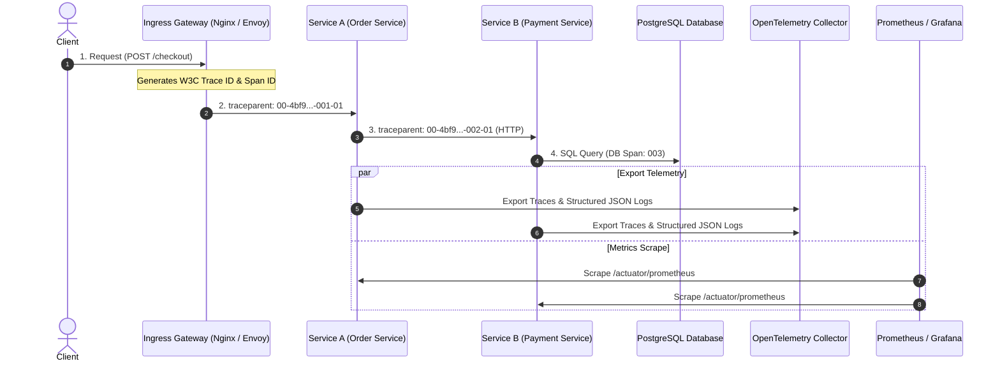

# Module 16: Observability & Production Readiness

Master enterprise observability and site reliability engineering (SRE): The 3 Telemetry Pillars (Structured JSON logging, Prometheus metrics, OpenTelemetry distributed tracing), W3C Trace Context propagation, Micrometer and PromQL query patterns, Kubernetes health probes, zero-downtime graceful shutdown, and Multi-Window Burn-Rate alerting with blameless postmortems.

---

## 🗺️ Master Request Telemetry & Trace Propagation Flow

---

## 📚 Curriculum Lessons

| # | Lesson | Core Focus & Mechanics |
|:---:|---|---|
| **01** | [`01-three-pillars-of-observability-logs-metrics-traces.md`](./01-three-pillars-of-observability-logs-metrics-traces.md) | Telemetry triad, structured JSON logging, MDC thread safety hygiene, metric types, and cardinality explosion prevention. |
| **02** | [`02-distributed-tracing-opentelemetry-and-w3c-trace-context.md`](./02-distributed-tracing-opentelemetry-and-w3c-trace-context.md) | Traces & Spans, W3C `traceparent` header standard, context propagation across HTTP/Kafka, and tail-based sampling. |
| **03** | [`03-metrics-instrumentation-micrometer-and-prometheus.md`](./03-metrics-instrumentation-micrometer-and-prometheus.md) | Micrometer MeterRegistry, Google SRE 4 Golden Signals, `/actuator/prometheus`, and PromQL query formulas (p99 quantiles, error rates). |
| **04** | [`04-production-health-checks-and-graceful-shutdown.md`](./04-production-health-checks-and-graceful-shutdown.md) | Kubernetes Startup/Liveness/Readiness probes, custom HealthIndicators, and 30-second graceful shutdown in-flight request draining. |
| **05** | [`05-reliability-engineering-sli-slo-sla-and-error-budgets.md`](./05-reliability-engineering-sli-slo-sla-and-error-budgets.md) | SLI vs SLO vs SLA, Error Budget calculus, Google Multi-Window Burn-Rate alerting, SEV incident tiers, and blameless postmortems. |

---

## ⚡ Key Production Takeaways

1. **Structured MDC Standard**: Always emit structured JSON logs with `traceId` and `correlationId`, and always clear MDC in a `finally` block.
2. **Never Check DB in Liveness Probes**: Checking external databases in Liveness probes causes total cluster restart loops during brief DB hiccups. Use Readiness probes instead.
3. **Graceful Shutdown**: Always enable `server.shutdown: graceful` with a 30s timeout to prevent dropped user requests during rolling deployments.
4. **Prevent Cardinality Explosion**: Never use UUIDs, user IDs, or unnormalized URLs as metric labels in Prometheus.
5. **Burn-Rate Alerting**: Replace noisy static threshold alerts with multi-window error budget burn-rate alerts.
