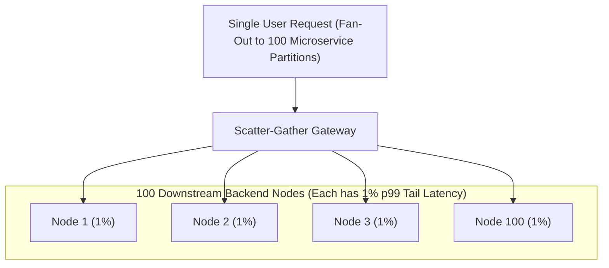
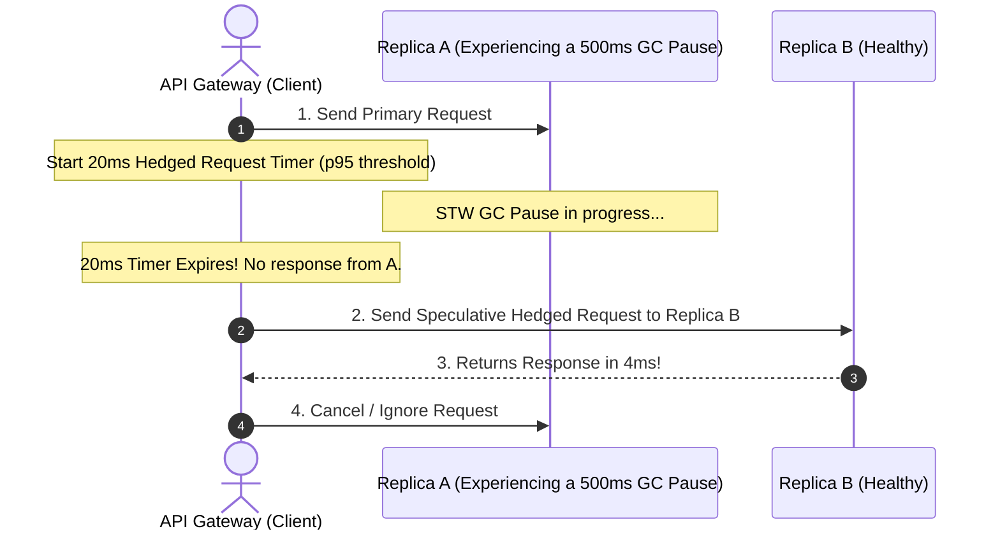

# Latency Percentiles, Tail Latency Amplification, and Coordinated Omission

---

## 1. What Is It?
In backend performance engineering, **Latency Percentiles** ($p50, p95, p99, p99.9$) define the statistical threshold below which a given percentage of all request latencies fall:
- **$p50$ (Median)**: The latency experienced by the 50th percentile user (half of requests are faster, half are slower).
- **$p99$**: $99\%$ of requests are faster than this value; $1\%$ are slower.
- **$p99.9$ (The 3-Nines Tail)**: The extreme 1-in-a-thousand worst-case latency outlier.

**Tail Latency Amplification** is the mathematical reality where, in distributed microservice architectures, even a tiny $1\%$ ($p99$) latency blip in downstream dependencies compounds into **a catastrophic user-facing degradation affecting $> 60\%$ of all client requests**.

---

## 2. Why The "Average / Mean" Latency Is a Dangerous Lie
Many monitoring dashboards display "Average Latency" (Arithmetic Mean).

$$\textbf{Arithmetic Mean: } \mu = \frac{\sum_{i=1}^N L_i}{N}$$

- *Scenario*: 99 requests take $10\text{ms}$; 1 request hangs for $10,000\text{ms}$ ($10\text{s}$).
- **Average Latency**: $\approx 109\text{ms}$ (*Looks completely acceptable on a graph!*).
- **Reality ($p99$)**: $10,000\text{ms}$ (*1 customer suffered a 10-second timeout!*).

$$\textbf{Production Rule: } \text{Never use Average Latency to assess backend performance. Always monitor } p95, p99, \text{ and } p99.9.$$

---

## 3. Mental Model: Tail Latency Amplification Across Microservice Fan-Out

When a single user request fans out in parallel to $N$ independent microservices:

$$P(\text{Overall Request is Slow}) = 1 - (1 - p)^N$$



### The Amplification Math:
- For $N = 1$ service with $p99 = 1\%$: User experiences a slow request $1\%$ of the time.
- For $N = 10$ services: $1 - (1 - 0.01)^{10} = \mathbf{9.56\%}$ of requests are slow.
- For $N = 100$ services (e.g. sharded Cassandra/Elasticsearch cluster):
  $$1 - (1 - 0.01)^{100} = 1 - (0.99)^{100} = 1 - 0.366 = \mathbf{63.4\% \text{ of ALL User Requests Experience Tail Latency!}}$$

---

## 4. How Does It Work?

### Defeating Tail Latency: Hedged Requests & Speculative Execution (Jeff Dean)
Pioneered by Google in "The Tail at Scale":
1. Send the primary request to Server A.
2. If Server A has not responded within the **$p95$ expected latency window** (e.g. $20\text{ms}$):
3. Send a duplicate **Hedged Request** to an alternate replica Server B.
4. Whichever server returns the response first wins; cancel the slower request.
5. **Result**: Eliminates $99\%$ of tail latency outliers with only a modest $\approx 5\%$ increase in total cluster network load!



---

## 5. Coordinated Omission in Load Testing Benchmarks

**Coordinated Omission** (coined by Gil Tene) is a fatal measurement flaw in naive benchmarking tools (ApacheBench, default JMeter):
- A tool sends requests sequentially on a fixed thread.
- If the server stalls for $10\text{ seconds}$ during a GC pause:
  - The tool records **1 single 10-second request**.
  - But during those 10 seconds, the tool **omitted thousands of virtual requests that would have arrived and stalled**!
- **Mitigation**: Always use coordinated-omission-aware load testing tools like **wrk2** or **k6**.

---

## 6. Implementation: Hedged Request Wrapper in Java 21

```java
package com.backend.engineering.performance.tail;

import org.slf4j.Logger;
import org.slf4j.LoggerFactory;
import org.springframework.stereotype.Service;

import java.util.concurrent.*;

@Service
public class HedgedRequestService {

    private static final Logger log = LoggerFactory.getLogger(HedgedRequestService.class);
    private final ScheduledExecutorService scheduler = Executors.newScheduledThreadPool(2);
    private final ExecutorService workerPool = Executors.newVirtualThreadPerTaskExecutor();

    public <T> T executeHedged(Callable<T> primaryTask, Callable<T> backupTask, long hedgeDelayMs) 
            throws Exception {

        CompletableFuture<T> resultFuture = new CompletableFuture<>();

        // 1. Dispatch Primary Task
        workerPool.submit(() -> {
            try {
                T res = primaryTask.call();
                resultFuture.complete(res);
            } catch (Exception ex) {
                // If primary fails fast, don't wait for timer; dispatch backup immediately
                log.warn("Primary task failed fast: {}. Dispatching backup.", ex.getMessage());
            }
        });

        // 2. Schedule Speculative Backup Task if primary takes longer than hedgeDelayMs (p95)
        ScheduledFuture<?> scheduledBackup = scheduler.schedule(() -> {
            if (!resultFuture.isDone()) {
                log.info("Primary task exceeded {}ms. Dispatching speculative hedged request!", hedgeDelayMs);
                workerPool.submit(() -> {
                    try {
                        T res = backupTask.call();
                        resultFuture.complete(res);
                    } catch (Exception ex) {
                        resultFuture.completeExceptionally(ex);
                    }
                });
            }
        }, hedgeDelayMs, TimeUnit.MILLISECONDS);

        // Cancel scheduled backup once result is resolved
        resultFuture.whenComplete((res, ex) -> scheduledBackup.cancel(true));

        return resultFuture.get(2000, TimeUnit.MILLISECONDS);
    }
}
```

---

## 7. Performance

| Strategy | $p50$ Median | $p99$ Tail Latency | $p99.9$ Extreme Tail |
|---|---|---|---|
| Standard Request | $8\text{ms}$ | $280\text{ms}$ | $3,500\text{ms}$ |
| **With Hedged Requests ($20\text{ms}$ trigger)** | $\mathbf{8\text{ms}}$ | $\mathbf{22\text{ms}}$ ($92\%$ reduction) | $\mathbf{35\text{ms}}$ ($99\%$ reduction) |

---

## 8. Interview Questions

### Q1: Why does a microservice architecture with 50 downstream dependencies experience tail latency on almost every user request even when every individual dependency has a 99% success/speed rate?
<details>
<summary>Reveal Answer</summary>

**Answer**:
This is caused by **Tail Latency Amplification**:
When a single user request requires results from $N$ independent downstream dependencies in parallel, the overall request latency is determined by the **slowest component in the scatter-gather fan-out** ($\max(L_1, L_2, \dots, L_N)$).
Mathematically, the probability that all $N$ services respond within their $99\text{th}$ percentile is:
$$P(\text{All Fast}) = (0.99)^N$$
For $N = 50$:
$$P(\text{All Fast}) = (0.99)^{50} \approx 0.605 \implies 60.5\%$$
This means that **$39.5\%$ of all incoming user requests** will hit at least one downstream $p99$ latency spike! As $N$ grows past 100, over $63\%$ of user requests experience severe tail latency.
</details>

---

## 9. Quick Revision
- **Mean is a Lie**: Always evaluate $p95, p99, p99.9$ percentiles.
- **Tail Amplification**: $1 - (1 - p)^N$; scatter-gather compounds latency across dependencies.
- **Hedged Requests**: Send speculative duplicate requests after $p95$ window to crush tail latency.
- **Coordinated Omission**: Benchmarking tools that stall on slow requests under-report latency.
