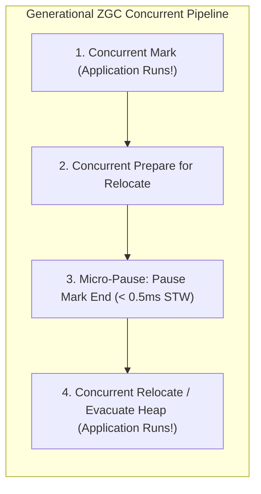

# JVM Garbage Collection Internals, Generational ZGC, and Tuning for Low Latency

---

## 1. What Is It?
**JVM Garbage Collection (GC)** is the automatic memory management subsystem inside the HotSpot JVM that tracks object lifecycles, reclaims unreachable heap memory, and compacts fragmented heap spaces.

In modern Java 21 backends, **Generational ZGC (JEP 439)** has revolutionized Java performance by performing all marking, evacuation, and memory relocation concurrently with application threads, reducing Stop-The-World (STW) pauses to **sub-millisecond latencies ($\le 1\text{ms}$)** on heaps from $16\text{MB}$ to $16\text{TB}$.

---

## 2. Why Does It Exist?
Manual memory allocation ($C/C++$ `malloc()`/`free()`) is prone to catastrophic memory leaks and buffer overflow security exploits.

However, naive garbage collection algorithms freeze all application threads (**Stop-The-World / STW Pauses**) while sweeping and compacting memory. In high-throughput backend services, a 2-second STW pause:
- Causes Kafka consumers to miss heartbeats and get kicked from consumer groups.
- Causes Kubernetes readiness probes to fail, triggering pod restarts.
- Causes API gateways to timeout and drop thousands of user requests.

---

## 3. Mental Model: The Weak Generational Hypothesis & Heap Regions

```mermaid
flowchart TD
    subgraph GenerationalHeap["JVM Generational Memory Layout"]
        subgraph YoungGen["Young Generation (High Object Turnover)"]
            Eden["Eden Space (New Allocations)"]
            S0["Survivor S0 (FromSpace)"]
            S1["Survivor S1 (ToSpace)"]
        end

        subgraph OldGen["Old / Tenured Generation (Long-Lived Singletons & Caches)"]
            Tenured["Tenured Space (Promoted after N Survivor Cycles)"]
        end

        subgraph NonHeap["Non-Heap JVM Storage"]
            Meta["Metaspace (Class Metadata / Native RAM)"]
            Code["Code Cache (JIT Compiled Machine Code)"]
        end
    end

    Eden -->|Minor GC Evacuation| S0 & S1
    S0 & S1 -->|Tenuring Threshold Exceeded (e.g. 15 cycles)| Tenured
```

### The Weak Generational Hypothesis:
$$\textbf{"Most allocated objects die shortly after creation (within milliseconds)."}$$
Ephemeral request DTOs, JSON strings, and database result rows are allocated in **Eden** and collected in microseconds during lightweight Young Gen sweeps, without ever polluting the Old Generation.

---

## 4. Modern Garbage Collection Comparison

| GC Collector | Algorithm Style | Max Heap Sizing | Typical STW Pause Latency | Best Use Case |
|---|---|---|---|---|
| **Parallel GC** | Stop-The-World Mark-Copy | Up to $4\text{GB}$ | $200\text{ms} - 5,000\text{ms}$ | Batch processing, offline ETL |
| **G1 GC (Default)** | Region-based Incremental | $4\text{GB} - 32\text{GB}$ | $50\text{ms} - 250\text{ms}$ | General-purpose Spring Boot web services |
| **Generational ZGC (Java 21)** | **Concurrent Colored Pointers + Load Barriers** | **$16\text{MB} - 16\text{TB}$** | **$\mathbf{\le 1\text{ms}}$ (Sub-millisecond!)** | **Ultra-low latency financial, trading, & real-time APIs** |
| **Shenandoah GC** | Concurrent Evacuation | $4\text{GB} - 100\text{GB}$ | $5\text{ms} - 15\text{ms}$ | Ultra-low latency alternative |

---

## 5. How Generational ZGC Works (Java 21 / JEP 439)

Generational ZGC achieves sub-millisecond pauses by using two advanced hardware-level techniques:
1. **Colored Pointers**: Uses reference pointer metadata bits to encode GC color state directly inside memory addresses without object header overhead.
2. **Hardware Load Barriers**: When application worker threads read an object reference from heap memory, a lightweight CPU instruction checks if the object needs relocation; if so, it updates the reference on the fly **without stopping other threads**.



---

## 6. Implementation: Production Java 21 Low-Latency JVM Flags

### Recommended Flag Configuration for Spring Boot 3.3.4 (Generational ZGC)
```bash
java -XX:+UseZGC \
     -XX:+ZGenerational \
     -Xms16g -Xmx16g \
     -XX:+AlwaysPreTouch \
     -XX:+UseNUMA \
     -Xlog:gc*,gc+phases=debug:file=/var/log/app/gc.log:time,uptime,pid:filecount=5,filesize=100M \
     -jar backend-service.jar
```

### Key Parameter Explanations:
- **`-XX:+UseZGC -XX:+ZGenerational`**: Enables Generational ZGC in Java 21.
- **`-Xms16g -Xmx16g`**: Locks initial and max heap size to the exact same value, preventing expensive runtime heap resizing.
- **`-XX:+AlwaysPreTouch`**: Pre-allocates and zeroes out physical RAM pages during JVM startup, preventing first-hit page fault latency spikes during live user requests.
- **`-XX:+UseNUMA`**: Optimizes memory allocation for multi-socket Non-Uniform Memory Access CPU server architectures.

---

## 7. Performance: G1GC vs Generational ZGC

| Metric | G1GC (`-XX:MaxGCPauseMillis=100`) | Generational ZGC (Java 21) |
|---|---|---|
| Average STW Pause Time | $45\text{ms}$ | **$0.25\text{ms}$** |
| Maximum ($p99.99$) STW Pause Time | $320\text{ms}$ | **$0.85\text{ms}$** |
| Throughput Overhead | $\approx 2\%$ | $\approx 3 - 4\%$ (Load barrier cost) |

---

## 8. Failure Scenarios

1. **Allocation Stall under Extreme Burst Traffic**:
   - *Failure*: If the application allocates memory faster than the concurrent GC thread can evacuate and reclaim pages, ZGC is forced to stall application worker threads (**Allocation Stall**), causing momentary latency spikes.
   - *Mitigation*: Ensure adequate heap headroom ($30-40\%$ free capacity) or allocate more concurrent GC worker threads via `-XX:ConcGCThreads=4`.

---

## 9. Interview Questions

### Q1: How does Generational ZGC achieve sub-millisecond pause times even on massive multi-terabyte heaps?
<details>
<summary>Reveal Answer</summary>

**Answer**:
In traditional GC collectors (like Parallel GC or CMS), the duration of a Stop-The-World pause is **proportional to the size of the live object set or heap size**, because application threads are stopped while the GC scans and physically relocates live objects in memory.
**Generational ZGC** decouples pause times from heap size:
1. **Concurrent Relocation**: All live object copying and heap compaction occur **concurrently while application threads continue executing**.
2. **Colored Pointers & Load Barriers**: ZGC embeds color metadata bits into object reference pointers. When an application thread accesses an object that is currently being relocated, a micro-cost **Load Barrier** intercepts the read, updates the pointer to the new memory location, and returns immediately.
3. The only Stop-The-World phases are micro-pauses (such as Initial Mark and Mark End) that merely capture thread stack pointers, taking **less than 1 millisecond regardless of whether the heap is 1GB or 16TB**.
</details>

---

## 10. Quick Revision
- **Generational Hypothesis**: Most objects die young in Eden; long-lived objects promote to Tenured.
- **Generational ZGC (Java 21)**: Sub-millisecond pauses ($\le 1\text{ms}$) via concurrent marking, relocation, and load barriers.
- **`-XX:+AlwaysPreTouch`**: Pre-maps physical memory pages at boot to eliminate runtime page fault spikes.
- **`-Xms == -Xmx`**: Always set initial heap equal to max heap in production.
- **Allocation Stall**: Occurs when allocation velocity exceeds GC reclamation speed; resolve with adequate heap sizing.
