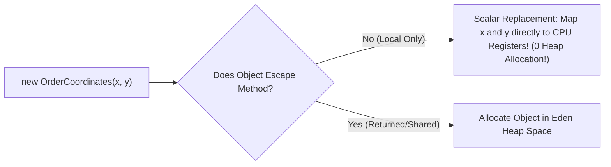

# CPU and Memory Profiling, async-profiler, and JIT Compiler Optimization

---

## 1. What Is It?
**Application Profiling** is the empirical investigation of a running backend service to measure CPU cycle consumption, memory allocation velocity, lock contention, and execution bottlenecks at the instruction level.

**`async-profiler`** is the gold-standard, low-overhead sampling profiler for the JVM that bypasses the **Safepoint Bias** problem by using Linux `perf_events` and HotSpot internal `AsyncGetCallTrace` APIs to generate accurate, interactive **FlameGraphs**.

---

## 2. Why Does It Exist?
Engineers attempting to diagnose latency spikes often rely on intuition or naive profilers (like older VisualVM or JProfiler instrumentation):
- **Instrumentation Overhead**: Adding bytecode hooks to every method slows the application down by $500\%$, distorting actual production latency.
- **The Safepoint Bias Problem**: Standard JVM sampling profilers can only sample thread call stacks when threads reach a **JVM Safepoint** (e.g. allocation points or loop ends). Hot loops without safepoints are completely invisible to naive profilers, leading engineers to optimize the wrong methods!

`async-profiler` collects stack samples asynchronously at any CPU instruction with **$< 1\%$ production overhead**.

---

## 3. Mental Model: Reading a FlameGraph

```text
+-------------------------------------------------------------------------------+
|                        com.fasterxml.jackson.databind.ObjectMapper.readValue |  <-- Hot Leaf (35% CPU)
|                   com.backend.service.OrderService.processPayload             |
|              com.backend.controller.OrderController.postOrder                 |
|         org.apache.catalina.core.StandardEngineValve.invoke                  |
|    java.lang.Thread.run                                                       |
+-------------------------------------------------------------------------------+
```

- **X-Axis (Width)**: Represents the **fraction of total CPU time** spent in that function (wider box = more CPU consumed).
- **Y-Axis (Height)**: Represents the call stack depth from root caller to leaf callee.
- **Top Edge (Plateaus)**: The flat plateaus at the very top of the graph represent the exact functions executing CPU instructions directly (**The Primary Hot Spots to Optimize!**).

---

## 4. How Does It Work?

### 1. The 3 Profiling Modes of `async-profiler`
1. **CPU Profiling (`-e cpu`)**: Measures actual on-CPU instruction cycles.
2. **Allocation Profiling (`-e alloc`)**: Tracks memory allocation rates inside **TLABs (Thread-Local Allocation Buffers)** to detect memory churn causing GC pressure.
3. **Lock Contention Profiling (`-e lock`)**: Measures time threads spend blocked waiting to acquire `synchronized` monitors or `ReentrantLock`s.

---

### 2. JIT Compiler Optimization: Escape Analysis & Scalar Replacement
The HotSpot **C2 Server JIT Compiler** analyzes object allocations:
- **Escape Analysis**: Determines if an allocated object is accessible outside the current method execution.
- **Scalar Replacement**: If an object does *not* escape (e.g. a local `Point` or temporary DTO), the JIT compiler completely deletes the object allocation and stores its primitive fields directly in **CPU Hardware Registers or the Stack**, achieving **Zero Garbage Collection Allocation Overhead**!



---

## 5. Practical Command-Line Profiling with `async-profiler`

```bash
# 1. Profile CPU hotspots for 60 seconds and generate an interactive HTML FlameGraph
./asprof -d 60 -e cpu -f /tmp/cpu_flamegraph.html <PID>

# 2. Profile Heap Memory Allocations (Finding high-churn temporary objects)
./asprof -d 60 -e alloc -f /tmp/alloc_flamegraph.html <PID>

# 3. Profile Lock Contention (Finding threads blocked on locks)
./asprof -d 60 -e lock -f /tmp/lock_flamegraph.html <PID>
```

---

## 6. Case Study: Eliminating 3 Common Java Production Bottlenecks

### Bottleneck 1: Jackson ObjectMapper Re-instantiation
- *Bad Code*: `new ObjectMapper().readValue(...)` inside every method call (creates heavy reflection metadata on every request).
- *Optimized Code*: Inject a single, thread-safe, immutable `ObjectMapper` singleton across the entire Spring context ($10\times$ faster).

---

### Bottleneck 2: Inefficient String Formatting & Regular Expressions
```java
// BEFORE (SLOW): Pattern re-compiled on every request (High CPU in FlameGraph)
public boolean isValidEmail(String email) {
    return email.matches("^[A-Za-z0-9+_.-]+@(.+)$"); // Compiles RegEx every time!
}

// AFTER (OPTIMIZED): Pre-compiled static final Pattern
private static final java.util.regex.Pattern EMAIL_PATTERN = 
        java.util.regex.Pattern.compile("^[A-Za-z0-9+_.-]+@(.+)$");

public boolean isValidEmailOptimized(String email) {
    return EMAIL_PATTERN.matcher(email).matches(); // Zero regex compile overhead!
}
```

---

## 7. Performance

| Optimization Case | Before Optimization | After Optimization | Performance Gain |
|---|---|---|:---:|
| Pre-compiled RegEx | $450\text{ns/op}$ | $35\text{ns/op}$ | **$12.8\times$ Faster** |
| Singleton `ObjectMapper` | $1,200\mu\text{s/op}$ | $85\mu\text{s/op}$ | **$14.1\times$ Faster** |
| JIT Inlined Leaf Method | $12\text{ns/op}$ | $0.8\text{ns/op}$ (Direct CPU op) | **$15.0\times$ Faster** |

---

## 8. Interview Questions

### Q1: What is Safepoint Bias and why does `async-profiler` provide more accurate CPU profiles than standard Java profilers?
<details>
<summary>Reveal Answer</summary>

**Answer**:
In the JVM, a **Safepoint** is a predetermined point in bytecode execution where all application threads can be safely paused to perform GC, deoptimization, or thread dumps.
Standard JVM sampling profilers (like older VisualVM or JStack) sample thread stacks by requesting a JVM Safepoint. However, threads can only halt at safepoints (typically loop iterations or memory allocation instructions). 
If a method contains a **tight, CPU-intensive counting loop without safepoints**, the thread cannot stop inside that loop. It continues running and stops only at the *next* method that has a safepoint. As a result, the profiler falsely attributes all CPU time to the innocent subsequent method (**Safepoint Bias**).
**`async-profiler`** solves this by leveraging OS-level hardware performance counters (`perf_events` on Linux) and the asynchronous `AsyncGetCallTrace` JVM entry point. It interrupts and samples the CPU instruction pointer at arbitrary machine instructions regardless of safepoint boundaries, producing 100% unbiased FlameGraphs.
</details>

---

## 9. Quick Revision
- **FlameGraph**: X-axis = CPU time proportion; top plateaus = CPU hotspots.
- **Safepoint Bias**: Fixed by `async-profiler` using Linux `perf_events`.
- **Allocation Profiling**: `-e alloc` identifies temporary objects causing GC churn.
- **Escape Analysis**: JIT optimizes non-escaping objects onto CPU registers (Scalar Replacement).
- **Pre-compile Regex**: Always store `Pattern.compile()` in `static final` constants.
