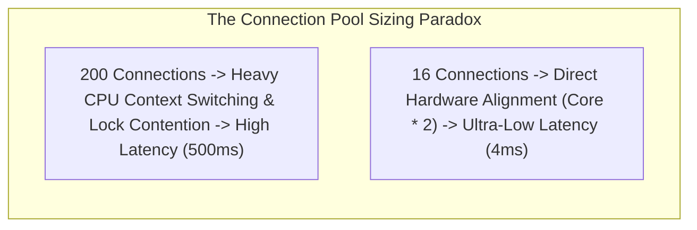

# High-Performance Network I/O, Socket Tuning, and HikariCP Optimization

---

## 1. What Is It?
**High-Performance Network I/O** is the optimization of low-level Linux kernel network stack parameters (TCP socket buffers, epoll multiplexing) and database connection pools (HikariCP) to maximize request throughput while eliminating thread context switching and socket stalls.

---

## 2. Why Does It Exist?
Backend performance bottlenecks rarely originate in raw CPU computations; they occur at **I/O Boundaries**:
- **Nagle's Algorithm Latency**: Micro-packets buffer in TCP sockets for $40\text{ms}$ waiting to fill MTU frames.
- **Oversized Database Connection Pools**: Allocating 200 database connections on an 8-core PostgreSQL server forces the database kernel to spend $70\%$ of its CPU cycles context-switching between competing thread backends, crashing query throughput.
- **Connection Leaks**: Unclosed JDBC connections exhaust pools, freezing the entire application.

---

## 3. Mental Model: Database Connection Pool Sizing Math



### The PostgreSQL / HikariCP Sizing Formula:
$$\text{Optimal Pool Size} = (\text{CPU Cores} \times 2) + \text{Effective Spindle Count}$$

- *Example*: For an 8-core database server with an NVMe SSD array (Spindle count $\approx 1$):
  $$\text{Pool Size} = (8 \times 2) + 1 = \mathbf{17\text{ Connections}}$$
- A pool of **17 connections** will achieve higher sustained transactions per second than a pool of 200 connections!

---

## 4. How Does It Work?

### 1. Low-Level Linux TCP Socket Tuning Parameters
- **`TCP_NODELAY` (Disable Nagle's Algorithm)**:
  - *Problem*: Nagle's algorithm buffers small outgoing TCP packets to combine them into full MTU frames ($1,460\text{ bytes}$), introducing a mandatory $40\text{ms}$ delay.
  - *Fix*: Enable `TCP_NODELAY` (`socket.setTcpNoDelay(true)`) to flush JSON/REST packets over the wire **instantly with zero delay**.
- **`SO_REUSEPORT`**: Allows multiple independent worker processes to bind to the exact same TCP port (e.g. 8080), with the Linux kernel performing kernel-level load balancing across sockets.
- **`net.core.somaxconn`**: Increases the maximum length of the Linux TCP listen backlog queue (from default 128 to 4096) to absorb sudden connection spikes.

---

### 2. HikariCP Production Configuration Standards

```properties
# Optimal HikariCP Configuration for High-Throughput Production Services
spring.datasource.hikari.maximum-pool-size=20
spring.datasource.hikari.minimum-idle=20 # Fixed pool size eliminates runtime connection creation lag
spring.datasource.hikari.connection-timeout=2000 # Fail fast in 2000ms if pool is saturated
spring.datasource.hikari.validation-timeout=1000 # 1s health check
spring.datasource.hikari.max-lifetime=1800000 # 30 mins (Rotate connections before DB drops them)
spring.datasource.hikari.idle-timeout=600000 # 10 mins
spring.datasource.hikari.leak-detection-threshold=2000 # Logs stack trace if connection unreturned in 2s!
```

---

## 5. Implementation: Netty Direct Off-Heap ByteBuf Allocation

For high-performance networking (Netty / gRPC / WebSockets), allocating buffers on the JVM heap triggers severe Garbage Collection pressure. Netty allocates **Direct Off-Heap Memory (`DirectByteBuffer`)** with pooled memory allocators (`PooledByteBufAllocator`):

```java
package com.backend.engineering.performance.io;

import io.netty.buffer.ByteBuf;
import io.netty.buffer.PooledByteBufAllocator;

public class HighPerformanceBufferManager {

    private final PooledByteBufAllocator allocator = PooledByteBufAllocator.DEFAULT;

    public void processNetworkPacket(byte[] rawData) {
        // Direct Off-Heap Memory Allocation: Zero JVM GC Pressure!
        ByteBuf directBuffer = allocator.directBuffer(rawData.length);
        try {
            directBuffer.writeBytes(rawData);
            // Process bytes via Direct Memory Access (DMA)
        } finally {
            // Netty uses Reference Counting (retain/release) for off-heap memory
            directBuffer.release();
        }
    }
}
```

---

## 6. Performance

| Optimization Parameter | Default Out-of-the-Box | Tuned Production Value | Throughput Impact |
|---|---|---|:---:|
| TCP Nagle Algorithm | Enabled ($40\text{ms}$ delay) | `TCP_NODELAY = true` | **$40\text{ms}$ Latency Drop** |
| HikariCP Pool Sizing | 100 Connections | 20 Connections (Fixed) | **$3.5\times$ Higher Query TPS** |
| Netty Off-Heap Pooling | Heap Allocations | Direct Pooled Buffers | **$80\%$ Lower GC Pauses** |

---

## 7. Interview Questions

### Q1: Why does decreasing the database connection pool size from 200 to 20 often increase overall application throughput?
<details>
<summary>Reveal Answer</summary>

**Answer**:
A database server (like PostgreSQL or MySQL) has a fixed number of physical CPU hardware cores (e.g. 8 cores) and disk I/O channels.
- When 200 client connections query the database simultaneously, the database operating system must manage **200 competing server threads**.
- The OS spends a massive proportion of CPU time **context-switching** between threads, invalidating CPU L1/L2 hardware caches, and contending for internal database page latch locks.
- By capping the pool size to the mathematical optimum ($\approx \text{CPUs} \times 2 = 16-20$), the database processes 20 queries concurrently at maximum CPU cache locality with **near-zero context switching overhead**.
- Queries finish in 2ms instead of 50ms, freeing connections rapidly to process the next queued request and resulting in **higher overall Transactions Per Second (TPS)**.
</details>

---

## 8. Quick Revision
- **`TCP_NODELAY`**: Disables Nagle's algorithm to eliminate 40ms micro-packet buffering delays.
- **HikariCP Formula**: $\text{Connections} = (\text{CPUs} \times 2) + \text{Disk Spindles}$.
- **Fixed Pool Size**: Set `minimumIdle == maximumPoolSize` to prevent runtime allocation freezes.
- **Leak Detection**: Configure `leakDetectionThreshold = 2000` to catch unclosed JDBC connections.
- **Off-Heap Pooling**: Use Netty `directBuffer()` to bypass JVM Garbage Collection on network packets.
