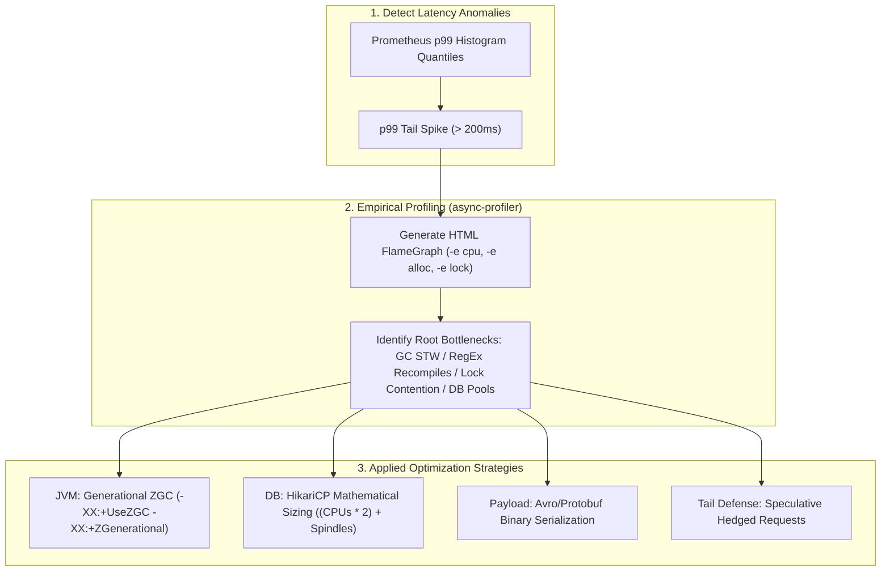

# Module 17: Performance & p99 Optimization

Master production backend performance engineering: Latency distributions ($p50, p95, p99, p99.9$), tail latency amplification across microservice fan-outs, JVM Generational ZGC internals (sub-millisecond STW pauses), CPU and memory profiling with `async-profiler` and FlameGraphs, low-level Linux socket and HikariCP connection pool tuning, and binary serialization benchmarks (Avro/Protobuf vs JSON).

---

## 🗺️ Master Latency Tuning & Profiling Workflow

---

## 📚 Curriculum Lessons

| # | Lesson | Core Focus & Mechanics |
|:---:|---|---|
| **01** | [`01-latency-percentiles-and-tail-latency-amplification.md`](./01-latency-percentiles-and-tail-latency-amplification.md) | Why the average is a lie, Tail Latency Amplification ($1 - (1-p)^N$), Jeff Dean Hedged Requests, and Coordinated Omission. |
| **02** | [`02-jvm-garbage-collection-internals-and-tuning.md`](./02-jvm-garbage-collection-internals-and-tuning.md) | Weak generational hypothesis, Stop-The-World pauses, Generational ZGC (JEP 439), and `-XX:+AlwaysPreTouch` tuning. |
| **03** | [`03-cpu-and-memory-profiling-async-profiler.md`](./03-cpu-and-memory-profiling-async-profiler.md) | FlameGraph analysis, fixing the Safepoint Bias problem, TLAB allocation tracking, and JIT Escape Analysis. |
| **04** | [`04-high-performance-io-and-connection-pool-tuning.md`](./04-high-performance-io-and-connection-pool-tuning.md) | `TCP_NODELAY` (Nagle fix), Linux `somaxconn`, HikariCP pool sizing math, and Netty Direct Off-Heap ByteBufs. |
| **05** | [`05-serialization-payload-optimization-and-code-benchmarks.md`](./05-serialization-payload-optimization-and-code-benchmarks.md) | Serialization CPU costs, Avro/Protobuf vs JSON benchmarks, `-XX:+UseStringDeduplication`, and before/after code case studies. |

---

## ⚡ Key Production Takeaways

1. **Never Trust Averages**: Always evaluate performance via $p95, p99,$ and $p99.9$ percentiles.
2. **Generational ZGC for Low Latency**: Use `-XX:+UseZGC -XX:+ZGenerational` in Java 21 to reduce GC pauses to under 1 millisecond.
3. **Right-Size Connection Pools**: Do not create 200 database connections; size HikariCP to $(\text{CPUs} \times 2) + \text{Spindles}$ to eliminate DB context switching.
4. **Use async-profiler**: Eliminate safepoint bias and identify exact CPU/memory hot spots with FlameGraphs.
5. **Hedged Requests**: Use speculative duplicate requests after $p95$ delays to crush tail latency in scatter-gather fan-outs.
