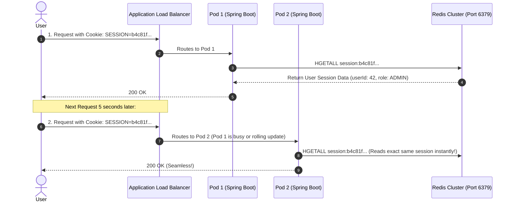

# Scaling Dimensions: Vertical vs Horizontal, Statelessness, and Distributed Sessions

---

## 1. What Is It?
**Scalability** is the architectural capability of a software system to handle increased workload demand proportionally by adding computing resources without degrading performance or re-architecting core business logic.

The two fundamental dimensions of scaling are:
1. **Vertical Scaling (Scale-Up)**: Adding more CPU cores, RAM, and faster NVMe storage to a single server instance.
2. **Horizontal Scaling (Scale-Out)**: Adding more independent server instances to a distributed cluster (**Shared-Nothing Architecture**).

---

## 2. Why Does It Exist?
Vertical scaling hits severe physical and economic limits:
- **Hardware Ceiling**: You cannot buy a single server with 10,000 CPU cores or 100TB of RAM.
- **Amdahl's Law**: The speedup of a program on a multi-core machine is strictly limited by its sequential (non-parallelizable) portion. Adding 128 cores provides diminishing returns if threads contend for shared memory locks.
- **Single Point of Failure (SPOF)**: A single massive server leaves the platform vulnerable to total failure during hardware crashes or kernel upgrades.

Horizontal scaling distributes load across hundreds of cheap commodity servers or Kubernetes pods, providing **near-infinite elasticity and high availability**.

---

## 3. Mental Model: Service Scale vs Database Scale

```mermaid
flowchart TD
    subgraph ServiceScaling["1. Application Service Tier (Stateless - TRIVIAL TO SCALE)"]
        ALB["Application Load Balancer"] --> Pod1["Pod 1 (Spring Boot)"]
        ALB --> Pod2["Pod 2 (Spring Boot)"]
        ALB --> PodN["Pod N (Elastic Auto-Scaling 1 -> 100 Pods)"]
        Note over ServiceScaling: Zero local state! Adding 50 pods takes 30 seconds.
    end

    subgraph DatabaseScaling["2. Database Storage Tier (Stateful - HARD TO SCALE)"]
        Pod1 & Pod2 & PodN --> Redis[("Distributed Redis Cluster (Sessions/Cache)")]
        Pod1 & Pod2 & PodN --> MasterDB[("PostgreSQL Master (Writes)")]
        MasterDB --> Replica1[("Read Replica 1")]
        MasterDB --> Replica2[("Read Replica 2")]
        Note over DatabaseScaling: Stateful coordination, replication lag, and data partitioning limits!
    end
```

---

## 4. Statelessness & The Distributed Session Architecture

### The "Sticky Session" Anti-Pattern
Historically, load balancers used **Sticky Sessions (Session Affinity)** to route all requests from User A to the exact same server instance storing User A's session in local RAM:
- **The Failure**: If Server 2 crashes or restarts during a rolling deploy, all 5,000 active users pinned to Server 2 have their shopping carts and login sessions **instantly destroyed**. Furthermore, traffic cannot be load-balanced evenly.

---

### The Production Standard: Stateless Services + Redis Distributed Sessions
Application pods store **zero user state in JVM memory**:
- User sessions are stored in an external, highly available **Distributed Redis Cluster**.
- Any incoming request can be handled by **any pod at any time**.



---

## 5. Implementation: Spring Session with Redis in Spring Boot 3.3.4

### 1. `pom.xml` Dependency
```xml
<dependency>
    <groupId>org.springframework.session</groupId>
    <artifactId>spring-session-data-redis</artifactId>
</dependency>
```

---

### 2. `application.yml`
```yaml
spring:
  session:
    store-type: redis # Offloads all HttpSession data to Redis cluster
    timeout: 1800s # 30 minute session expiration
    redis:
      namespace: spring:session:app
```

---

## 6. Performance

| Architecture Pattern | Horizontal Scalability | Pod Restart Impact on Users | Memory Utilization per Pod |
|---|---|---|---|
| In-Memory Sticky Sessions | Poor (Cannot scale pods elastically) | **Data Loss & Logouts** | High (JVM Heap bloat) |
| **Stateless Pods + Redis Sessions** | **Infinite (1 to 1,000+ pods)** | **Zero Impact (Seamless failover)** | **Minimal (Ephemeral)** |

---

## 7. Interview Questions

### Q1: Why is scaling the application tier horizontally significantly easier than scaling the database tier horizontally?
<details>
<summary>Reveal Answer</summary>

**Answer**:
1. **Application Tier (Stateless)**:
   - Application microservices do not persist durable data locally; they execute pure computation and delegate persistence to external datastores.
   - Because all application instances are completely interchangeable, adding or removing 50 pods involves only updating the Load Balancer's endpoint routing table. There is **zero data migration, zero replication coordination, and zero distributed state reconciliation**.
2. **Database Tier (Stateful)**:
   - Databases store authoritative, durable state on physical disks that must satisfy **ACID consistency and durability guarantees**.
   - Scaling databases horizontally requires **Data Replication (introducing replication lag)** or **Data Sharding (splitting tables across disks)**.
   - Sharding introduces immense operational complexity: cross-shard distributed transactions (2PC/Sagas), distributed foreign key constraints, rebalancing data during cluster resizing, and cross-shard join performance penalties.
</details>

---

## 8. Quick Revision
- **Vertical Scaling**: Adding CPU/RAM to 1 machine; bounded by hardware ceiling and Amdahl's Law.
- **Horizontal Scaling**: Adding independent nodes (Shared-Nothing).
- **Stateless Tier**: All application instances are interchangeable.
- **Sticky Session Anti-Pattern**: Never pin users to specific pods.
- **Spring Session Redis**: Centralizes session state in Redis for seamless pod failover.
