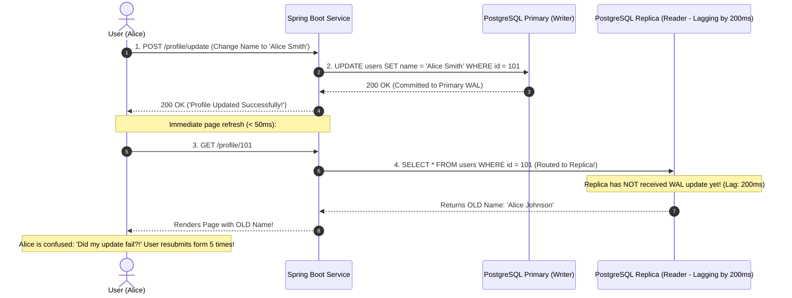
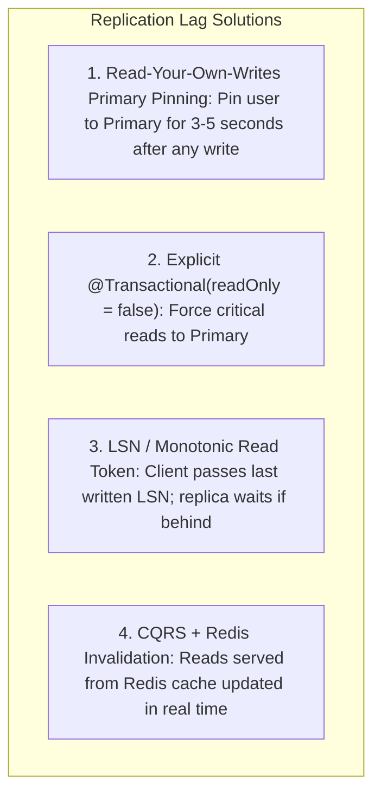

# Database Read-Write Splitting, Read Replicas, and Replication Lag Solutions

---

## 1. What Is It?
**Read-Write Splitting** is a database scaling pattern where all data mutations (`INSERT`, `UPDATE`, `DELETE`) are directed to a single authoritative **Primary / Master** database instance, while read queries (`SELECT`) are distributed across multiple asynchronous **Read Replicas**.

**Replication Lag** is the time delay between when a transaction commits to the primary database WAL and when that mutation is asynchronously replayed on the read replica, causing replicas to serve **Stale Data**.

---

## 2. The Read-After-Write Inconsistency Disaster



---

## 3. The 4 Production Solutions to Replication Lag



### Solution 1: Read-Your-Own-Writes Primary Pinning (The Industry Standard)
- When User 101 performs a write (`POST/PUT/DELETE`):
  - The application sets a short-lived HTTP cookie or Redis flag: `user:101:recent_write = true (TTL: 5s)`.
- On subsequent read requests:
  - If `recent_write` flag exists $\longrightarrow$ **Route query to Primary Database**.
  - If flag is absent $\longrightarrow$ **Route query to Read Replicas**.

---

## 4. Implementation: Dynamic Read-Write DataSource Router in Spring Boot

```java
package com.backend.engineering.scalability.routing;

import org.springframework.jdbc.datasource.lookup.AbstractRoutingDataSource;
import org.springframework.transaction.support.TransactionSynchronizationManager;

public class DynamicReadWriteRoutingDataSource extends AbstractRoutingDataSource {

    public enum DataSourceType { PRIMARY, REPLICA }

    @Override
    protected Object determineCurrentLookupKey() {
        // 1. Check if an explicit primary override is active (e.g. recent write pinning)
        if (DataSourceContextHolder.isForcePrimary()) {
            return DataSourceType.PRIMARY;
        }

        // 2. Automatically route based on Spring @Transactional(readOnly) attribute
        boolean isReadOnly = TransactionSynchronizationManager.isCurrentTransactionReadOnly();
        return isReadOnly ? DataSourceType.REPLICA : DataSourceType.PRIMARY;
    }
}
```

---

## 5. Performance

| Database Architecture | Max Read QPS | Max Write TPS | Read Consistency Guarantee |
|---|---|---|---|
| Single Master Node | $3,000\text{ QPS}$ | $1,500\text{ TPS}$ | Strict Linearizability |
| **Primary + 5 Read Replicas (No Pinning)** | **$25,000\text{ QPS}$** | $1,500\text{ TPS}$ | Eventual (Stale read anomaly) |
| **Primary + 5 Replicas (With Primary Pinning)** | **$22,000\text{ QPS}$** | $1,500\text{ TPS}$ | **Read-Your-Own-Writes Guaranteed!** |

---

## 6. Interview Questions

### Q1: How does Spring's `AbstractRoutingDataSource` implement dynamic Read-Write splitting?
<details>
<summary>Reveal Answer</summary>

**Answer**:
`AbstractRoutingDataSource` acts as a proxy wrapper around multiple underlying `DataSource` connection pools (e.g. 1 Primary pool + 2 Replica pools).
When a database transaction begins, Spring invokes `determineCurrentLookupKey()`:
1. It inspects `TransactionSynchronizationManager.isCurrentTransactionReadOnly()`.
2. If `@Transactional(readOnly = true)` is present on the executing service method, it returns the key `REPLICA`, and the proxy borrows a connection from the Read Replica pool.
3. If `@Transactional` is `readOnly = false` (or non-transactional write), it returns the key `PRIMARY`, borrowing a connection from the Primary Writer pool.
**Gotcha**: The routing decision occurs **at connection acquisition time**. You cannot switch DataSources midway through a single `@Transactional` method boundary.
</details>

---

## 7. Quick Revision
- **Read-Write Splitting**: Routes `SELECT` to replicas; writes to Primary.
- **Replication Lag**: Asynchronous delay before replicas apply WAL changes.
- **Read-Your-Own-Writes**: Pin user to Primary for 3–5 seconds after writes to prevent stale UI refreshes.
- **`AbstractRoutingDataSource`**: Spring mechanism for dynamic DataSource switching based on `readOnly` flags.
