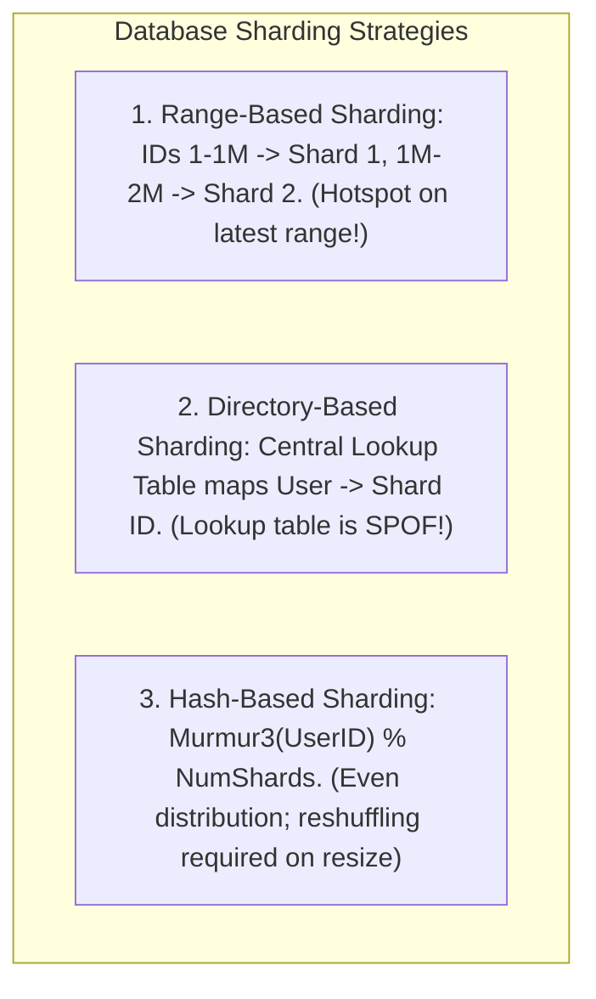
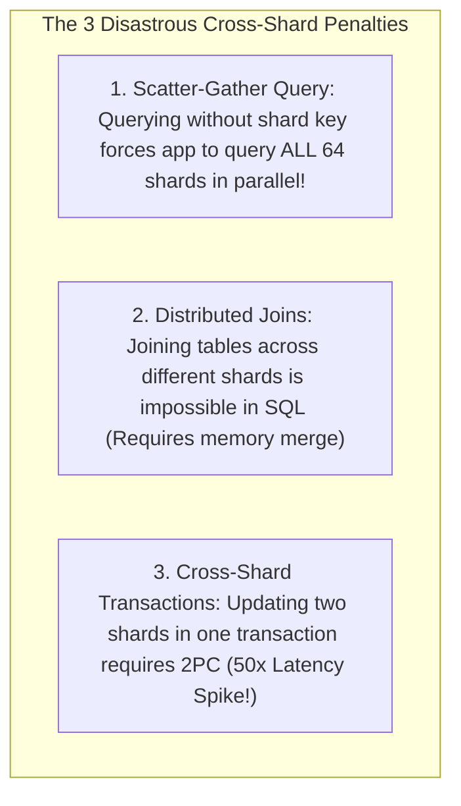

# Database Sharding Mechanics, Partition Keys, and Cross-Shard Query Penalties

---

## 1. What Is It?
**Database Sharding (Horizontal Partitioning)** is the architectural technique of dividing a massive relational database table across multiple independent physical database servers (**Shards**), where each shard holds a mutually exclusive subset of the total rows.

---

## 2. Why Does It Exist?
While **Read Replicas** scale read capacity, **all write operations still bottleneck on the single Primary database disk**.

When write volume exceeds the physical hardware limits of the largest available server ($> 50,000\text{ writes/sec}$ or $> 20\text{TB}$ table sizes), **Sharding the Write Path** is the only architectural solution to scale write throughput and storage linearly.

---

## 3. Mental Model: The 3 Sharding Strategies



---

## 4. How Does It Work?

### 1. Partition Key Selection Rules
The **Partition Key (Shard Key)** determines which physical shard stores a row. Selecting the wrong shard key will permanently destroy database performance.

$$\textbf{The 3 Laws of Partition Key Selection:}$$
1. **High Cardinality**: Must have millions of distinct values (e.g. `user_id` or `tenant_id`; never `gender` or `country_code`).
2. **Uniform Access Distribution**: Avoid power-law skew where $90\%$ of traffic hits a single celebrity ID.
3. **Co-location of Related Data**: Entities queried together should share the same partition key (e.g. storing `orders` and `order_items` using `user_id` as the shard key ensures all customer data resides on the **exact same physical shard**).

---

## 5. The 3 Cross-Shard Penalties



### 1. Scatter-Gather Query Disaster
- If you execute: `SELECT * FROM orders WHERE user_id = 101` $\longrightarrow$ Router sends query directly to **Shard 3** ($< 2\text{ms}$).
- If you execute: `SELECT * FROM orders WHERE status = 'PENDING'` (No shard key!) $\longrightarrow$ Router must send 64 parallel queries to **ALL 64 Shards**, wait for the slowest shard, and merge/sort thousands of rows in JVM RAM (**$100\times$ Latency Explosion**).

---

## 6. Implementation: Application-Level Shard Router in Java 21

```java
package com.backend.engineering.scalability.sharding;

import java.util.List;
import java.util.Map;
import javax.sql.DataSource;

public class HashBasedShardRouter {

    private final List<DataSource> shardDataSources;
    private final int numShards;

    public HashBasedShardRouter(List<DataSource> shardDataSources) {
        this.shardDataSources = shardDataSources;
        this.numShards = shardDataSources.size();
    }

    public DataSource getShardForUser(Long userId) {
        if (userId == null) {
            throw new IllegalArgumentException("Cannot route query without Partition Key (userId)!");
        }

        // Murmur3 Hash to prevent consecutive key clustering
        int hash = Math.abs(hashMurmur3(userId));
        int shardIndex = hash % numShards;

        return shardDataSources.get(shardIndex);
    }

    private int hashMurmur3(Long key) {
        long k = key ^ (key >>> 33);
        k *= 0xff51afd7ed558ccdL;
        k ^= (k >>> 33);
        k *= 0xc4ceb9fe1a85ec53L;
        k ^= (k >>> 33);
        return (int) k;
    }
}
```

---

## 7. Performance & Comparison

| Operation | Single Database | Sharded Database (Single-Shard Key) | Sharded Database (Scatter-Gather) |
|---|---|---|---|
| Single Row Point Read | $1.5\text{ms}$ | **$1.5\text{ms}$** | $\mathbf{85\text{ms}}$ (Wait on slowest shard) |
| Max Cluster Write Throughput | $5,000\text{ TPS}$ (Hardware capped) | **$150,000+\text{ TPS}$ (Linear scale!)** | Severely degraded |
| ACID Transaction Scope | Full Database | Within single shard | Heavy 2PC coordination ($50\text{ms}$) |

---

## 8. Interview Questions

### Q1: What are the primary trade-offs introduced when moving from a single large relational database to a sharded database architecture?
<details>
<summary>Reveal Answer</summary>

**Answer**:
1. **Advantages**:
   - **Linear Write & Storage Scaling**: Write throughput and storage capacity scale proportionally by adding more physical database shard nodes.
   - **Failure Blast Radius Reduction**: An outage of Shard 3 impacts only $1/N$ fraction of the user base (e.g. $1.5\%$ on a 64-shard cluster), while all other shards remain $100\%$ operational.
2. **Major Trade-offs & Disadvantages**:
   - **Loss of Global ACID Transactions**: Multi-table transactions spanning different shards require distributed Two-Phase Commit (2PC) or Sagas, destroying write latency.
   - **No Cross-Shard Foreign Keys or Joins**: Relational constraints and `JOIN`s cannot execute across separate database processes; joins must be performed in application memory.
   - **Scatter-Gather Latency**: Any query that does not include the partition key must query all shards in parallel, suffering from tail latency amplification.
   - **Resharding Complexity**: Adding new shards requires complex consistent hashing and live data migration scripts.
</details>

---

## 9. Quick Revision
- **Sharding**: Horizontally splits tables across multiple independent database instances.
- **Partition Key Rules**: High cardinality, uniform traffic, co-locates related child entities.
- **Scatter-Gather**: Queries lacking partition keys hammer all shards simultaneously.
- **Cross-Shard Joins**: Strictly forbidden; denormalize or merge in application memory.
- **Blast Radius**: Sharding limits database outages to $1/N$ of total customers.
