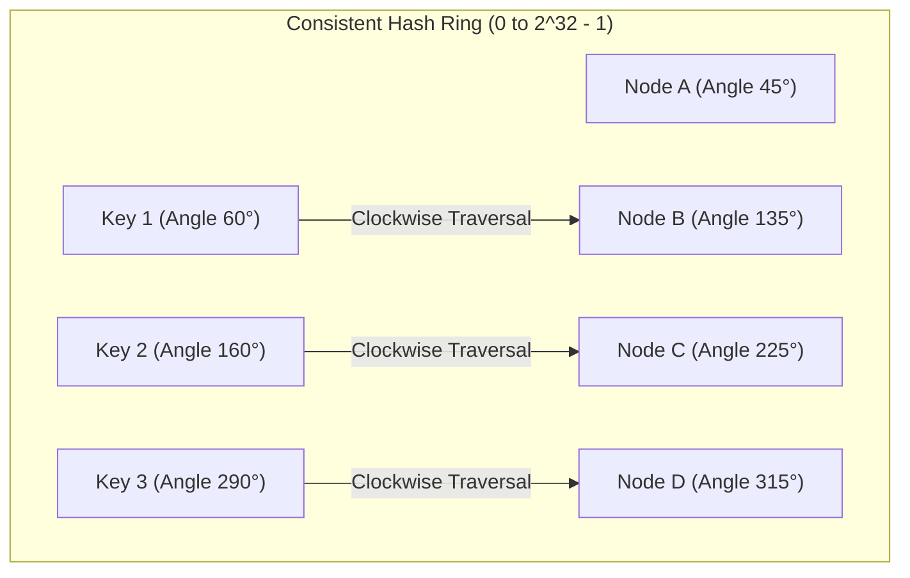

# Consistent Hashing, The Hash Ring, and Virtual Nodes (VNodes)

---

## 1. What Is It?
**Consistent Hashing** is a distributed hashing algorithm where resizing a cluster (adding or removing a node) causes only **$K/N$ keys to be migrated on average** (where $K$ is total keys and $N$ is total nodes), compared to simple modulo hashing where almost **$100\%$ of all keys are relocated**.

It is the core routing algorithm powering distributed databases, caches, and load balancers (Apache Cassandra, Amazon DynamoDB, Akamai CDN, Redis Cluster, Envoy Proxy).

---

## 2. Why Does It Exist?

### The Modulo Hashing Resizing Catastrophe
In standard hash routing:

$$\text{Node Index} = \text{Hash}(\text{Key}) \pmod N$$

- *Scenario*: You run a cluster of 4 cache servers ($N = 4$).
- When traffic grows, you add a 5th server ($N = 5$).
- Because the divisor in the modulo operation changes from $4$ to $5$:

$$\textbf{Key Remapping Fraction: } \frac{N}{N+1} = \frac{4}{5} = \mathbf{80\% \text{ of ALL Cached Keys Instantly Miss!}}$$

- **Result**: $80\%$ of all client requests miss the cache simultaneously, dumping the entire platform's read traffic directly onto the primary database (**Total System Collapse**).

---

## 3. Mental Model: The Consistent Hash Ring



### The Ring Algorithm:
1. Both **Nodes** and **Keys** are hashed into the exact same 32-bit integer address space ($0 \dots 2^{32} - 1$), forming a continuous circle (**The Hash Ring**).
2. To find which node stores `Key X`:
   - Calculate $\text{Hash}(\text{Key X})$ to find its position on the ring.
   - Travel **clockwise** along the ring until you encounter the first physical node.
3. **When Node B is Added between Node A and C**:
   - Only keys residing between Node A and Node B migrate to the new Node B.
   - **All other keys in the entire cluster remain completely untouched on their existing nodes!**

---

## 4. The Non-Uniform Distribution Flaw & Virtual Nodes (VNodes)

On a naive hash ring with few physical servers (e.g. 4 nodes), hash functions randomly cluster nodes unevenly around the circle, creating **Hot Spots** where one server receives $60\%$ of all keys while another receives only $5\%$.

```mermaid
flowchart TD
    subgraph VirtualNodesModel["Virtual Nodes (VNodes) Solution"]
        P1["Physical Server 1"] --> V1_1["Server1_v1"] & V1_2["Server1_v2"] & V1_3["Server1_v256"]
        P2["Physical Server 2"] --> V2_1["Server2_v1"] & V2_2["Server2_v2"] & V2_3["Server2_v256"]
        Note over VirtualNodesModel: 256 Virtual Nodes per Server scattered evenly around the ring -> Perfect Uniform Distribution!
    end
```

### Advantages of VNodes:
1. **Mathematical Uniformity**: Spreading 256 virtual tokens per physical node ensures standard deviation of load across servers is $< 2\%$.
2. **Proportional Capacity Weighting**: A massive 64-core server can be assigned 512 vnodes, while a smaller 16-core server is assigned 128 vnodes, automatically balancing load proportional to hardware capacity.
3. **Even Rebalancing on Node Outage**: When a physical node crashes, its 256 vnode segments are dispersed evenly across *all* remaining nodes, rather than overloading a single neighbor.

---

## 5. Implementation: Consistent Hash Ring with VNodes in Java 21

```java
package com.backend.engineering.scalability.hashing;

import java.nio.charset.StandardCharsets;
import java.security.MessageDigest;
import java.util.*;

public class ConsistentHashRing<T> {

    private final int numberOfReplicas; // Number of VNodes per physical node (e.g. 150)
    private final SortedMap<Long, T> ring = new TreeMap<>();

    public ConsistentHashRing(int numberOfReplicas, Collection<T> nodes) {
        this.numberOfReplicas = numberOfReplicas;
        for (T node : nodes) {
            addNode(node);
        }
    }

    public synchronized void addNode(T node) {
        for (int i = 0; i < numberOfReplicas; i++) {
            // Hash virtual node identifier: e.g. "192.168.1.10:8080-vnode-42"
            long hash = hashMd5(node.toString() + "-vnode-" + i);
            ring.put(hash, node);
        }
    }

    public synchronized void removeNode(T node) {
        for (int i = 0; i < numberOfReplicas; i++) {
            long hash = hashMd5(node.toString() + "-vnode-" + i);
            ring.remove(hash);
        }
    }

    public T getNode(String key) {
        if (ring.isEmpty()) {
            return null;
        }

        long hash = hashMd5(key);

        // Find the nearest node clockwise (tailMap)
        if (!ring.containsKey(hash)) {
            SortedMap<Long, T> tailMap = ring.tailMap(hash);
            // If tail is empty, wrap around to the first element on the ring!
            hash = tailMap.isEmpty() ? ring.firstKey() : tailMap.firstKey();
        }

        return ring.get(hash);
    }

    private long hashMd5(String key) {
        try {
            MessageDigest md = MessageDigest.getInstance("MD5");
            byte[] digest = md.digest(key.getBytes(StandardCharsets.UTF_8));
            // Extract 32-bit integer as positive long
            return ((long) (digest[3] & 0xFF) << 24)
                 | ((long) (digest[2] & 0xFF) << 16)
                 | ((long) (digest[1] & 0xFF) << 8)
                 | ((long) (digest[0] & 0xFF));
        } catch (Exception e) {
            throw new RuntimeException(e);
        }
    }
}
```

---

## 6. Performance & Comparison

| Hashing Strategy | Keys Remapped on Adding 1 Node ($N=10$) | Load Distribution Variance | Lookup Complexity |
|---|---|---|---|
| Modulo Hashing (`hash % N`) | $\mathbf{90.9\% \text{ (Total Reshuffle)}}$ | High | $O(1)$ |
| Naive Consistent Hashing | $\mathbf{10\% \text{ (Minimal Migration)}}$ | Poor (Hot spot clustering) | $O(\log N)$ |
| **Consistent Hashing + VNodes (256)** | $\mathbf{10\% \text{ (Minimal Migration)}}$ | **Optimal ($< 2\%$ Variance)** | **$O(\log(N \times V))$ ($< 1\mu\text{s}$)** |

---

## 7. Interview Questions

### Q1: Why does adding Virtual Nodes (VNodes) prevent the "Cascading Neighbor Crash" failure in consistent hashing?
<details>
<summary>Reveal Answer</summary>

**Answer**:
On a basic consistent hash ring without virtual nodes:
1. When Server B crashes, all keys previously handled by Server B fall to its **single immediate clockwise neighbor, Server C**.
2. Server C suddenly receives **$2\times$ its normal traffic load**.
3. Under high peak traffic, Server C becomes overwhelmed and crashes as well.
4. Server C's combined $2\times$ load now falls entirely onto Server D ($3\times$ load), triggering a **Cascading Failure Wave that crashes the entire cluster**.
**With Virtual Nodes (VNodes)**:
Server B's keyspace is broken into 256 small virtual tokens scattered evenly across the entire ring. When Server B crashes, its 256 segments are inherited **evenly across all surviving nodes** (e.g. Server A, C, D, and E each take only a tiny $\approx 25\%$ extra share), preventing any single node from being overwhelmed.
</details>

---

## 8. Quick Revision
- **Modulo Hashing Flaw**: Resizing cluster remaps $N/(N+1) \approx 90\%$ of keys, triggering cache collapse.
- **Consistent Hashing**: Remaps only $K/N$ keys on resize by mapping keys and nodes to a 32-bit ring.
- **VNodes (Virtual Nodes)**: Maps each physical server to hundreds of virtual points on the ring for uniform balance.
- **Cascading Crash Defense**: VNodes disperse a failed server's load evenly across all surviving cluster nodes.
