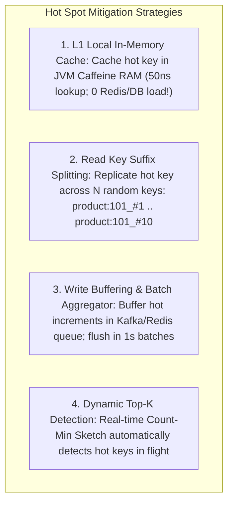
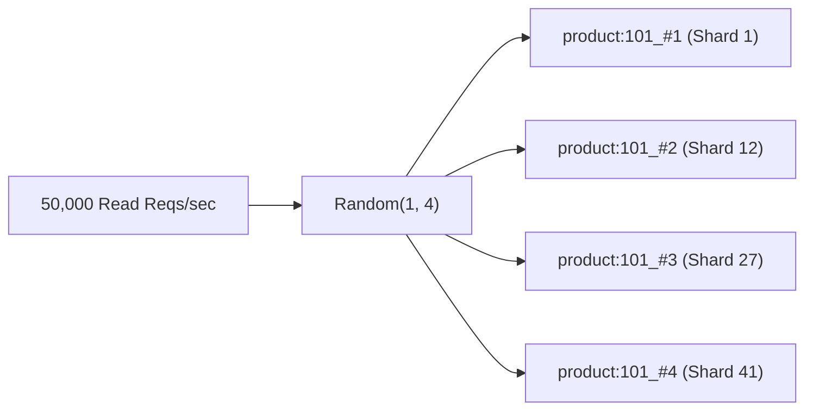

# Hot Spot Mitigation: The Celebrity Problem and Key Splitting Architectures

---

## 1. What Is It?
The **Hot Spot (Celebrity / Hot Partition) Problem** occurs in partitioned or sharded systems when a single entity key experiences an extreme, disproportionate surge of concurrent traffic (e.g. a viral tweet from an account with 100 million followers or a Black Friday flash sale item with 500,000 requests/sec).

---

## 2. Why Does It Exist?
Standard sharding and consistent hashing algorithms are designed under the assumption of **Uniform Key Access**:
- When 1,000,000 keys each receive 10 requests/sec, consistent hashing distributes the 10M req/sec evenly across 50 shards.
- However, if a **single key (`product:ps5_sale`)** receives 300,000 requests/sec, all 300,000 requests hash to the **exact same physical shard node**, saturating that single node's CPU, disk, and 10Gbps NIC, while the other 49 shards sit $98\%$ idle.

---

## 3. Mental Model: The 4 Hot Spot Defenses



---

## 4. Deep Dive: Key Splitting & Randomized Suffix Replication

### 1. Scaling the Read Path (Key Suffix Splitting)
When a key `product:101` becomes hot:
1. Replicate the entity across $N$ ($10$) distinct Redis/DB keys with random suffixes:
   - `product:101_#1`, `product:101_#2`, `...`, `product:101_#10`.
2. Because each suffixed key hashes to a **different physical shard**, read traffic is dispersed evenly across 10 separate servers.
3. Clients randomly select a suffix:
   $$\text{Target Key} = \texttt{"product:101\_\#"} + \text{Random}(1, 10)$$



---

### 2. Scaling the Write Path (Write Buffering & Batch Aggregation)
If 100,000 users like a celebrity's post simultaneously:
- Direct database writes (`UPDATE posts SET likes = likes + 1 WHERE id = 101`) will deadlock on the database row lock.
- **Solution**: Push like events into an in-memory **Redis HyperLogLog / Atomic Buffer** or Kafka partition.
- A background scheduler reads the buffer and executes **1 single database batch update every 2 seconds**:
  ```sql
  UPDATE posts SET likes = likes + 48210 WHERE id = 101;
  ```
- **Result**: Reduces 48,210 individual row-lock database queries into **1 single atomic database operation**!

---

## 5. Implementation: Randomized Read Splitting in Java 21

```java
package com.backend.engineering.scalability.hotspot;

import org.springframework.data.redis.core.RedisTemplate;
import org.springframework.stereotype.Service;

import java.time.Duration;
import java.util.concurrent.ThreadLocalRandom;

@Service
public class HotItemReadService {

    private final RedisTemplate<String, String> redisTemplate;
    private static final int SHARD_SUFFIX_COUNT = 10;

    public HotItemReadService(RedisTemplate<String, String> redisTemplate) {
        this.redisTemplate = redisTemplate;
    }

    // Read with randomized suffix distribution
    public String getHotProductDetails(Long productId) {
        // Randomly pick one of the 10 suffixed shards
        int randomShardIndex = ThreadLocalRandom.current().nextInt(1, SHARD_SUFFIX_COUNT + 1);
        String distributedKey = "product:" + productId + "_#" + randomShardIndex;

        return redisTemplate.opsForValue().get(distributedKey);
    }

    // Replicate hot item to all 10 suffixed keys upon update
    public void publishHotProduct(Long productId, String productJson, Duration ttl) {
        for (int i = 1; i <= SHARD_SUFFIX_COUNT; i++) {
            String key = "product:" + productId + "_#" + i;
            redisTemplate.opsForValue().set(key, productJson, ttl);
        }
    }
}
```

---

## 6. Performance

| Workload ($500,000\text{ req/s}$ on 1 Hot Key) | Standard Sharding | With Key Suffix Splitting + L1 Caffeine |
|---|---|---|
| Single Shard CPU Load | **$100\%$ (Crashed & Dropping packets)** | **$\approx 4\%$ (Evenly balanced)** |
| User Read Latency ($p99$) | Timeouts ($> 10\text{s}$) | **$< 0.8\text{ms}$** |
| Database Write Lock Contention | Deadlock failures | **Zero (Batch aggregated)** |

---

## 7. Interview Questions

### Q1: How do you handle the "Celebrity / Hot Key" problem in a partitioned database where one user has 80 million followers?
<details>
<summary>Reveal Answer</summary>

**Answer**:
A multi-layered architectural approach is required:
1. **Read Path (Celebrity Timeline & Profile)**:
   - **Multi-Tier L1 In-Memory Caching (Caffeine)**: Cache the celebrity's profile and public posts directly in application JVM memory with a short TTL (e.g. 10 seconds), absorbing $99\%$ of read queries at the ingress layer.
   - **Key Suffix Splitting**: Replicate the celebrity's data across $N$ randomly suffixed keys (`user:celebrity_#1` to `#10`) so that cache requests hash to different Redis shards.
2. **Write Path (Followers & Notifications - The Fan-Out Dilemma)**:
   - **Hybrid Fan-Out (Push vs Pull)**:
     - For standard users with $< 5,000$ followers: Use **Fan-Out-on-Write (Push)** (write new posts directly to each follower's inbox timeline).
     - For celebrities with $> 1,000,000$ followers: **Do NOT fan-out on write** (which would require 1M database inserts per post). Instead, use **Fan-Out-on-Read (Pull)**: when a normal user opens their feed, their timeline dynamically merges their inbox with the cached timeline of the celebrities they follow.
</details>

---

## 8. Quick Revision
- **The Hot Spot Problem**: Extreme traffic to one key overwhelms a single shard while others sit idle.
- **L1 In-Memory Caching**: Absorbs hot reads at zero network cost.
- **Suffix Splitting**: Replicate hot keys (`key_#1 .. #N`) to distribute read load across multiple shards.
- **Write Buffering**: Coalesce thousands of hot increments into periodic batch SQL updates.
- **Hybrid Fan-Out**: Push for normal users; Pull for celebrities.
