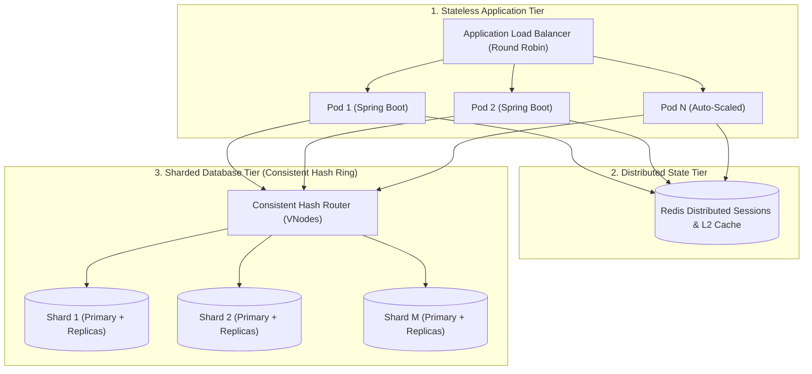

# Module 18: Scalability & Sharding

Master large-scale distributed scaling architectures: Vertical vs Horizontal scaling, stateless service tier design with Redis distributed sessions, database read-write splitting with replication lag defenses, write-path database sharding mechanics, Consistent Hashing with Virtual Nodes (VNodes), and Hot Spot / Celebrity partition mitigation.

---

## 🗺️ Master Distributed Horizontal Scaling Architecture

---

## 📚 Curriculum Lessons

| # | Lesson | Core Focus & Mechanics |
|:---:|---|---|
| **01** | [`01-scaling-dimensions-vertical-vs-horizontal-and-statelessness.md`](./01-scaling-dimensions-vertical-vs-horizontal-and-statelessness.md) | Vertical (Amdahl's law) vs Horizontal scaling, stateless services, sticky session anti-patterns, and Spring Session with Redis. |
| **02** | [`02-database-horizontal-scaling-read-replicas-and-lag.md`](./02-database-horizontal-scaling-read-replicas-and-lag.md) | Read-Write splitting, Spring `AbstractRoutingDataSource`, replication lag anomalies, and Read-Your-Own-Writes primary pinning. |
| **03** | [`03-database-sharding-mechanics-and-partition-keys.md`](./03-database-sharding-mechanics-and-partition-keys.md) | Sharding the write path, partition key selection rules, and the 3 cross-shard penalties (Scatter-Gather, distributed joins, 2PC). |
| **04** | [`04-consistent-hashing-and-virtual-nodes.md`](./04-consistent-hashing-and-virtual-nodes.md) | Modulo resizing collapse ($N \to N+1$), the 32-bit consistent hash ring, and Virtual Nodes (VNodes) for uniform distribution. |
| **05** | [`05-hot-spots-and-celebrity-partition-mitigation.md`](./05-hot-spots-and-celebrity-partition-mitigation.md) | The Celebrity / Hot Shard problem, L1 JVM caching, randomized key suffix splitting (`key_#1` to `#N`), and write buffering queues. |

---

## ⚡ Key Production Takeaways

1. **Stateless Services Standard**: Never store user session state in pod memory; always offload to a distributed Redis cluster.
2. **Defend Against Replication Lag**: Use Primary Pinning (read-your-own-writes) for 3–5 seconds after user mutations to prevent stale UI refreshes.
3. **Partition Key Rules**: Select high-cardinality partition keys that co-locate parent-child entities on the same physical shard to avoid cross-shard joins.
4. **Consistent Hashing + VNodes**: Use 256 virtual nodes per physical server to achieve mathematically uniform distribution and prevent cascading neighbor crashes.
5. **Mitigate Hot Keys**: Replicate hot keys with randomized suffixes (`product_#1 .. #10`) and buffer high-frequency writes in queues.
