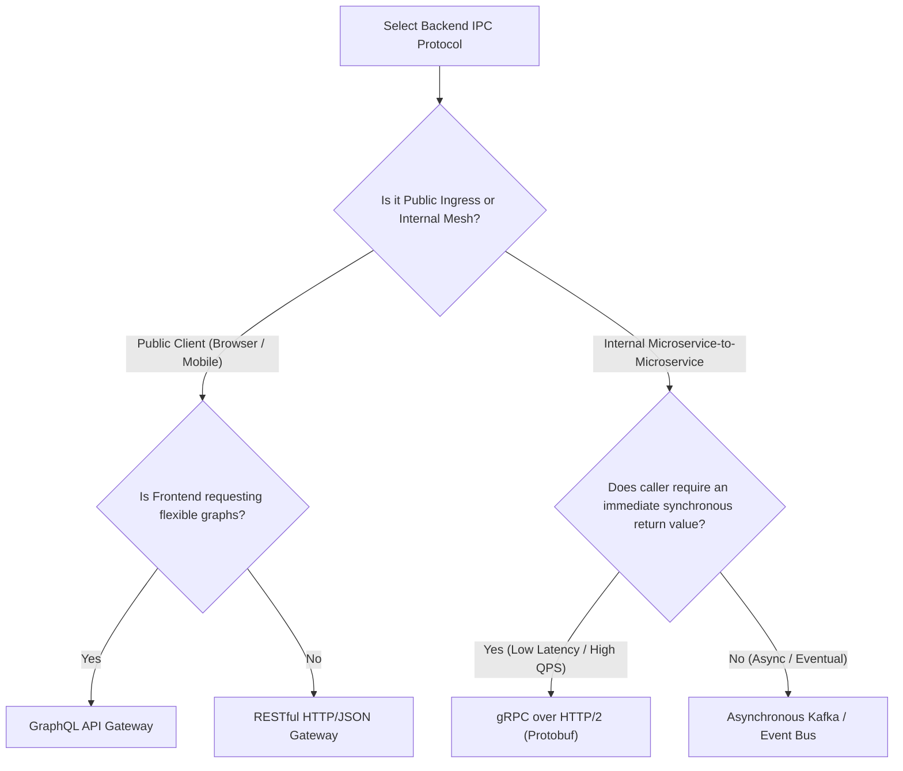
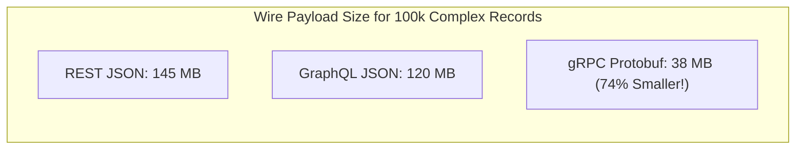

# Inter-Process Communication: REST vs gRPC vs GraphQL vs Async Messaging

---

## 1. What Is It?
In microservice architectures, **Inter-Process Communication (IPC)** defines the protocols, serialization formats, and network transport mechanisms used by distributed services to exchange requests and data across network boundaries.

The 4 dominant backend IPC mechanisms are:
1. **REST (HTTP/1.1 + JSON)**: Human-readable, text-based, resource-oriented.
2. **gRPC (HTTP/2 + Protocol Buffers)**: High-performance, binary, strongly typed RPC.
3. **GraphQL (HTTP + JSON)**: Client-driven query language for flexible entity graph fetching.
4. **Asynchronous Event Streaming (Kafka / RabbitMQ)**: Decoupled message brokers for fire-and-forget and pub/sub.

---

## 2. Why Does It Exist?
Selecting the wrong IPC mechanism destroys performance and team productivity:
- Using REST/JSON for internal high-throughput microservice communication introduces severe **JSON parsing CPU overhead ($40\%$)** and **HTTP/1.1 Head-of-Line connection blocking**.
- Using synchronous gRPC for asynchronous workflows introduces **temporal coupling and cascading failure vulnerabilities**.

---

## 3. Mental Model: IPC Protocol Decision Matrix



---

## 4. Comprehensive Protocol Comparison

| Dimension | REST (JSON) | gRPC (Protobuf) | GraphQL | Async Messaging (Kafka) |
|---|---|---|---|---|
| **Transport Layer** | HTTP/1.1 or HTTP/2 | **HTTP/2 (Multiplexed Streams)** | HTTP/1.1 or HTTP/2 | TCP (Custom Binary Wire Protocol) |
| **Payload Format** | Plain Text JSON | **Dense Binary (Protobuf)** | Plain Text JSON | Binary (Avro / Protobuf / JSON) |
| **Contract Enforcement** | OpenAPI (Swagger) - Optional | **`.proto` IDL - Strictly Enforced** | GraphQL Schema - Strictly Enforced | Schema Registry (Confluent/Apicurio) |
| **Communication Style** | Request / Response | Unary, Server/Client/Bidi Streaming | Request / Response | Pub/Sub, Point-to-Point, Event Log |
| **Streaming Support** | ❌ None (or SSE) | ✅ **Full Bidirectional Streaming** | Subscriptions (WebSockets) | ✅ **Continuous Infinite Event Streams** |
| **Typical Latency** | $5 - 25\text{ms}$ | **$0.5 - 3\text{ms}$ (Ultra-Fast)** | $10 - 50\text{ms}$ | $< 5\text{ms}$ (Async decoupled) |

---

## 5. Performance & Network Overhead Benchmark



### Why gRPC Outperforms REST for Internal Mesh Communication:
1. **HTTP/2 Multiplexing**: Hundreds of concurrent RPC calls execute simultaneously over a **single persistent TCP connection**, completely eliminating TCP 3-way handshake and TLS renegotiation latency.
2. **Binary Wire Format**: Protocol Buffers pack integers and field tags into compact variable-length bytes, eliminating human-readable JSON quotes, brackets, and field name strings.
3. **Compile-Time Client Stubs**: Generated Java client stubs use direct byte-buffer mapping, eliminating expensive Java reflection.

---

## 6. Implementation: Spring Boot 3.3.4 Declarative `HttpInterfaces` (REST)

Spring Boot 3 introduces declarative HTTP interfaces (similar to Feign, but built directly into core Spring Framework):

```java
package com.backend.engineering.communication.client;

import org.springframework.web.bind.annotation.PathVariable;
import org.springframework.web.bind.annotation.RequestParam;
import org.springframework.web.service.annotation.GetExchange;
import org.springframework.web.service.annotation.HttpExchange;

@HttpExchange(url = "/api/v1/users", accept = "application/json")
public interface UserServiceClient {

    @GetExchange("/{userId}")
    UserProfileDto getUserById(@PathVariable("userId") Long userId);

    @GetExchange("/search")
    UserSearchResponse searchUsers(@RequestParam("query") String query);
}
```

---

## 7. Failure Scenarios

1. **The Distributed Monolith RPC Chain**:
   - *Failure*: Microservice A makes a synchronous gRPC call to B, which calls C, which calls D. A single slow database query in D blocks all 4 services, exhausting thread pools across the entire company.
   - *Mitigation*: **Break synchronous RPC chains**. Limit synchronous call depth to $\le 2$; convert subsequent steps into asynchronous event-driven Kafka events.

---

## 8. Interview Questions

### Q1: When should you choose gRPC over REST for service-to-service communication, and when is REST still preferred?
<details>
<summary>Reveal Answer</summary>

**Answer**:
1. **Choose gRPC When**:
   - **Internal Microservice-to-Microservice Communication**: Where sub-millisecond latency, high throughput, and minimal CPU/bandwidth overhead are required.
   - **Strict Contract Governance**: Where `.proto` IDL files serve as compile-time typed contracts across cross-functional teams (e.g. Java, Go, and Python services).
   - **Streaming Use Cases**: When bidirectional real-time data streaming (e.g. market data feeds, large file chunks) is needed over HTTP/2.
2. **Choose REST When**:
   - **Public-Facing External APIs**: Where third-party developers, web browsers, and mobile clients require simple, universally understood HTTP/JSON endpoints that can be tested via `curl` without custom client stubs.
   - **Heavy Edge Caching**: Where standard HTTP caching headers (`Cache-Control`, `ETag`, CDN intermediate proxies) provide major performance benefits.
</details>

---

## 9. Quick Revision
- **REST**: Best for public ingress APIs and browser clients (Human-readable, CDN friendly).
- **gRPC**: Best for internal microservice communication (HTTP/2 multiplexing, Protobuf binary speed).
- **GraphQL**: Best for complex frontend aggregations (Prevents over-fetching and under-fetching).
- **Async Messaging**: Best for decoupled, non-blocking, multi-subscriber workflows.
- **RPC Chains**: Limit synchronous RPC depth to $\le 2$ to prevent cascading thread starvation.
