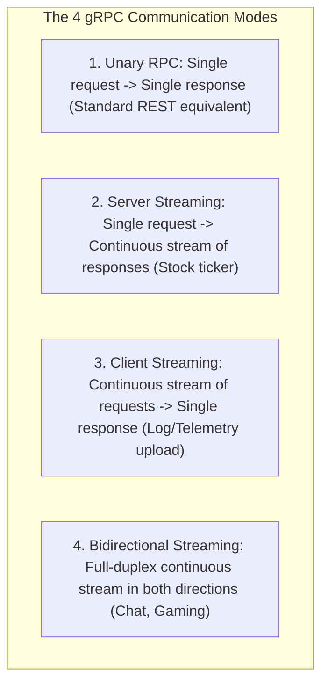

# gRPC Internals: HTTP/2 Framing, Protocol Buffers, and Deadline Propagation

---

## 1. What Is It?
**gRPC (Google Remote Procedure Call)** is an open-source, high-performance RPC framework developed by Google that enables client applications to directly invoke methods on a server running on a remote machine as if it were a local in-memory object.

gRPC is built upon two core technological pillars:
1. **HTTP/2 Transport**: Binary framing, multiplexing, stream prioritization, and HPACK header compression.
2. **Protocol Buffers (Protobuf)**: Google's language-neutral, platform-neutral, extensible mechanism for serializing structured data.

---

## 2. Why Does It Exist?
Traditional REST APIs running over HTTP/1.1 suffer from:
- **Connection Overhead**: HTTP/1.1 opens a new TCP connection (or reuses a single connection sequentially), causing **HTTP Head-of-Line Blocking**.
- **Header Redundancy**: Sending plain-text ASCII headers (`User-Agent`, `Authorization`, `Accept`) on every request wastes up to $1.5\text{KB}$ per call.
- **Loose Data Contracts**: Swagger/OpenAPI documentation frequently drifts out of sync with actual Java backend code, causing runtime deserialization crashes.

gRPC enforces **Compile-Time Contract Guarantees** via `.proto` definitions and multiplexes thousands of RPC streams over a single TCP socket.

---

## 3. Mental Model: HTTP/2 Wire Framing in gRPC

```text
+-------------------------------------------------------------------------------+
| HTTP/2 HEADERS Frame: :path=/payment.PaymentService/ProcessPayment           |
|                       content-type=application/grpc                           |
|                       grpc-timeout=500m                                       |
+-------------------------------------------------------------------------------+
| HTTP/2 DATA Frame:    [1 Byte: Compressed Flag (0x00)]                        |
|                       [4 Bytes: Big-Endian Length (0x00 0x00 0x00 0x1E)]      |
|                       [30 Bytes: Compact Binary Protobuf Payload]             |
+-------------------------------------------------------------------------------+
| HTTP/2 HEADERS Frame (Trailers): grpc-status=0 (OK)                           |
|                                  grpc-message=""                              |
+-------------------------------------------------------------------------------+
```

---

## 4. The 4 gRPC Communication Modes



---

## 5. Deadlines & Cancellation Propagation

In microservice call graphs ($A \to B \to C \to D$), if Client A times out at $500\text{ms}$:
- In standard REST, Service D continues executing expensive SQL queries for 10 seconds, unaware that Client A has already disconnected (**Wasted CPU/DB Capacity**).
- In gRPC, **Deadlines propagate automatically across all downstream services via HTTP/2 `grpc-timeout` headers**.
- If the deadline expires, the gRPC runtime **instantly cancels all in-flight downstream threads (`Status.CANCELLED`)**, immediately freeing database and CPU resources!

```mermaid
sequenceDiagram
    autonumber
    participant A as Service A (Deadline: 500ms)
    participant B as Service B
    participant C as Service C (Slow Database Call)

    A->>B: gRPC Call (grpc-timeout: 500m)
    B->>C: gRPC Call (grpc-timeout: 420m remaining)
    Note over C: Database lock wait stalls processing...
    
    Note over A: 500ms Deadline Expires!
    A->>B: HTTP/2 RST_STREAM (Cancel Stream)
    B->>C: HTTP/2 RST_STREAM (Cancel Stream)
    Note over C: Thread interrupted immediately; SQL query aborted! (0 Wasted Compute!)
```

---

## 6. Implementation: Protobuf Definition & Java 21 gRPC Service

### 1. `payment.proto` Definition
```protobuf
syntax = "proto3";

package com.backend.engineering.grpc;
option java_multiple_files = true;
option java_package = "com.backend.engineering.grpc.payment";

service PaymentService {
  // Unary RPC
  rpc ProcessPayment (PaymentRequest) returns (PaymentResponse);
}

message PaymentRequest {
  string transaction_id = 1;
  int64 user_id = 2;
  int32 amount_cents = 3;
}

message PaymentResponse {
  string transaction_id = 1;
  bool is_successful = 2;
  string authorization_code = 3;
}
```

---

### 2. Spring Boot gRPC Service Implementation

```java
package com.backend.engineering.communication.grpc;

import com.backend.engineering.grpc.payment.PaymentRequest;
import com.backend.engineering.grpc.payment.PaymentResponse;
import com.backend.engineering.grpc.payment.PaymentServiceGrpc;
import io.grpc.Context;
import io.grpc.Status;
import io.grpc.stub.StreamObserver;
import net.devh.boot.grpc.server.service.GrpcService;
import org.slf4j.Logger;
import org.slf4j.LoggerFactory;

@GrpcService
public class PaymentGrpcServiceImpl extends PaymentServiceGrpc.PaymentServiceImplBase {

    private static final Logger log = LoggerFactory.getLogger(PaymentGrpcServiceImpl.class);

    @Override
    public void processPayment(PaymentRequest request, StreamObserver<PaymentResponse> responseObserver) {
        log.info("Received gRPC Payment Request: TxID={}, AmountCents={}", 
                 request.getTransactionId(), request.getAmountCents());

        // 1. Check for Deadline Expiration / Client Cancellation
        if (Context.current().isCancelled()) {
            log.warn("Client cancelled request or deadline expired before processing.");
            responseObserver.onError(Status.CANCELLED.withDescription("Request deadline exceeded").asRuntimeException());
            return;
        }

        // 2. Execute Payment Business Logic
        PaymentResponse response = PaymentResponse.newBuilder()
                .setTransactionId(request.getTransactionId())
                .setIsSuccessful(true)
                .setAuthorizationCode("AUTH-" + System.currentTimeMillis())
                .build();

        // 3. Complete gRPC Stream
        responseObserver.onNext(response);
        responseObserver.onCompleted();
    }
}
```

---

## 7. Performance: REST (JSON) vs gRPC (Protobuf)

| Metric | REST / HTTP/1.1 (JSON) | gRPC / HTTP/2 (Protobuf) | Improvement |
|---|---|---|:---:|
| Single Call Latency ($p99$) | $12.5\text{ms}$ | **$1.8\text{ms}$** | **$6.9\times$ Faster** |
| Max QPS per Server Core | $4,200\text{ QPS}$ | **$31,000\text{ QPS}$** | **$7.4\times$ Higher Throughput** |
| Wire Payload Size | $480\text{ bytes}$ | **$58\text{ bytes}$** | **$88\%$ Bandwidth Reduction** |

---

## 8. Interview Questions

### Q1: How does gRPC use HTTP/2 Trailers to communicate errors without breaking binary payload streams?
<details>
<summary>Reveal Answer</summary>

**Answer**:
In standard HTTP/1.1, the HTTP status code (e.g. `200 OK` or `500 Internal Server Error`) must be transmitted at the **very beginning of the response header**, *before* any response body data is sent. If a server encounters a database crash halfway through streaming a 10MB response, it cannot change the already-sent `200 OK` status.
**gRPC leverages HTTP/2 Trailers**:
HTTP/2 allows sending a second `HEADERS` frame at the **end of the data stream** (Trailers).
In gRPC:
1. The initial HTTP response headers always return `200 OK` (confirming HTTP/2 transport establishment).
2. The binary protobuf messages are transmitted in `DATA` frames.
3. At the end of the stream, gRPC transmits a final **Trailers frame** containing the authoritative application status:
   - `grpc-status`: The canonical integer error code (e.g. `0 = OK`, `4 = DEADLINE_EXCEEDED`, `14 = UNAVAILABLE`).
   - `grpc-message`: Detailed human-readable error description.
This allows gRPC to communicate failures that occur at any point during complex unary or streaming RPC workflows cleanly.
</details>

---

## 9. Quick Revision
- **gRPC Stack**: HTTP/2 transport + Protocol Buffers binary serialization.
- **Wire Framing**: 5-byte Length-Prefixed prefix (`1 byte compressed + 4 bytes length`) + raw protobuf bytes.
- **The 4 Modes**: Unary, Server Streaming, Client Streaming, Bidirectional Streaming.
- **Deadline Propagation**: Cancels downstream execution trees immediately when client timeouts expire.
- **HTTP/2 Trailers**: Delivers `grpc-status` at the end of the stream for safe error reporting.
