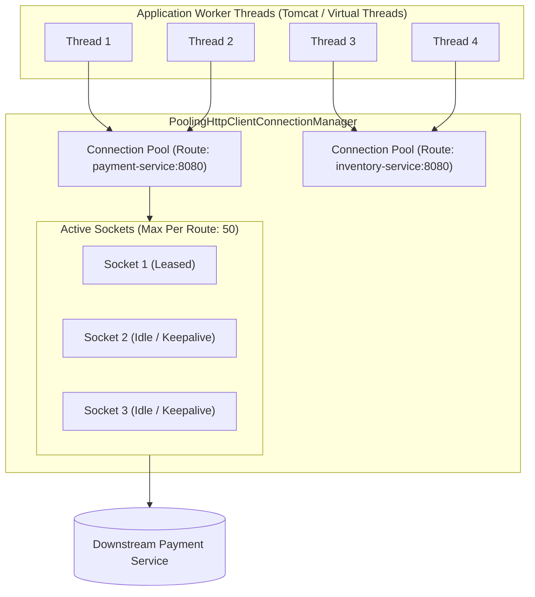
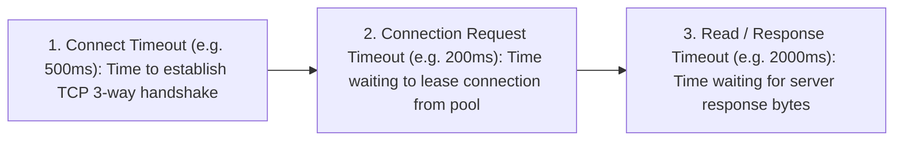

# Resilient HTTP & gRPC Client Architecture: Connection Pooling, Timeouts, and Keepalives

---

## 1. What Is It?
A **Production-Grade Microservice Client** is a configured network transport layer (HTTP/REST or gRPC) that manages persistent connection pools, enforces strict timeout budgets, handles DNS name resolution, and maintains TCP keepalive heartbeats to communicate reliably with downstream services.

---

## 2. Why Does It Exist?
Default out-of-the-box HTTP clients (like default `RestTemplate` or basic `HttpClient`) contain dangerous default settings:
- **Infinite Read Timeouts**: If a downstream service hangs, client worker threads wait **forever**, causing thread pool exhaustion and cascading failures.
- **Default 2-Connection Route Cap**: Legacy Apache HttpClient caps connections to **2 per host by default**, causing 1,000 threads to queue for 2 connections!
- **Silent NAT Gateway Connection Drops**: Cloud firewalls and AWS NAT Gateways silently drop idle TCP sockets after $350\text{ seconds}$, causing sudden `Connection reset by peer` errors on un-heartbeated connections.

---

## 3. Mental Model: HTTP Connection Pool Architecture



---

## 4. How Does It Work?

### 1. The 3 Non-Negotiable Timeout Tiers



$$\textbf{Production Rule: } \text{Never allow ANY network call to execute without explicit Connect, Request, and Read timeouts!}$$

---

### 2. gRPC `ManagedChannel` & Keepalive Pings
A gRPC `ManagedChannel` encapsulates multiple underlying HTTP/2 TCP **Subchannels** connected to backend server replicas.
- **Client-Side Load Balancing**: Configured with `defaultLoadBalancingPolicy("round_robin")` and DNS NameResolver to balance RPC streams across all discovered Kubernetes pod IPs.
- **TCP Keepalive Pings**: Sends an HTTP/2 `PING` frame every $30\text{ seconds}$ (`keepAliveTime`) to prevent AWS NAT Gateways and intermediate load balancers from silently severing idle TCP connections.

---

## 5. Implementation: Production Spring Boot 3 `RestClient` Configuration

```java
package com.backend.engineering.communication.client;

import org.apache.hc.client5.http.config.ConnectionConfig;
import org.apache.hc.client5.http.config.RequestConfig;
import org.apache.hc.client5.http.impl.classic.CloseableHttpClient;
import org.apache.hc.client5.http.impl.classic.HttpClients;
import org.apache.hc.client5.http.impl.io.PoolingHttpClientConnectionManager;
import org.apache.hc.core5.util.TimeValue;
import org.apache.hc.core5.util.Timeout;
import org.springframework.context.annotation.Bean;
import org.springframework.context.annotation.Configuration;
import org.springframework.http.client.HttpComponentsClientHttpRequestFactory;
import org.springframework.web.client.RestClient;

@Configuration
public class ResilientHttpClientConfig {

    @Bean
    public RestClient paymentRestClient() {
        // 1. Connection Pool Sizing
        PoolingHttpClientConnectionManager connectionManager = new PoolingHttpClientConnectionManager();
        connectionManager.setMaxTotal(200); // Max total connections across all routes
        connectionManager.setDefaultMaxPerRoute(50); // Max connections to a single service route

        // 2. TCP Socket & Connect Timeouts
        ConnectionConfig connectionConfig = ConnectionConfig.custom()
                .setConnectTimeout(Timeout.ofMilliseconds(500)) // 500ms TCP Handshake
                .setSocketTimeout(Timeout.ofMilliseconds(2000)) // 2000ms Socket Read Timeout
                .setValidateAfterInactivity(TimeValue.ofSeconds(2)) // Stale connection validation
                .build();
        connectionManager.setDefaultConnectionConfig(connectionConfig);

        // 3. Request Lease Timeouts
        RequestConfig requestConfig = RequestConfig.custom()
                .setConnectionRequestTimeout(Timeout.ofMilliseconds(300)) // 300ms max wait for pool lease
                .build();

        // 4. Build Apache HttpClient 5 with Idle Connection Eviction
        CloseableHttpClient httpClient = HttpClients.custom()
                .setConnectionManager(connectionManager)
                .setDefaultRequestConfig(requestConfig)
                .evictExpiredConnections()
                .evictIdleConnections(TimeValue.ofSeconds(30)) // Evict connections idle > 30s
                .build();

        // 5. Wrap in Spring Boot 3 RestClient
        return RestClient.builder()
                .baseUrl("https://payment.internal")
                .requestFactory(new HttpComponentsClientHttpRequestFactory(httpClient))
                .build();
    }
}
```

---

## 6. Implementation: Production gRPC `ManagedChannel` Configuration

```java
package com.backend.engineering.communication.grpc;

import io.grpc.ManagedChannel;
import io.grpc.ManagedChannelBuilder;
import org.springframework.context.annotation.Bean;
import org.springframework.context.annotation.Configuration;

import java.util.concurrent.TimeUnit;

@Configuration
public class ResilientGrpcChannelConfig {

    @Bean(destroyMethod = "shutdown")
    public ManagedChannel paymentGrpcChannel() {
        return ManagedChannelBuilder.forTarget("dns:///payment-service.production.svc.cluster.local:9090")
                .defaultLoadBalancingPolicy("round_robin") // Client-side round-robin across pod IPs
                .usePlaintext() // Inside private mTLS mesh
                
                // TCP KEEPALIVE HEARTBEAT DEFENSE AGAINST CLUSTER NAT DROPS
                .keepAliveTime(30, TimeUnit.SECONDS) // Send PING every 30s
                .keepAliveTimeout(5, TimeUnit.SECONDS) // Wait 5s for PING ACK
                .keepAliveWithoutCalls(true) // Keepalive even when no active RPCs exist
                .idleTimeout(5, TimeUnit.MINUTES)
                .build();
    }
}
```

---

## 7. Performance

| Client Setting | Default Unconfigured | Tuned Production Architecture |
|---|---|---|
| Concurrent Throughput to Single Host | Bottlenecked at $\approx 200\text{ req/s}$ ($2\text{ conn max}$) | **$> 15,000\text{ req/s}$ ($50\text{ conn pool}$)** |
| Resilience to Downstream Outage | Permanent thread pool freeze | **Fails fast in $500\text{ms}$; 0 thread leaks** |
| Idle TCP Connection Stability | Disconnected with reset errors | **$100\%$ Stable via 30s Keepalives** |

---

## 8. Interview Questions

### Q1: What is the difference between `connectTimeout`, `connectionRequestTimeout`, and `socketTimeout` (readTimeout)?
<details>
<summary>Reveal Answer</summary>

**Answer**:
1. **`connectTimeout`**: The maximum time the client waits to establish the physical TCP 3-way handshake with the target remote host (typically $500\text{ms} - 1\text{s}$). If the host is powered off or unreachable, this timeout trips.
2. **`connectionRequestTimeout`**: The maximum time an application thread is willing to wait **in the client's internal memory queue** to borrow an available connection lease from the connection pool (typically $200 - 500\text{ms}$). If all 50 pool connections are currently leased to other threads, this timeout prevents the calling thread from blocking indefinitely.
3. **`socketTimeout` / `readTimeout`**: The maximum time allowed between consecutive data packets returning from the server after the request has been sent (typically $1 - 3\text{s}$). If the downstream database query is deadlocked or slow, this timeout trips and closes the socket.
</details>

---

## 9. Quick Revision
- **Connection Pool Bounds**: Always configure `maxTotal` and `defaultMaxPerRoute` (default 2 connections is an anti-pattern).
- **The Timeout Trio**: Always configure Connect, Connection Request, and Socket/Read timeouts.
- **gRPC Keepalives**: Set `keepAliveTime(30s)` to prevent NAT firewalls from dropping idle HTTP/2 streams.
- **Client-Side Balancing**: Use gRPC `round_robin` with DNS resolver to balance across Kubernetes pod IPs.
- **Idle Eviction**: Evict connections idle for $> 30\text{s}$ to prevent attempting writes on half-closed sockets.
