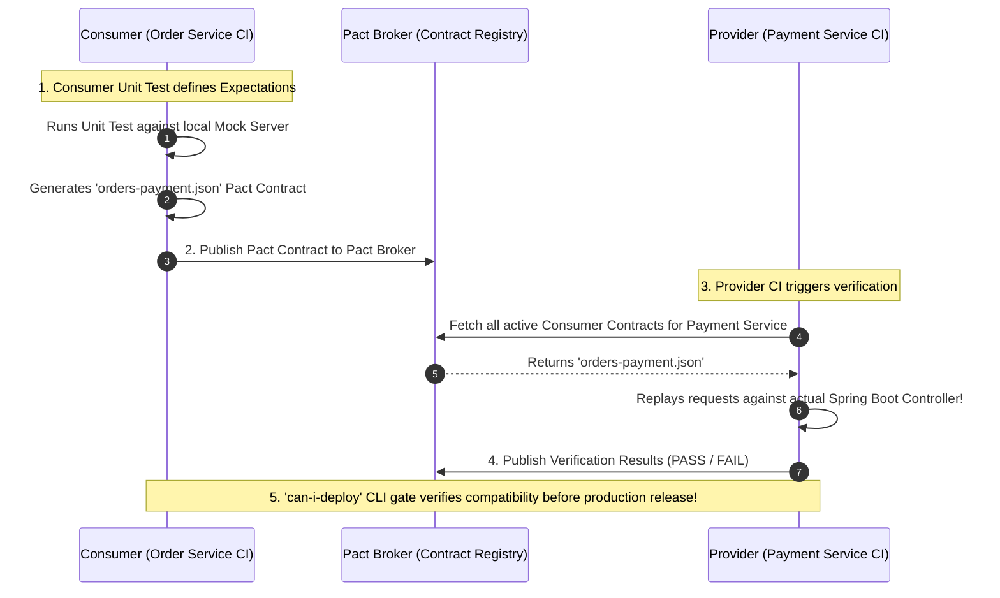
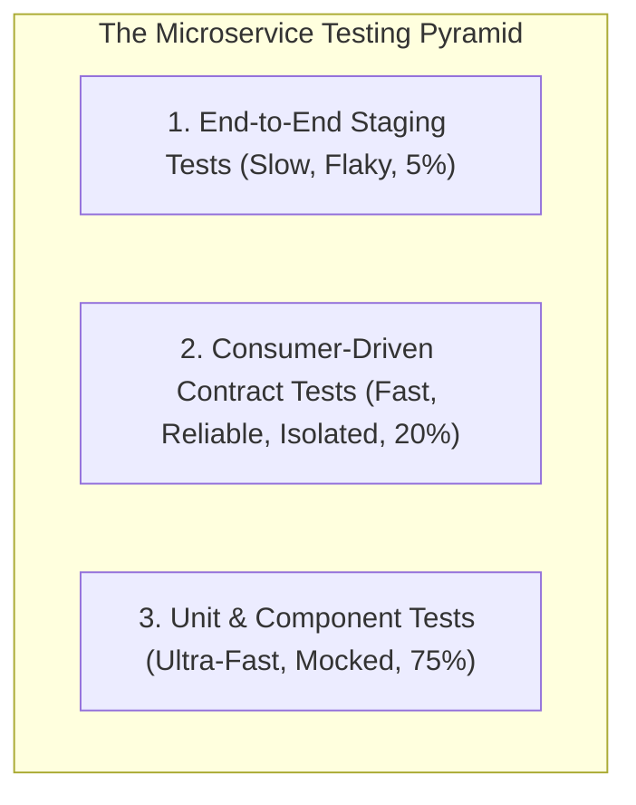

# Consumer-Driven Contract Testing and Pact Framework Architecture

---

## 1. What Is It?
**Consumer-Driven Contract (CDC) Testing** is a formal integration testing methodology where API **Consumers** (the calling services) define their exact expectations regarding request structures and response schemas as a machine-readable **Contract**, and API **Providers** (the implementing services) automatically verify that their implementations satisfy all registered consumer contracts in CI/CD pipelines.

**Pact** is the industry-standard framework for Consumer-Driven Contract testing.

---

## 2. Why Does It Exist?
In microservice architectures, verifying that services work together using traditional **End-to-End (E2E) Staging Environments** fails at scale:
- **Flaky & Slow**: E2E staging tests take hours to run and fail frequently due to unrelated network timeouts and test data collisions.
- **Breaking Changes in Production**: Service B renames a field from `totalAmount` to `amountCents`. Service B's unit tests pass $100\%$, but deploying to production crashes Service A.

Contract testing tests integrations **in isolation** at unit-test speed ($< 2\text{ seconds}$), providing $100\%$ mathematical certainty that independent deployments will not break upstream consumers.

---

## 3. Mental Model: The Pact Contract Testing Lifecycle



---

## 4. How Does It Work?

### The "can-i-deploy" Release Gate
In continuous delivery pipelines, before deploying Service B to production:
```bash
pact-broker can-i-deploy \
  --pacticipant payment-service \
  --version 2.4.1 \
  --to-environment production \
  --broker-base-url https://pact-broker.internal
```
- The Pact Broker checks if `payment-service v2.4.1` has verified contracts with the **exact versions of Order Service currently running in production**.
- If a breaking change exists $\longrightarrow$ The build **fails immediately in CI**, blocking deployment before any user is impacted!

---

## 5. Implementation: Consumer & Provider Contract Tests in Java 21

### 1. Consumer Test (Order Service) generating the Pact Contract
```java
package com.backend.engineering.communication.contract;

import au.com.dius.pact.consumer.dsl.PactDslWithProvider;
import au.com.dius.pact.consumer.junit5.PactConsumerTestExt;
import au.com.dius.pact.consumer.junit5.PactTestFor;
import au.com.dius.pact.core.model.RequestResponsePact;
import au.com.dius.pact.core.model.annotations.Pact;
import org.junit.jupiter.api.Test;
import org.junit.jupiter.api.extension.ExtendWith;
import org.springframework.web.client.RestClient;

import java.util.Map;

import static org.junit.jupiter.api.Assertions.assertEquals;

@ExtendWith(PactConsumerTestExt.class)
@PactTestFor(providerName = "payment-service")
public class PaymentConsumerContractTest {

    @Pact(consumer = "order-service")
    public RequestResponsePact createPact(PactDslWithProvider builder) {
        return builder
            .given("payment account exists for user 42")
            .uponReceiving("a request to authorize payment")
                .path("/api/v1/payments/authorize")
                .method("POST")
                .headers(Map.of("Content-Type", "application/json"))
                .body("{\"orderId\": 101, \"userId\": 42, \"amountCents\": 5000}")
            .willRespondWith()
                .status(200)
                .headers(Map.of("Content-Type", "application/json"))
                .body("{\"status\": \"AUTHORIZED\", \"authCode\": \"AUTH-9942\"}")
            .toPact();
    }

    @Test
    @PactTestFor(pactMethod = "createPact")
    public void testPaymentAuthorizationContract(MockServer mockServer) {
        RestClient client = RestClient.builder().baseUrl(mockServer.getUrl()).build();
        
        // Execute request against local Pact Mock Server
        PaymentResponseDto response = client.post()
                .uri("/api/v1/payments/authorize")
                .header("Content-Type", "application/json")
                .body(new PaymentRequestDto(101L, 42L, 5000))
                .retrieve()
                .body(PaymentResponseDto.class);

        assertEquals("AUTHORIZED", response.status());
    }
}
```

---

### 2. Provider Verification Test (Payment Service)
```java
package com.backend.engineering.communication.contract;

import au.com.dius.pact.provider.junit5.HttpTestTarget;
import au.com.dius.pact.provider.junit5.PactVerificationContext;
import au.com.dius.pact.provider.junit5.PactVerificationInvocationContextProvider;
import au.com.dius.pact.provider.junitsupport.Provider;
import au.com.dius.pact.provider.junitsupport.State;
import au.com.dius.pact.provider.junitsupport.loader.PactBroker;
import org.junit.jupiter.api.BeforeEach;
import org.junit.jupiter.api.TestTemplate;
import org.junit.jupiter.api.extension.ExtendWith;
import org.springframework.boot.test.context.SpringBootTest;
import org.springframework.boot.test.web.server.LocalServerPort;

@SpringBootTest(webEnvironment = SpringBootTest.WebEnvironment.RANDOM_PORT)
@Provider("payment-service")
@PactBroker(url = "https://pact-broker.internal")
public class PaymentProviderVerificationTest {

    @LocalServerPort
    private int port;

    @BeforeEach
    void setUp(PactVerificationContext context) {
        context.setTarget(new HttpTestTarget("localhost", port));
    }

    @TestTemplate
    @ExtendWith(PactVerificationInvocationContextProvider.class)
    void verifyPact(PactVerificationContext context) {
        // Replays all consumer pacts against running Spring Boot server!
        context.verifyInteraction();
    }

    @State("payment account exists for user 42")
    public void setupUserAccountState() {
        // Seed test database with required test fixture
    }
}
```

---

## 6. Performance & Testing Pyramid



---

## 7. Interview Questions

### Q1: How does Consumer-Driven Contract testing differ from standard Schema Validation (like OpenAPI/JSON Schema)?
<details>
<summary>Reveal Answer</summary>

**Answer**:
- **Schema Validation (OpenAPI / Swagger)** defines what a provider is **capable of returning in its entirety**. However, schemas are passive; they do not reveal **which specific fields individual consumers actually care about or depend upon**. A provider cannot know if deleting a field will break a consumer.
- **Consumer-Driven Contract (CDC) Testing** captures the **exact active subset of fields each specific consumer actually uses**.
If Provider B wants to delete field `legacyTaxCode`, the Pact Broker can instantly verify: "Zero active consumers have an expectation on `legacyTaxCode`; it is 100% safe to delete!" Conversely, if Consumer A depends on it, the verification test fails immediately in Provider B's CI build, preventing breaking changes.
</details>

---

## 8. Quick Revision
- **CDC Testing**: Consumers define expectations; Providers verify compliance in CI.
- **Pact Framework**: Generates and verifies machine-readable contract files (`.json`).
- **Pact Broker**: Centralized registry tracking contract versions across environments.
- **`can-i-deploy`**: Automated CI/CD gate preventing deployment of incompatible services.
- **Isolates Tests**: Replaces slow, flaky E2E staging environments with fast unit-level contract verification.
