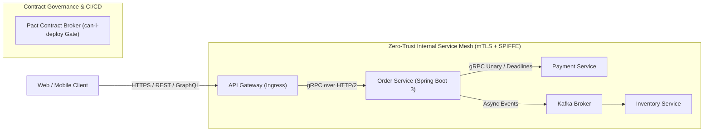

# Module 20: Service-to-Service Communication

Master modern enterprise Inter-Process Communication (IPC) patterns: REST vs gRPC vs GraphQL vs Async Messaging, low-level HTTP/2 framing and Protocol Buffers IDLs, Mutual TLS (mTLS) and Zero-Trust service identities (SPIFFE/SPIRE), production client connection pool and timeout tuning, and Consumer-Driven Contract testing with Pact.

---

## 🗺️ Master Service-to-Service Ingress & Mesh Architecture

---

## 📚 Curriculum Lessons

| # | Lesson | Core Focus & Mechanics |
|:---:|---|---|
| **01** | [`01-ipc-protocols-rest-vs-grpc-vs-graphql.md`](./01-ipc-protocols-rest-vs-grpc-vs-graphql.md) | REST (JSON) vs gRPC (Protobuf) vs GraphQL vs Kafka, payload benchmarking, and eliminating synchronous RPC chains. |
| **02** | [`02-grpc-internals-http2-and-protobuf.md`](./02-grpc-internals-http2-and-protobuf.md) | Protobuf IDLs, HTTP/2 5-byte length framing, the 4 RPC modes (Unary to Bidi), and deadline/cancellation propagation. |
| **03** | [`03-service-to-service-authentication-and-mtls.md`](./03-service-to-service-authentication-and-mtls.md) | Zero-Trust principles, mTLS X.509 handshake verification, SPIFFE/SPIRE workload IDs, and OAuth2 signed JWTs. |
| **04** | [`04-resilient-http-and-grpc-client-architecture.md`](./04-resilient-http-and-grpc-client-architecture.md) | Apache HttpClient 5 pool sizing, Spring Boot 3 `RestClient`, the 3 timeout tiers, and gRPC `ManagedChannel` keepalives. |
| **05** | [`05-api-contract-testing-and-pact.md`](./05-api-contract-testing-and-pact.md) | Consumer-Driven Contract (CDC) testing, Pact broker workflows, provider verification, and `can-i-deploy` CI/CD gates. |

---

## ⚡ Key Production Takeaways

1. **Use gRPC for Internal High QPS**: Multiplexing binary Protobuf over HTTP/2 reduces CPU parsing by $70\%$ and network bandwidth by $80\%$.
2. **Propagate Deadlines**: Use gRPC deadlines (`withDeadlineAfter`) to cancel downstream execution trees when client timeouts trip.
3. **Zero-Trust mTLS Standard**: Enforce mutual TLS and SPIFFE workload identities across all internal service communications.
4. **The Timeout Trio**: Never make a network call without explicit Connect, Connection Request, and Socket Read timeouts.
5. **Contract Testing Prevents Breaks**: Use Pact consumer-driven contract tests to verify API compatibility in CI before deploying to production.
