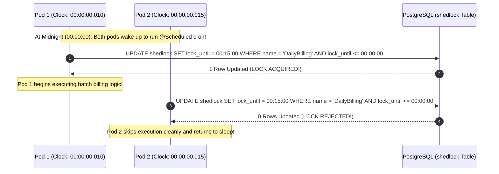

# Distributed Job Schedulers: ShedLock, Distributed Locks, and Clustered Quartz

---

## 1. What Is It?
A **Distributed Job Scheduler** is a coordination framework that ensures recurring scheduled batch tasks (`@Scheduled` crons) execute **exactly once across an entire multi-node cluster of application instances**, preventing duplicate parallel executions.

The two dominant frameworks in the Java ecosystem are:
1. **ShedLock**: A lightweight, database/Redis-backed distributed lock library for Spring Boot.
2. **Quartz Enterprise Scheduler**: A full-featured enterprise scheduling engine supporting stateful clustered jobs, dynamic runtime scheduling, and misfire recovery policies.

---

## 2. Why Does It Exist?
In modern cloud environments, applications run as dozens of horizontally scaled Kubernetes pods:
- If a financial billing job executes at midnight, all 20 pods wake up at the exact same second.
- Without distributed coordination, all 20 pods execute the billing logic concurrently, processing payments 20 times and deadlocking on database tables.

---

## 3. Mental Model: ShedLock Distributed Lock Coordination



---

## 4. How Does It Work?

### 1. ShedLock's Two Critical Parameters

$$\texttt{@SchedulerLock(name = "DailyBilling", lockAtLeastFor = "10s", lockAtMostFor = "15m")}$$

1. **`lockAtMostFor` (Deadlock Safeguard)**:
   - The maximum duration the lock is held if the pod **crashes or loses power mid-execution**.
   - If Pod 1 dies at minute 2, the lock naturally expires after 15 minutes, allowing subsequent cron triggers to run without manual DBA intervention.
2. **`lockAtLeastFor` (Clock Skew & Fast Task Safeguard)**:
   - If the batch task finishes in $100\text{ms}$, Pod 1 releases the lock immediately.
   - If Pod 2's clock is lagging by $500\text{ms}$, Pod 2 wakes up $500\text{ms}$ later, finds the lock released, and **executes the exact same job a second time!**
   - Setting `lockAtLeastFor = "10s"` forces the lock to remain held for at least 10 seconds, completely neutralizing clock skew!

---

### 2. Clustered Quartz & Misfire Policies
In enterprise systems where jobs are configured dynamically at runtime by business users:
- **Clustered Quartz** coordinates via relational database tables (`QRTZ_TRIGGERS`, `QRTZ_JOB_DETAILS`, `QRTZ_LOCKS`).
- **Misfire Handling**: If the database is offline at midnight and recovers at 02:00:
  - `MISFIRE_INSTRUCTION_FIRE_NOW`: Quartz executes the missed job immediately upon recovery.
  - `MISFIRE_INSTRUCTION_DO_NOTHING`: Quartz ignores the missed run and waits for the next scheduled trigger.

---

## 5. Implementation: Spring Boot 3 ShedLock Configuration

### 1. PostgreSQL Lock Table Schema
```sql
CREATE TABLE shedlock (
    name VARCHAR(64) PRIMARY KEY,
    lock_until TIMESTAMP WITH TIME ZONE NOT NULL,
    locked_at TIMESTAMP WITH TIME ZONE NOT NULL,
    locked_by VARCHAR(255) NOT NULL
);
```

---

### 2. Spring Boot Service with `@SchedulerLock`

```java
package com.backend.engineering.jobs.shedlock;

import net.javacrumbs.shedlock.spring.annotation.EnableSchedulerLock;
import net.javacrumbs.shedlock.spring.annotation.SchedulerLock;
import org.slf4j.Logger;
import org.slf4j.LoggerFactory;
import org.springframework.scheduling.annotation.EnableScheduling;
import org.springframework.scheduling.annotation.Scheduled;
import org.springframework.stereotype.Service;

@Service
@EnableScheduling
@EnableSchedulerLock(defaultLockAtMostFor = "10m")
public class DistributedFinancialReconciliationJob {

    private static final Logger log = LoggerFactory.getLogger(DistributedFinancialReconciliationJob.class);

    // Runs every night at 02:00 AM UTC
    @Scheduled(cron = "0 0 2 * * *")
    @SchedulerLock(
        name = "Financial_Reconciliation_Job",
        lockAtLeastFor = "30s", // Protects against clock skew on fast completion
        lockAtMostFor = "15m"   // Prevents permanent deadlock if pod crashes
    )
    public void executeDailyReconciliation() {
        log.info("Distributed lock acquired! Executing daily financial reconciliation batch...");
        
        // Execute batch database aggregation and report generation
        processFinancialBatch();
        
        log.info("Financial reconciliation batch completed successfully.");
    }

    private void processFinancialBatch() {
        // Business logic
    }
}
```

---

## 6. Performance & Comparison

| Scheduler | Setup Complexity | Dynamic Runtime Jobs? | Storage Backend | Overhead |
|---|---|---|---|---|
| **ShedLock** | **Minimal (1 Annotation + 1 Table)** | ❌ Fixed in Code | PostgreSQL / Redis / Mongo | **Near-Zero ($< 1\text{ms}$)** |
| **Clustered Quartz** | Moderate (11 Tables) | ✅ **Yes (Full Dynamic API)** | Relational DB (JDBC) | Moderate (DB row locks) |

---

## 7. Interview Questions

### Q1: Why is `lockAtLeastFor` necessary in ShedLock when scheduling cron jobs in a multi-pod cluster?
<details>
<summary>Reveal Answer</summary>

**Answer**:
`lockAtLeastFor` protects against **Duplicate Execution Caused by Clock Skew and Fast Jobs**:
Consider a cron job that finishes in only $200\text{ms}$ across a cluster where physical server clocks drift slightly by $1\text{ second}$:
1. Pod A wakes up at $T = 00:00:00.000$, acquires the lock, completes the task in $200\text{ms}$, and releases the lock at $T = 00:00:00.200$.
2. Pod B's physical clock is lagging by $800\text{ms}$. Pod B reaches midnight at $T = 00:00:00.800$ (real time) and attempts to acquire the lock.
3. Because Pod A has already released the lock, **Pod B successfully acquires the lock and executes the exact same batch job again**.
Setting `lockAtLeastFor = "10s"` ensures that the lock remains held in the database for a minimum of 10 seconds regardless of how quickly Pod A finishes, guaranteeing that no other pod whose clock is slightly behind can execute the job during that scheduled window.
</details>

---

## 8. Quick Revision
- **ShedLock**: Lightweight distributed lock for `@Scheduled` crons.
- **`lockAtMostFor`**: Deadlock safeguard; auto-releases lock if worker crashes.
- **`lockAtLeastFor`**: Clock skew safeguard; prevents second pod from re-running fast jobs.
- **Quartz**: Enterprise engine for dynamic runtime scheduling and misfire recovery.
