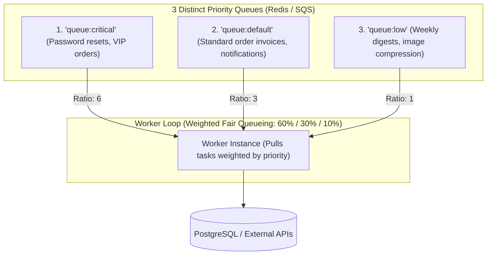
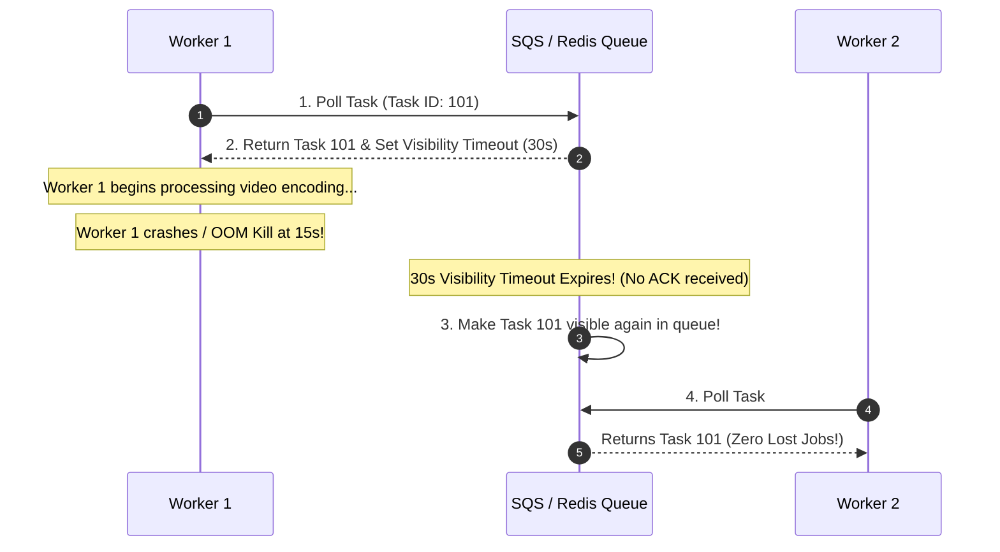

# Queue-Worker Architecture, Priority Queues, and Elastic Worker Scaling (KEDA)

---

## 1. What Is It?
The **Queue-Worker Pattern** is an asynchronous decoupled architecture where producer applications push job definitions into a durable message queue, and a scalable pool of background **Worker Instances** pull and process those jobs independently.

**Priority Queueing** guarantees that mission-critical, time-sensitive tasks (e.g. *Password reset emails, VIP payment processing*) are executed ahead of low-priority bulk tasks (e.g. *Weekly analytics digest rendering*).

---

## 2. Why Does It Exist?
In high-scale systems, background workloads vary in urgency:
- If all background jobs are pushed into a single FIFO queue, submitting 100,000 marketing bulk emails will push a critical password reset email to the back of the queue, delaying it by **3 hours**.
- Without elastic auto-scaling, a sudden surge in queue depth creates unbounded processing lag.

---

## 3. Mental Model: Multi-Bucket Priority Worker Architecture



---

## 4. How Does It Work?

### 1. The Low-Priority Starvation Trap & Weighted Fair Queueing (WFQ)
- **Strict Priority Trap**: If workers *always* drain `queue:critical` before checking `queue:low`, a continuous stream of high-priority jobs will **completely starve low-priority tasks indefinitely**.
- **Weighted Fair Queueing (WFQ)**: Workers consume tasks using a probabilistic or round-robin ratio (e.g. For every $6$ critical tasks, pull $3$ default tasks and $1$ low-priority task). This guarantees high-priority responsiveness while **ensuring low-priority jobs always make progress**.

---

### 2. Task Claiming & The Visibility Timeout (AWS SQS / Redis `BRPOPLPUSH`)
To ensure zero job loss if a worker crashes mid-execution:
1. Worker claims a task from the active queue.
2. The broker moves the task to an **In-Flight Processing Queue** and starts a **Visibility Timeout** (e.g. $30\text{ seconds}$).
3. If the worker succeeds $\longrightarrow$ Worker explicitly deletes the task from the in-flight queue.
4. If the worker crashes $\longrightarrow$ The Visibility Timeout expires, and the broker automatically re-queues the task for another worker to claim!



---

## 5. Elastic Worker Auto-Scaling with KEDA (Kubernetes)

Traditional Kubernetes Horizontal Pod Autoscalers (HPA) scale based on CPU/RAM metrics, which is ineffective for background queues (a queue can hold 500,000 tasks while idle workers consume 0% CPU).

**KEDA (Kubernetes Event-driven Autoscaling)** scales worker pods directly based on **Queue Backlog Depth**:

$$\text{Target Replicas} = \left\lceil \frac{\text{Current Queue Length}}{\text{Target Backlog per Worker}} \right\rceil$$

```yaml
# KEDA ScaledObject Configuration
apiVersion: keda.sh/v1alpha1
kind: ScaledObject
metadata:
  name: video-worker-scaler
spec:
  scaleTargetRef:
    name: video-worker-deployment
  minReplicaCount: 1
  maxReplicaCount: 50
  triggers:
    - type: redis
      metadata:
        type: list
        listName: jobs:queue:video_processing
        listLength: "50" # Scale out +1 pod for every 50 pending video jobs!
```

---

## 6. Implementation: Priority Task Dispatcher in Java 21

```java
package com.backend.engineering.jobs.priority;

import org.springframework.data.redis.core.RedisTemplate;
import org.springframework.stereotype.Service;

import java.util.concurrent.ThreadLocalRandom;

@Service
public class PriorityJobWorkerService {

    private static final String QUEUE_CRITICAL = "jobs:critical";
    private static final String QUEUE_DEFAULT = "jobs:default";
    private static final String QUEUE_LOW = "jobs:low";

    private final RedisTemplate<String, String> redisTemplate;

    public PriorityJobWorkerService(RedisTemplate<String, String> redisTemplate) {
        this.redisTemplate = redisTemplate;
    }

    // Weighted Fair Queueing (WFQ) Pull Loop: 60% Critical, 30% Default, 10% Low
    public String pollNextJob() {
        int randomRoll = ThreadLocalRandom.current().nextInt(100);

        if (randomRoll < 60) {
            String job = redisTemplate.opsForList().rightPop(QUEUE_CRITICAL);
            if (job != null) return job;
        }

        if (randomRoll < 90) {
            String job = redisTemplate.opsForList().rightPop(QUEUE_DEFAULT);
            if (job != null) return job;
        }

        // Fallback or low-priority pull
        String job = redisTemplate.opsForList().rightPop(QUEUE_LOW);
        if (job != null) return job;

        // Drain any pending critical if rolled low but only critical was available
        return redisTemplate.opsForList().rightPop(QUEUE_CRITICAL);
    }
}
```

---

## 7. Performance

| Queueing Strategy | High-Priority P99 Latency | Low-Priority Starvation Risk | Auto-Scaling Latency |
|---|---|---|---|
| Single Shared FIFO | $15 - 180\text{ minutes}$ (Under bulk load) | N/A | Slow (CPU-based) |
| Strict Priority Queue | $\mathbf{< 1\text{ second}}$ | **Extreme (100% Starved)** | Moderate |
| **Weighted Fair Queue + KEDA** | $\mathbf{< 1\text{ second}}$ | **Zero (Guaranteed 10% progress)** | **Instant (Queue depth scaling)** |

---

## 8. Interview Questions

### Q1: What is a Visibility Timeout in queue-worker architectures and how does it prevent lost jobs during worker crashes?
<details>
<summary>Reveal Answer</summary>

**Answer**:
A **Visibility Timeout** is a safety timer set by a message queue (such as AWS SQS or Redis reliable queues) when a worker pulls a job.
- When Worker A retrieves a task, the queue does not delete it immediately; instead, it **hides the task from all other workers** for the duration of the visibility timeout (e.g. 60 seconds).
- If Worker A successfully completes the task within 60 seconds, it sends an explicit delete command (ACK) to remove the task permanently.
- If Worker A crashes (e.g. OutOfMemoryError, hardware loss, or network partition), no ACK is received.
- Once the 60-second visibility timeout expires, the queue automatically **makes the task visible again at the front of the queue**, allowing Worker B to claim and process it, guaranteeing **At-Least-Once Job Execution with zero data loss**.
</details>

---

## 9. Quick Revision
- **Multi-Bucket Queues**: Separate critical, default, and low priority tasks.
- **Weighted Fair Queueing (WFQ)**: Prevents low-priority job starvation.
- **Visibility Timeout**: Protects against worker crashes by re-queuing unacknowledged tasks.
- **KEDA Auto-Scaling**: Scales Kubernetes pods directly on Queue Depth rather than CPU.
- **Reliable Queues**: Use `RPOPLPUSH` or SQS visibility to ensure zero task loss.
