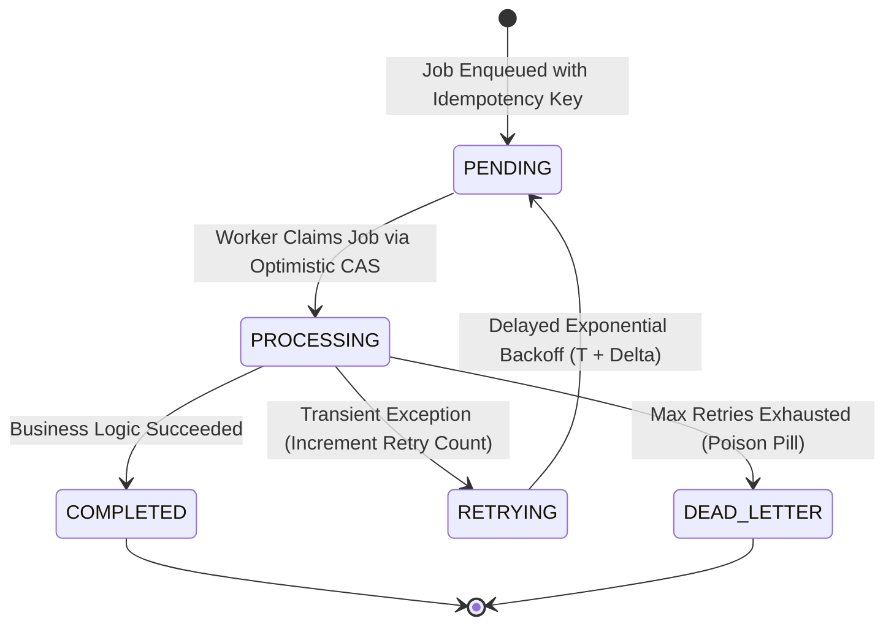

# Job State Machines, Task Deduplication, and Optimistic Lock Claiming

---

## 1. What Is It?
In background processing architectures:
- **Job Deduplication**: The prevention of duplicate identical tasks from being enqueued or executed multiple times within a given time window.
- **Job State Machine**: A formal finite state machine governing the lifecycle transitions of background tasks (`PENDING` $\to$ `PROCESSING` $\to$ `COMPLETED` $\to$ `FAILED`).
- **Optimistic Lock Claiming**: A lock-free concurrency control pattern where worker threads claim tasks using atomic database version checks, guaranteeing that **exactly one worker executes a task** without table-level locking.

---

## 2. Why Does It Exist?
Without job deduplication and state machine guards:
- An upstream user clicks "Export CSV" 10 times rapidly, spawning 10 identical heavy background export jobs that saturate worker CPU pools.
- A network timeout on a message broker ACK causes a payment charge job to be delivered to two workers simultaneously, resulting in a **Double Charge Incident**.

---

## 3. Mental Model: The Job Lifecycle State Machine



---

## 4. How Does It Work?

### 1. Ingress Deduplication via Redis Idempotency Keys
When an API receives a request to enqueue a task:
$$\texttt{SET job:idempotency:export\_csv:user\_101 "1" NX EX 300}$$
- If Redis returns `null` (key already exists within the 5-minute sliding window) $\longrightarrow$ Return the existing `job_id` without enqueuing a duplicate task.

---

### 2. Optimistic Lock Claiming in SQL
Instead of using heavy pessimistic locks (`SELECT ... FOR UPDATE` which blocks database rows):
```sql
UPDATE background_jobs 
SET status = 'PROCESSING', 
    locked_by = :workerId, 
    locked_at = CURRENT_TIMESTAMP, 
    version = version + 1
WHERE id = :jobId 
  AND status = 'PENDING' 
  AND version = :expectedVersion;
```
- If the `UPDATE` returns `1` row affected $\longrightarrow$ Worker successfully claims the job!
- If the `UPDATE` returns `0` rows affected $\longrightarrow$ Another worker claimed the job concurrently; abort cleanly!

---

## 5. Implementation: Production Job State Machine in Java 21

```java
package com.backend.engineering.jobs.statemachine;

import org.slf4j.Logger;
import org.slf4j.LoggerFactory;
import org.springframework.jdbc.core.JdbcTemplate;
import org.springframework.stereotype.Service;
import org.springframework.transaction.annotation.Transactional;

@Service
public class BackgroundJobManager {

    private static final Logger log = LoggerFactory.getLogger(BackgroundJobManager.class);
    private final JdbcTemplate jdbcTemplate;

    public BackgroundJobManager(JdbcTemplate jdbcTemplate) {
        this.jdbcTemplate = jdbcTemplate;
    }

    // 1. Lock-free Atomic Task Claiming
    public boolean claimJob(Long jobId, long expectedVersion, String workerId) {
        String sql = """
            UPDATE background_jobs 
            SET status = 'PROCESSING', 
                locked_by = ?, 
                locked_at = CURRENT_TIMESTAMP, 
                version = version + 1
            WHERE id = ? AND status = 'PENDING' AND version = ?
        """;

        int rowsUpdated = jdbcTemplate.update(sql, workerId, jobId, expectedVersion);
        return rowsUpdated == 1; // True only if this specific worker won the race!
    }

    // 2. State Transition: Complete
    @Transactional
    public void markJobCompleted(Long jobId, String workerId) {
        String sql = """
            UPDATE background_jobs 
            SET status = 'COMPLETED', 
                completed_at = CURRENT_TIMESTAMP, 
                locked_by = NULL
            WHERE id = ? AND locked_by = ? AND status = 'PROCESSING'
        """;
        jdbcTemplate.update(sql, jobId, workerId);
        log.info("Job {} marked COMPLETED by worker {}", jobId, workerId);
    }

    // 3. State Transition: Transient Failure Retry
    @Transactional
    public void scheduleRetry(Long jobId, int retryCount, long delaySeconds, String errorMsg) {
        String sql = """
            UPDATE background_jobs 
            SET status = 'PENDING', 
                retry_count = retry_count + 1,
                execute_at = CURRENT_TIMESTAMP + (? * INTERVAL '1 second'),
                last_error = ?,
                locked_by = NULL
            WHERE id = ? AND status = 'PROCESSING'
        """;
        jdbcTemplate.update(sql, delaySeconds, errorMsg, jobId);
        log.warn("Job {} scheduled for retry #{} in {}s. Error: {}", jobId, retryCount + 1, delaySeconds, errorMsg);
    }
}
```

---

## 6. Performance

| Claiming Mechanism | DB CPU Overhead under 100 Workers | Concurrency Collision Result |
|---|---|---|
| Pessimistic Row Lock (`FOR UPDATE`) | High (DB lock manager thread contention) | Threads block and wait |
| **Optimistic CAS (`WHERE version = v`)** | **Ultra-Low (Standard non-blocking SQL UPDATE)** | **Fails fast in $< 1\text{ms}$ (0 Blocking!)** |

---

## 7. Interview Questions

### Q1: Why is Optimistic Locking preferred over Pessimistic Locking when worker pools poll tasks from a relational database table?
<details>
<summary>Reveal Answer</summary>

**Answer**:
When 50 background worker threads continuously poll a database table for pending jobs using **Pessimistic Locking (`SELECT ... FOR UPDATE`)**:
1. Every polling query acquires physical row-level locks and page latches inside the database engine.
2. If multiple workers scan the same index range, they enter lock contention, blocking worker threads and driving database CPU utilization to $100\%$ without executing actual business logic.
**Optimistic Locking** eliminates database lock overhead entirely:
1. Workers execute standard non-locking `SELECT` queries to find candidates.
2. Workers execute an atomic conditional `UPDATE ... WHERE id = :id AND version = :version AND status = 'PENDING'`.
3. If two workers attempt to claim the exact same task simultaneously, one worker's update succeeds and the other immediately returns `0 rows affected` in $< 1\text{ms}$ with **zero thread blocking and zero lock manager contention**.
</details>

---

## 8. Quick Revision
- **Deduplication Key**: Redis `SETNX` prevents duplicate tasks from being enqueued.
- **Job States**: `PENDING` $\to$ `PROCESSING` $\to$ `COMPLETED` / `FAILED` / `DEAD_LETTER`.
- **Optimistic Claiming**: Atomic `UPDATE ... WHERE version = expectedVersion` guarantees single-worker ownership.
- **Retry Delay**: Increment `retry_count` and push `execute_at` timestamp into the future.
