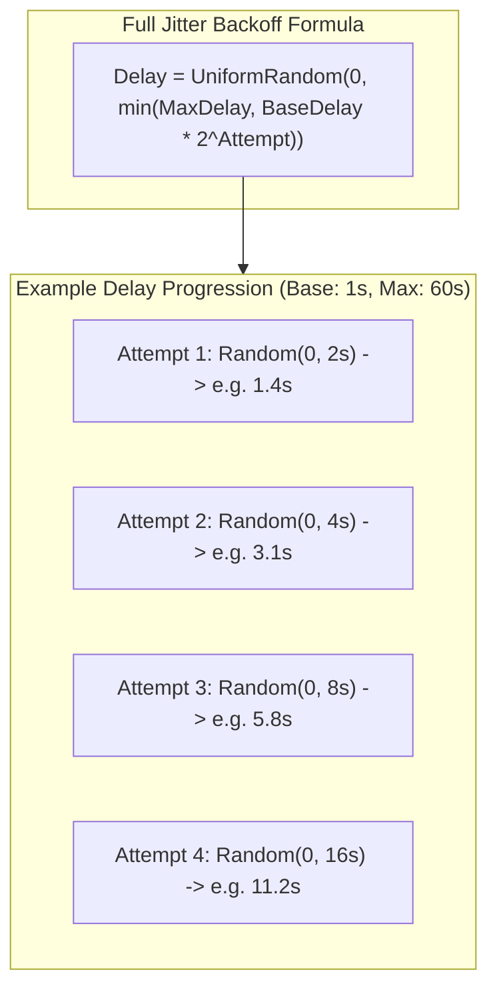

# Retry Strategies, Full Jitter, Poison Pills, and Zombie Worker Recovery

---

## 1. What Is It?
In background processing architectures:
- **Exponential Backoff with Full Jitter**: A mathematical retry algorithm that progressively increases the delay between retry attempts while adding uniform randomization to prevent synchronized retry storms.
- **Poison Pill**: A malformed or permanently unprocessable job payload (e.g. corrupted byte array or divide-by-zero bug) that causes any worker executing it to crash or fail.
- **Zombie Task Recovery**: An automated reconciliation mechanism that detects and re-queues tasks abandoned in a `PROCESSING` state when a worker pod terminates abruptly (e.g. OOM kill or server power loss).

---

## 2. Why Does It Exist?
- **The Self-Inflicted Retry Storm (Immediate Retries)**: If a downstream payment API suffers a brief 5-second outage, 10,000 workers executing immediate retries will hammer the recovering service with **100,000 requests/sec**, permanently preventing it from recovering.
- **The Poison Pill Death Loop**: Without a Dead Letter Queue (DLQ) and max retry threshold, a single poison pill message will be polled, crash worker 1, get re-queued, crash worker 2, and cascade across the entire cluster until **every background worker pod has crashed!**

---

## 3. Mental Model: Exponential Backoff with Full Jitter



---

## 4. How Does It Work?

### 1. The 3 Backoff Algorithms Compared (AWS Architecture Research)
1. **No Jitter ($T = B \cdot 2^c$)**: All 1,000 failing workers retry at the exact same synchronized second (**Thundering Herd Spikes**).
2. **Equal Jitter ($T = \frac{B \cdot 2^c}{2} + \text{random}(0, \frac{B \cdot 2^c}{2})$)**: Partial smoothing.
3. **Full Jitter ($T = \text{random}(0, \min(M, B \cdot 2^c))$)**: **The Gold Standard**. Spreads retry load perfectly evenly across the entire time window, minimizing peak network collision.

---

### 2. Zombie Task Recovery (Worker Heartbeats)
What happens if a worker pod is killed by Linux kernel OOM killer while a job is in `PROCESSING` state?
- The database row remains marked `status = 'PROCESSING'` forever (**Zombie Task**).
- **The Recovery Daemon**:
  - Workers update a heartbeat timestamp (`last_heartbeat = CURRENT_TIMESTAMP`) every $30\text{ seconds}$ during execution.
  - A background **Zombie Cleaner Cron** runs every 2 minutes:
    ```sql
    UPDATE background_jobs 
    SET status = 'PENDING', locked_by = NULL 
    WHERE status = 'PROCESSING' 
      AND last_heartbeat < CURRENT_TIMESTAMP - INTERVAL '3 minutes';
    ```
  - Abandoned tasks are safely unlocked and re-queued for healthy workers to resume!

---

## 5. Implementation: Full Jitter Backoff Calculator in Java 21

```java
package com.backend.engineering.jobs.retry;

import java.time.Duration;
import java.util.concurrent.ThreadLocalRandom;

public class FullJitterBackoffCalculator {

    private final long baseDelayMillis;
    private final long maxDelayMillis;

    public FullJitterBackoffCalculator(long baseDelayMillis, long maxDelayMillis) {
        this.baseDelayMillis = baseDelayMillis;
        this.maxDelayMillis = maxDelayMillis;
    }

    public Duration calculateBackoff(int retryAttempt) {
        // Calculate raw exponential ceiling: Base * 2^attempt
        long exponentialCeiling = (long) (baseDelayMillis * Math.pow(2, retryAttempt));
        
        // Truncate to Max Delay
        long cappedCeiling = Math.min(maxDelayMillis, exponentialCeiling);

        // Apply Uniform Full Jitter: Random(0, cappedCeiling)
        long sleepTime = ThreadLocalRandom.current().nextLong(0, cappedCeiling + 1);

        return Duration.ofMillis(sleepTime);
    }
}
```

---

## 6. Performance

| Retry Strategy | Peak Concurrent Collision Load | Time to Service Recovery | Risk of Cascading Outage |
|---|---|---|:---:|
| Immediate Retries | **$10\times$ Normal Load (DDoS)** | Blocked indefinitely | **Critical (SEV-1 Outage)** |
| Exponential (No Jitter) | High periodic spikes | Slow | Moderate |
| **Exponential + Full Jitter** | **Flat, Smooth Line ($\approx 1\times$)** | **Fastest Recovery** | **Zero** |

---

## 7. Interview Questions

### Q1: What is a Poison Pill message in background queues, and how do you protect worker pools from total failure?
<details>
<summary>Reveal Answer</summary>

**Answer**:
A **Poison Pill** is a corrupt, malformed, or unprocessable job payload (e.g. invalid JSON syntax, missing mandatory fields, or code triggering an unhandled `NullPointerException` or JVM crash) that cannot succeed regardless of how many times it is retried.
Without safeguards, workers pull the message, crash, return the message to the queue via visibility timeout expiration, and crash again in an infinite loop.
**Protection Architecture**:
1. **Max Retry Budget**: Enforce a strict maximum retry limit (e.g. 3 attempts).
2. **Dead Letter Queue (DLQ / DLT)**: Once `retry_count >= max_retries`, catch the exception and route the payload to a separate **Dead Letter Queue (`jobs:dlq`)**, marking the database status as `DEAD_LETTER`.
3. **SRE Alerting**: Trigger PagerDuty/Slack notifications whenever a message enters the DLQ.
4. **Poison Pill Isolation**: By removing the poison pill from the active queue, worker pools continue processing valid jobs with zero downtime.
</details>

---

## 8. Quick Revision
- **Full Jitter**: $T = \text{random}(0, \min(M, B \cdot 2^c))$; spreads retries evenly to prevent thundering herds.
- **Poison Pill**: Malformed job that crashes workers; isolate immediately to a **Dead Letter Queue (DLQ)**.
- **Max Retries**: Always enforce a ceiling (e.g. 3-5 retries) before terminating to DLQ.
- **Zombie Recovery**: Background cleaner re-queues tasks stuck in `PROCESSING` with expired heartbeats.
