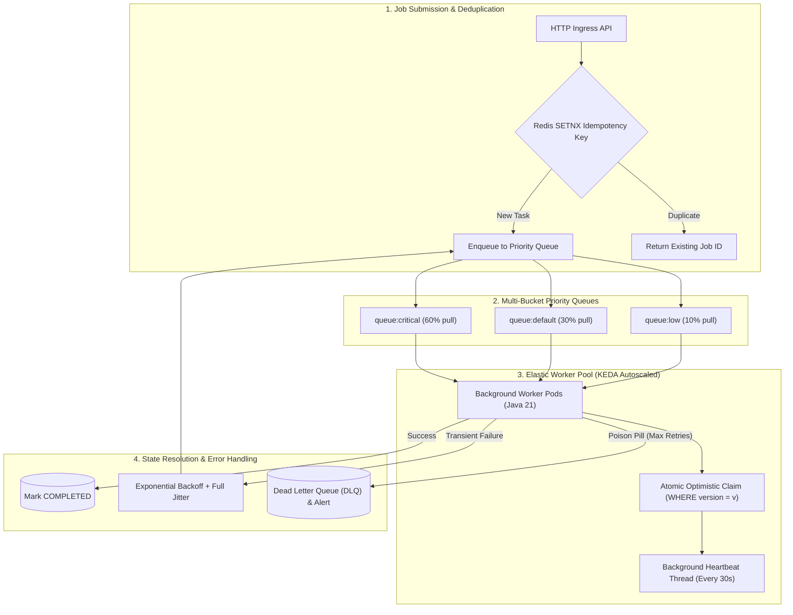

# Module 21: Background Jobs & Workers

Master asynchronous background processing architectures: Periodic Crons vs Delayed One-Off Tasks vs Continuous Queue Workers, distributed scheduling with ShedLock and Clustered Quartz, Multi-Bucket Priority Queues, KEDA Kubernetes auto-scaling on queue depth, optimistic lock task claiming, Exponential Backoff with Full Jitter, Poison Pill Dead Letter Queues (DLQ), and Zombie Worker recovery.

---

## 🗺️ Master Background Worker Lifecycle & Queue Architecture

---

## 📚 Curriculum Lessons

| # | Lesson | Core Focus & Mechanics |
|:---:|---|---|
| **01** | [`01-background-job-paradigms-cron-vs-delayed-vs-queues.md`](./01-background-job-paradigms-cron-vs-delayed-vs-queues.md) | Periodic Crons vs Delayed Tasks (`ZSet`) vs Continuous Queue Workers, and the multi-pod `@Scheduled` execution hazard. |
| **02** | [`02-distributed-job-schedulers-shedlock-and-quartz.md`](./02-distributed-job-schedulers-shedlock-and-quartz.md) | Distributed cron locks, ShedLock (`lockAtLeastFor` / `lockAtMostFor`), and Clustered Quartz database state machines. |
| **03** | [`03-queue-worker-architecture-and-priority-queues.md`](./03-queue-worker-architecture-and-priority-queues.md) | Weighted Fair Queueing (WFQ), SQS / Redis visibility timeouts, and KEDA queue depth autoscaling. |
| **04** | [`04-job-idempotency-deduplication-and-state-machines.md`](./04-job-idempotency-deduplication-and-state-machines.md) | Ingress task deduplication (`SETNX`), the 5-state lifecycle machine, and lock-free optimistic SQL task claiming. |
| **05** | [`05-retry-strategies-exponential-backoff-and-poison-pills.md`](./05-retry-strategies-exponential-backoff-and-poison-pills.md) | Exponential backoff with Full Jitter, Poison Pill Dead Letter Queues (DLQ), and automated Zombie task recovery. |

---

## ⚡ Key Production Takeaways

1. **Never Run Raw `@Scheduled` Multi-Pod**: Always guard Spring `@Scheduled` methods with ShedLock to prevent duplicate cron executions across Kubernetes pods.
2. **Weighted Fair Queueing (WFQ)**: Use weighted ratios (60/30/10) on priority queues to guarantee high-priority latency while preventing low-priority starvation.
3. **Use Full Jitter on Retries**: Apply `random(0, min(Max, Base * 2^attempt))` to spread retry spikes evenly and prevent self-inflicted DDoS storms.
4. **Isolate Poison Pills to DLQ**: Enforce a strict max retry ceiling and route failing messages to a Dead Letter Queue to protect worker pools from crash loops.
5. **Zombie Task Recovery**: Run a background cleaner that detects and re-queues tasks stuck in `PROCESSING` whose worker heartbeat has expired.
