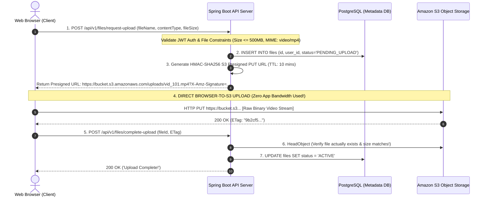

# Direct Browser Uploads, S3 Presigned URLs, and Security Constraints

---

## 1. What Is It?
An **S3 Presigned URL** is a temporary, cryptographically signed URL generated by a backend application using AWS IAM credentials that grants a client (browser or mobile app) direct, time-limited permission to upload (`HTTP PUT`) or download (`HTTP GET`) an object to/from Amazon S3 without requiring AWS credentials or passing through backend server proxies.

---

## 2. Why Does It Exist?
In naive file upload architectures, clients stream multi-gigabyte video files directly through application microservice pods:

```text
Browser -> [Upload 1GB Video] -> Spring Boot Pod (RAM/Bandwidth Saturated!) -> AWS S3
```

### The 4 Application Proxying Bottlenecks:
1. **Network Egress Double-Billing**: The backend server pays for double bandwidth: receiving the 1GB inbound stream and sending a 1GB outbound stream to S3.
2. **JVM Heap Exhaustion**: If 50 users upload large files concurrently, multipart buffering in Tomcat consumes gigabytes of heap memory, triggering Garbage Collection freezes.
3. **HTTP Connection Starvation**: Long-running uploads hold open application server worker threads for minutes, blocking standard transactional API traffic.

**Direct-to-S3 Uploads via Presigned URLs** offload all data transfer directly to AWS S3 infrastructure.

---

## 3. Mental Model: Direct-to-S3 Presigned Upload Lifecycle



---

## 4. How Does It Work?

### Cryptographic URL Signature (AWS Signature Version 4)
The Presigned URL embeds query parameters signed using the backend's AWS Secret Access Key:
- `X-Amz-Algorithm=AWS4-HMAC-SHA256`
- `X-Amz-Credential=AKIA.../20260901/us-east-1/s3/aws4_request`
- `X-Amz-Date=20260901T150000Z`
- `X-Amz-Expires=600` (10 minutes)
- `X-Amz-Signature=4a8b...` (HMAC cryptographic proof)

If an attacker tampers with the URL (e.g. changing the target bucket or file path), the cryptographic signature check fails at S3's edge, and S3 rejects the upload with `403 Forbidden`.

---

## 5. Implementation: Presigned URL Generator in Java 21 (AWS SDK v2)

```java
package com.backend.engineering.storage.presigned;

import org.slf4j.Logger;
import org.slf4j.LoggerFactory;
import org.springframework.stereotype.Service;
import software.amazon.awssdk.services.s3.model.PutObjectRequest;
import software.amazon.awssdk.services.s3.presigner.S3Presigner;
import software.amazon.awssdk.services.s3.presigner.model.PresignedPutObjectRequest;
import software.amazon.awssdk.services.s3.presigner.model.PutObjectPresignRequest;

import java.time.Duration;
import java.util.Map;
import java.util.Set;
import java.util.UUID;

@Service
public class S3PresignedUploadService {

    private static final Logger log = LoggerFactory.getLogger(S3PresignedUploadService.class);
    private static final String BUCKET_NAME = "production-user-uploads";
    private static final Set<String> ALLOWED_MIME_TYPES = Set.of("image/jpeg", "image/png", "application/pdf", "video/mp4");
    private static final long MAX_FILE_SIZE_BYTES = 500 * 1024 * 1024L; // 500MB

    private final S3Presigner s3Presigner;

    public S3PresignedUploadService(S3Presigner s3Presigner) {
        this.s3Presigner = s3Presigner;
    }

    public PresignedUploadResponse generatePresignedUploadUrl(String originalFileName, String contentType, long fileSizeBytes) {
        // 1. Strict Security & MIME Type Validation
        if (!ALLOWED_MIME_TYPES.contains(contentType)) {
            throw new IllegalArgumentException("Unsupported media type: " + contentType);
        }
        if (fileSizeBytes <= 0 || fileSizeBytes > MAX_FILE_SIZE_BYTES) {
            throw new IllegalArgumentException("File size exceeds 500MB limit");
        }

        // 2. Generate Collision-Free Unique S3 Key
        String uniqueObjectKey = "uploads/" + UUID.randomUUID() + "-" + sanitizeFileName(originalFileName);

        // 3. Build PutObject Request with Metadata & Content-Type binding
        PutObjectRequest objectRequest = PutObjectRequest.builder()
                .bucket(BUCKET_NAME)
                .key(uniqueObjectKey)
                .contentType(contentType)
                .contentLength(fileSizeBytes) // Strict length enforcement!
                .metadata(Map.of("original-filename", originalFileName))
                .build();

        // 4. Generate Presigned URL with a 10-Minute Expiration Window
        PutObjectPresignRequest presignRequest = PutObjectPresignRequest.builder()
                .signatureDuration(Duration.ofMinutes(10))
                .putObjectRequest(objectRequest)
                .build();

        PresignedPutObjectRequest presignedObject = s3Presigner.presignPutObject(presignRequest);
        String uploadUrl = presignedObject.url().toString();

        log.info("Generated Presigned PUT URL for key [{}] expiring in 10 minutes", uniqueObjectKey);
        return new PresignedUploadResponse(uniqueObjectKey, uploadUrl, 600);
    }

    private String sanitizeFileName(String fileName) {
        return fileName.replaceAll("[^a-zA-Z0-9.-]", "_");
    }

    public record PresignedUploadResponse(String objectKey, String uploadUrl, int expiresInSeconds) {}
}
```

---

## 6. Performance

| Upload Architecture | Backend Server CPU Load ($100\text{ Concurrent 1GB Uploads}$) | App Bandwidth Consumed | Max File Size Scalability |
|---|---|---|:---:|
| Server Proxying (Spring Boot) | **$100\%$ (Crashed & OOM)** | $100\text{GB In} + 100\text{GB Out}$ | $< 50\text{MB}$ |
| **Direct-to-S3 Presigned URLs** | **$\mathbf{< 1\%}$ (Only generates URL)** | **$\mathbf{0\text{ bytes}}$ (Direct to S3)** | **$5\text{TB}$ (S3 Limits)** |

---

## 7. Interview Questions

### Q1: How do you prevent malicious users from uploading malicious files (e.g. 50GB files or executable `.exe` files) when using S3 Presigned URLs?
<details>
<summary>Reveal Answer</summary>

**Answer**:
A multi-layered defense must be enforced:
1. **Cryptographic Header Binding in Presigned URL**: When generating the presigned URL, bind the exact `Content-Type` (e.g. `image/png`) and `Content-Length`. If the client attempts to upload an executable with a different MIME type or size, S3's Signature V4 verification fails and rejects the upload.
2. **Two-Phase Completion Confirmation**: The backend marks the database record as `PENDING_UPLOAD`. The client must invoke a `/complete-upload` endpoint upon finishing.
3. **Backend `HeadObject` Verification**: The backend executes an S3 `HeadObject` call to verify the actual uploaded file's byte size and MIME headers directly from S3 metadata before marking the file `ACTIVE`.
4. **Asynchronous Malware / Antivirus Scanning**: An S3 Event triggers an asynchronous AWS Lambda / worker to scan the file (e.g. ClamAV) and convert/sanitize images before making them public.
</details>

---

## 8. Quick Revision
- **Presigned URLs**: Grants temporary cryptographic access (`GET`/`PUT`) directly to S3.
- **Bypasses App Server**: Eliminates double bandwidth billing and JVM heap buffer bloat.
- **Short TTL**: Always set short expiration windows ($5-15\text{ minutes}$).
- **Signature V4**: Query parameters contain HMAC signature proof of permissions.
- **Two-Phase Commit**: Generate URL $\to$ Direct Upload $\to$ Complete & Verify via `HeadObject`.
