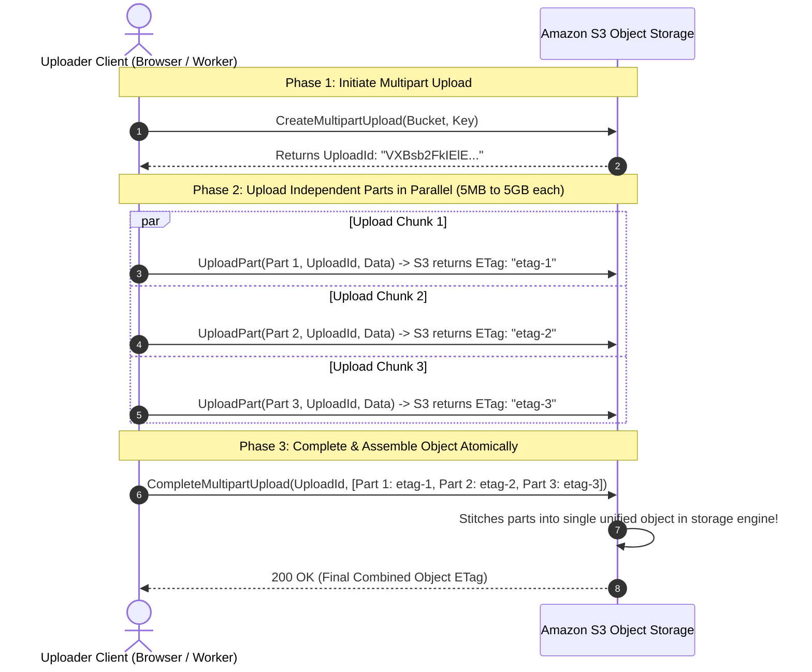

# S3 Multipart Uploads, Parallel Chunk Streaming, and Orphaned Part Cleanup

---

## 1. What Is It?
An **S3 Multipart Upload** is an Amazon S3 API protocol designed for uploading large files (from $100\text{MB}$ up to $5\text{TB}$) by splitting the object into discrete, independently transmitted **Parts (Chunks)** ranging from $5\text{MB}$ to $5\text{GB}$ each.

---

## 2. Why Does It Exist?
Attempting to upload a $50\text{GB}$ file over a single standard HTTP `PUT` request is fragile:
- **Network Glitch Catastrophe**: If a network connection drops at $49.8\text{GB}$ ($99.6\%$ completion), the entire upload fails, forcing the user to **restart the 50GB upload from byte zero**.
- **Bandwidth Underutilization**: A single sequential TCP stream cannot saturate high-speed Gigabit network connections.

**Multipart Uploads enable Parallelism and Fault Recovery**:
- 10 chunks upload concurrently in parallel, multiplying upload speed by $5-10\times$.
- If Chunk 4 fails, **only Chunk 4 is retried**, while all other successfully uploaded chunks remain safely stored in S3.

---

## 3. Mental Model: The 3-Phase Multipart Upload Lifecycle



---

## 4. How Does It Work?

### 1. Part Sizing & Constraints
- **Minimum Part Size**: $5\text{MB}$ (except the final last part, which can be any size).
- **Maximum Part Size**: $5\text{GB}$.
- **Maximum Number of Parts**: $10,000$ parts per object.
- **Maximum Total Object Size**: $10,000 \times 5\text{GB} = \mathbf{5\text{TB}}$.

---

### 2. The Dangerous "Orphaned Incomplete Multipart Upload" Billing Trap

$$\textbf{The Trap: } \text{Parts uploaded for an incomplete multipart upload are BILLED at standard S3 storage rates forever until explicitly completed or aborted!}$$

If a user uploads $40\text{GB}$ of parts and abandons the session without completing or calling `AbortMultipartUpload`, the $40\text{GB}$ of hidden binary chunks remain stored in S3 indefinitely, running up thousands of dollars in hidden AWS bills!

#### Production Solution: S3 Lifecycle Rule for Incomplete Multipart Uploads
```xml
<!-- Automatically delete aborted/incomplete multipart parts after 7 days -->
<LifecycleConfiguration>
    <Rule>
        <ID>AbortIncompleteMultipartUploadsAfter7Days</ID>
        <Status>Enabled</Status>
        <Filter><Prefix></Prefix></Filter>
        <AbortIncompleteMultipartUpload>
            <DaysAfterInitiation>7</DaysAfterInitiation>
        </AbortIncompleteMultipartUpload>
    </Rule>
</LifecycleConfiguration>
```

---

## 5. Implementation: Multipart Upload Coordinator in Java 21 (AWS SDK v2)

```java
package com.backend.engineering.storage.multipart;

import org.slf4j.Logger;
import org.slf4j.LoggerFactory;
import org.springframework.stereotype.Service;
import software.amazon.awssdk.core.sync.RequestBody;
import software.amazon.awssdk.services.s3.S3Client;
import software.amazon.awssdk.services.s3.model.*;

import java.io.InputStream;
import java.util.ArrayList;
import java.util.List;

@Service
public class S3MultipartUploadManager {

    private static final Logger log = LoggerFactory.getLogger(S3MultipartUploadManager.class);
    private static final String BUCKET_NAME = "production-raw-videos";
    private final S3Client s3Client;

    public S3MultipartUploadManager(S3Client s3Client) {
        this.s3Client = s3Client;
    }

    // Phase 1: Initiate
    public String initiateUpload(String objectKey, String contentType) {
        CreateMultipartUploadRequest createRequest = CreateMultipartUploadRequest.builder()
                .bucket(BUCKET_NAME)
                .key(objectKey)
                .contentType(contentType)
                .build();

        CreateMultipartUploadResponse response = s3Client.createMultipartUpload(createRequest);
        log.info("Initiated Multipart Upload for [{}] with UploadId: {}", objectKey, response.uploadId());
        return response.uploadId();
    }

    // Phase 2: Upload Single Part
    public CompletedPart uploadPart(String objectKey, String uploadId, int partNumber, InputStream data, long partSize) {
        UploadPartRequest uploadPartRequest = UploadPartRequest.builder()
                .bucket(BUCKET_NAME)
                .key(objectKey)
                .uploadId(uploadId)
                .partNumber(partNumber)
                .contentLength(partSize)
                .build();

        UploadPartResponse response = s3Client.uploadPart(uploadPartRequest, RequestBody.fromInputStream(data, partSize));

        log.info("Part #{} uploaded. ETag: {}", partNumber, response.etag());
        return CompletedPart.builder()
                .partNumber(partNumber)
                .eTag(response.etag())
                .build();
    }

    // Phase 3: Complete Assembly
    public void completeUpload(String objectKey, String uploadId, List<CompletedPart> completedParts) {
        CompletedMultipartUpload completedMultipartUpload = CompletedMultipartUpload.builder()
                .parts(completedParts) // Must be sorted in ascending order of PartNumber!
                .build();

        CompleteMultipartUploadRequest completeRequest = CompleteMultipartUploadRequest.builder()
                .bucket(BUCKET_NAME)
                .key(objectKey)
                .uploadId(uploadId)
                .multipartUpload(completedMultipartUpload)
                .build();

        s3Client.completeMultipartUpload(completeRequest);
        log.info("Multipart upload completed successfully for object: {}", objectKey);
    }

    // Rollback / Abort Cleanup
    public void abortUpload(String objectKey, String uploadId) {
        AbortMultipartUploadRequest abortRequest = AbortMultipartUploadRequest.builder()
                .bucket(BUCKET_NAME)
                .key(objectKey)
                .uploadId(uploadId)
                .build();
        s3Client.abortMultipartUpload(abortRequest);
        log.warn("Aborted multipart upload [{}] and freed all intermediate chunk storage.", uploadId);
    }
}
```

---

## 6. Performance

| Upload Method ($10\text{GB}$ Video File) | Bandwidth Saturation | Failure Recovery Cost | Total Upload Time |
|---|---|---|:---:|
| Single Sequential `PUT` | Low ($1\text{ TCP stream}$) | Re-upload entire $10\text{GB}$ | $\approx 8.5\text{ minutes}$ |
| **Multipart Upload ($10\text{ Parallel Streams}$)** | **High ($10\text{ TCP streams}$)** | **Re-upload single $10\text{MB}$ chunk** | **$\approx 1.2\text{ minutes}$ ($7\times$ Faster!)** |

---

## 7. Interview Questions

### Q1: Why must S3 Lifecycle Rules be configured to automatically abort incomplete multipart uploads in production AWS environments?
<details>
<summary>Reveal Answer</summary>

**Answer**:
When a client initiates an S3 Multipart Upload and uploads parts (e.g. 50 chunks of 100MB each = 5GB total), those binary chunks are saved in S3 storage. However, they **do not appear as visible objects in standard bucket listings** until `CompleteMultipartUpload` is called.
If a client crashes, loses network connectivity, or abandons the upload without explicitly calling `AbortMultipartUpload`:
1. S3 continues storing those 5GB of uploaded chunks **indefinitely**.
2. AWS bills the account for those hidden bytes at standard S3 storage rates every month.
3. In high-volume platforms with thousands of daily uploads, orphaned incomplete multipart uploads accumulate **terabytes of hidden, unrecoverable data costing thousands of dollars per month**.
**Mitigation**: Always configure an S3 Bucket Lifecycle Rule with `AbortIncompleteMultipartUpload: 7 Days` to automatically purge all uncompleted chunks older than 7 days.
</details>

---

## 8. Quick Revision
- **Multipart S3**: For files $> 100\text{MB}$ up to $5\text{TB}$.
- **3-Phase Lifecycle**: Initiate (`CreateMultipartUpload`) $\to$ Upload Parts $\to$ Complete (`CompleteMultipartUpload`).
- **Parallelism**: Multiple chunks upload simultaneously, saturating network bandwidth.
- **Fault Recovery**: Failed parts are retried individually without restarting the entire file.
- **Lifecycle Cleanup**: Enforce `AbortIncompleteMultipartUpload` after 7 days to eliminate hidden storage bills.
