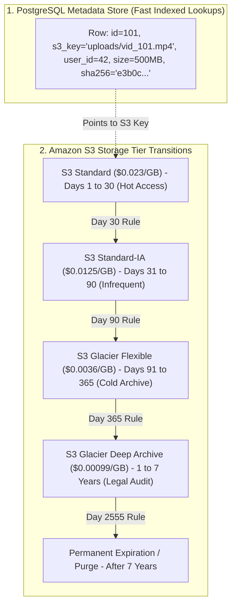

# Metadata Storage Modeling and S3 Storage Tier Lifecycle Policies

---

## 1. What Is It?
A **Hybrid File Storage Architecture** pairs a relational database (PostgreSQL) for rich, indexed, fast transactional **Metadata Management** with an object storage engine (Amazon S3) for durable, low-cost **Binary Object Persistence**.

**S3 Lifecycle Policies** are automated rule engines that transition aging objects through increasingly cost-effective storage tiers (e.g. S3 Standard $\to$ S3 Glacier $\to$ Glacier Deep Archive $\to$ Permanent Deletion) based on object age and access patterns.

---

## 2. Why Does It Exist?
- **S3 Query Limitations**: Object storage engines cannot execute complex SQL queries (e.g. *"Find all PDF files uploaded by User 42 between June and August that are larger than 5MB"*). Querying S3 directly requires expensive, slow full-bucket prefix scans.
- **Storage Cost Optimization**: Retaining terabytes of historical logs, user invoices, or raw video footage in **S3 Standard** indefinitely is a massive waste of cloud budget. Transitioning cold files to **S3 Glacier Deep Archive** cuts storage costs by **$95.7\%$**!

---

## 3. Mental Model: Relational Metadata + S3 Tier Transitions



---

## 4. How Does It Work?

### 1. Production PostgreSQL File Metadata Schema
```sql
CREATE TABLE file_assets (
    id UUID PRIMARY KEY,
    user_id BIGINT NOT NULL,
    bucket_name VARCHAR(64) NOT NULL,
    s3_key VARCHAR(512) NOT NULL UNIQUE,
    original_file_name VARCHAR(255) NOT NULL,
    mime_type VARCHAR(128) NOT NULL,
    file_size_bytes BIGINT NOT NULL,
    sha256_checksum CHAR(64) NOT NULL,
    status VARCHAR(32) NOT NULL DEFAULT 'PENDING_UPLOAD', -- PENDING_UPLOAD, ACTIVE, ARCHIVED, DELETED
    storage_class VARCHAR(32) NOT NULL DEFAULT 'STANDARD',
    created_at TIMESTAMP WITH TIME ZONE DEFAULT CURRENT_TIMESTAMP NOT NULL,
    updated_at TIMESTAMP WITH TIME ZONE DEFAULT CURRENT_TIMESTAMP NOT NULL
);

-- Fast B+Tree Indexes for Instant Filtering
CREATE INDEX idx_file_assets_user_status ON file_assets (user_id, status);
CREATE INDEX idx_file_assets_checksum ON file_assets (sha256_checksum); -- Deduplication lookups!
```

---

### 2. S3 Storage Class Cost & Retrieval Hierarchy

| S3 Storage Class | Cost per GB / Month | Minimum Storage Duration | Retrieval Latency | Best Use Case |
|---|---|---|---|---|
| **S3 Standard** | $\$0.023$ | None | **Milliseconds** | Frequently accessed active data |
| **S3 Intelligent-Tiering** | $\$0.023$ (Auto-adjusts) | None | Milliseconds | Unpredictable or shifting access |
| **S3 Standard-IA** | $\$0.0125$ ($45\%$ cheaper) | 30 Days | Milliseconds | Monthly backups, user history |
| **S3 Glacier Flexible** | $\$0.0036$ ($84\%$ cheaper) | 90 Days | Minutes to Hours | Yearly compliance archives |
| **S3 Glacier Deep Archive** | **$\$0.00099$ ($95.7\%$ cheaper!)** | 180 Days | **$9 - 12\text{ Hours}$** | **7-year legal / tax records** |

---

## 5. Implementation: Automated S3 Lifecycle Rule Configuration

```xml
<LifecycleConfiguration>
    <!-- Rule: Tiering for Customer Billing Documents -->
    <Rule>
        <ID>BillingDocumentsTieringLifecycle</ID>
        <Filter>
            <Prefix>invoices/</Prefix>
        </Filter>
        <Status>Enabled</Status>

        <!-- Day 30: Transition to Infrequent Access -->
        <Transition>
            <Days>30</Days>
            <StorageClass>STANDARD_IA</StorageClass>
        </Transition>

        <!-- Day 90: Transition to Cold Glacier -->
        <Transition>
            <Days>90</Days>
            <StorageClass>GLACIER</StorageClass>
        </Transition>

        <!-- Day 365: Transition to Deep Archive -->
        <Transition>
            <Days>365</Days>
            <StorageClass>DEEP_ARCHIVE</StorageClass>
        </Transition>

        <!-- Day 2555 (7 Years): Permanent Expiration -->
        <Expiration>
            <Days>2555</Days>
        </Expiration>
    </Rule>
</LifecycleConfiguration>
```

---

## 6. Performance & Cost Impact

| Scenario: Storing $100\text{TB}$ of Cold Historical Files | Monthly Cost in S3 Standard | Monthly Cost in S3 Glacier Deep Archive | Annual Financial Savings |
|---|---|---|:---:|
| $100\text{TB}$ Raw Logs / Video Archives | $\$2,300\text{ / month}$ | **$\$99\text{ / month}$** | **$\$26,412\text{ / year Saved!}$** |

---

## 7. Interview Questions

### Q1: Why is S3 Glacier Deep Archive not suitable for storing user-facing thumbnail images or active profile pictures?
<details>
<summary>Reveal Answer</summary>

**Answer**:
S3 Glacier Deep Archive is designed strictly for cold, offline compliance archiving.
1. **Retrieval Latency (9 to 12 Hours)**: When an object is requested from Glacier Deep Archive, it cannot be downloaded immediately over HTTP. An application must first issue a `RestoreObject` API call and wait **9 to 12 hours** for AWS to physically stage the bytes into temporary hot storage. Attempting to serve a user's avatar from Deep Archive would cause a 12-hour timeout.
2. **Retrieval Cost**: While storage is dirt cheap ($\$0.00099/\text{GB}$), reading/retrieving data incurs per-GB retrieval fees.
3. **Minimum Duration Penalty**: Objects deleted or overwritten before 180 days are still billed for the full 180 days.
**Rule**: Use S3 Standard or S3 Intelligent-Tiering for active media; reserve Glacier Deep Archive exclusively for long-term legal audits and disaster recovery snapshots.
</details>

---

## 8. Quick Revision
- **Hybrid Storage**: PostgreSQL stores metadata (indexes, MIME, checksums); S3 stores raw binary bytes.
- **Deduplication**: Hash files with SHA-256 in DB to prevent duplicate S3 object uploads.
- **Glacier Deep Archive**: $\$0.00099/\text{GB}$ ($95\%$ cheaper) with 9–12 hour retrieval latency.
- **Automated Lifecycle**: XML rules automatically tier aging files without application code changes.
