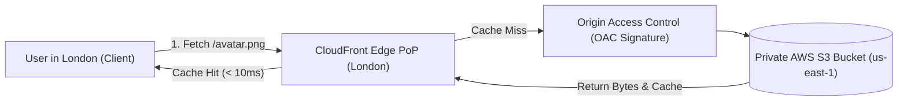
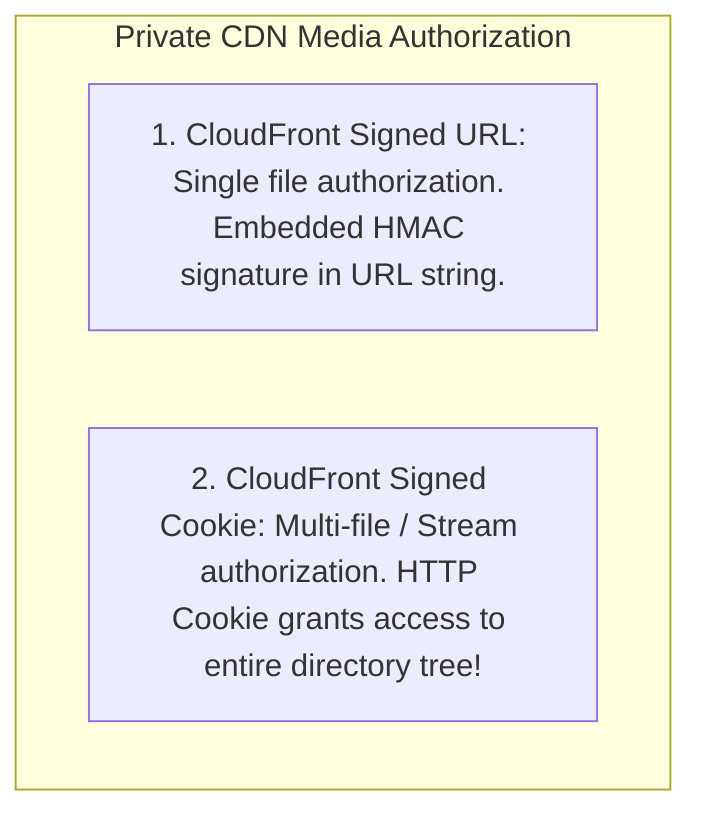

# CDN Integration, Origin Access Control, and CloudFront Signed Cookies

---

## 1. What Is It?
A **Content Delivery Network (CDN)** (e.g. Amazon CloudFront, Cloudflare, Fastly) is a globally distributed network of edge proxy servers (Points of Presence / PoPs) that cache and deliver static and streaming media assets (images, videos, JS/CSS) to end-users from geographical locations closest to them, minimizing network latency and offloading traffic from the origin S3 bucket.

---

## 2. Why Does It Exist?
- **Speed of Light Latency**: An S3 bucket in `us-east-1` (Virginia) requires $\approx 150 - 250\text{ms}$ of round-trip network time to serve a user in Singapore or London. A CDN Edge location in Singapore caches and serves the file locally in **$< 10\text{ms}$**.
- **S3 Origin Egress Costs**: Direct S3 data egress costs $\approx \$0.09\text{/GB}$, while CDN delivery is significantly cheaper and saves origin S3 read request fees.
- **S3 Security (Origin Protection)**: Public S3 buckets are vulnerable to accidental data leaks. CDNs use **Origin Access Control (OAC)** to lock down S3 buckets so that files can **ONLY be accessed through the CDN**.

---

## 3. Mental Model: S3 Origin + CloudFront Edge Topology



---

## 4. Serving Private & Paid Media: Signed URLs vs Signed Cookies

When users purchase paid video courses, private medical records, or subscription streaming content:
- Public CDN caching cannot be used.
- The CDN must authenticate user permissions at the Edge.



### Why Signed Cookies Are Mandatory for HLS Video Streaming (m3u8):
In HTTP Live Streaming (HLS), a video is split into a master playlist (`index.m3u8`) and thousands of $2\text{-second}$ chunk files (`segment_001.ts`, `segment_002.ts`):
- Using **Signed URLs** is impossible because the video player would need the backend to rewrite signatures inside every line of the internal `.m3u8` manifest file.
- Setting **3 CloudFront Signed Cookies** (`CloudFront-Policy`, `CloudFront-Signature`, `CloudFront-Key-Pair-Id`) allows the browser video player to automatically fetch all thousands of `.ts` segments seamlessly!

---

## 5. Implementation: Generating CloudFront Signed Cookies in Java 21

```java
package com.backend.engineering.storage.cdn;

import org.slf4j.Logger;
import org.slf4j.LoggerFactory;
import org.springframework.stereotype.Service;
import software.amazon.awssdk.services.cloudfront.CloudFrontUtilities;
import software.amazon.awssdk.services.cloudfront.cookie.CookiesForCustomPolicy;
import software.amazon.awssdk.services.cloudfront.model.CannedSignerRequest;
import software.amazon.awssdk.services.cloudfront.model.CustomSignerRequest;

import java.nio.file.Path;
import java.time.Instant;
import java.time.temporal.ChronoUnit;
import java.util.Map;

@Service
public class CloudFrontSignedCookieService {

    private static final Logger log = LoggerFactory.getLogger(CloudFrontSignedCookieService.class);
    private static final String KEY_PAIR_ID = "K2JCJMDEHXQW5F"; // CloudFront Public Key ID
    private static final String DOMAIN_RESOURCE = "https://media.company.com/courses/java21/*";

    private final CloudFrontUtilities cloudFrontUtilities = CloudFrontUtilities.create();
    private final Path privateKeyPath = Path.of("/etc/secrets/cloudfront-private-key.pem");

    public Map<String, String> generateStreamingCookiesForUser(Long userId) {
        Instant expiration = Instant.now().plus(4, ChronoUnit.HOURS); // 4-Hour Viewing Window

        try {
            // Build Custom Signer Request matching the entire course video directory
            CustomSignerRequest customSignerRequest = CustomSignerRequest.builder()
                    .resourceUrl(DOMAIN_RESOURCE)
                    .privateKey(privateKeyPath)
                    .keyPairId(KEY_PAIR_ID)
                    .expirationDate(expiration)
                    .build();

            // Generate the 3 CloudFront Signed Cookies
            CookiesForCustomPolicy cookies = cloudFrontUtilities.getCookiesForCustomPolicy(customSignerRequest);

            log.info("Generated CloudFront streaming cookies for User {}", userId);

            return Map.of(
                "CloudFront-Policy", cookies.policyHeaderValue(),
                "CloudFront-Signature", cookies.signatureHeaderValue(),
                "CloudFront-Key-Pair-Id", cookies.keyPairIdHeaderValue()
            );

        } catch (Exception ex) {
            log.error("Failed to generate signed cookies: {}", ex.getMessage());
            throw new RuntimeException(ex);
        }
    }
}
```

---

## 6. Cache Invalidation vs Cache Busting (Versioned Filenames)

When updating static web assets (CSS/JS/Images):

| Approach | Mechanics | Latency to Propagate | Financial Cost |
|---|---|---|:---:|
| **CloudFront Invalidation (`CreateInvalidation`)** | Tells all 400+ edge locations to purge cached key `/app.js` | $1 - 5\text{ minutes}$ | Incur fees past 1,000 paths/mo |
| **Cache Busting / Content Hashing** | File is built as `/app.8f3a9b.js` (Unique MD5 hash in filename) | **Instant ($0\text{ latency!})** | **$100\%$ Free & Infinite Cache (1 Year)** |

$$\textbf{Production Standard: } \text{Use Content-Hashed Filenames for static builds; use CDN Invalidation only for emergency hotfixes.}$$

---

## 7. Interview Questions

### Q1: What is Origin Access Control (OAC) in AWS CloudFront and why is it superior to legacy Origin Access Identity (OAI)?
<details>
<summary>Reveal Answer</summary>

**Answer**:
**Origin Access Control (OAC)** is AWS's modern security mechanism that ensures an S3 bucket is accessible **strictly through an Amazon CloudFront distribution**, blocking any direct public HTTP access to the raw S3 bucket.
- **Superiority over legacy OAI**:
  1. **AWS Signature Version 4 (SigV4)**: OAC signs all requests from CloudFront to S3 using SigV4 cryptography, supporting server-side encryption with AWS KMS customer-managed keys (SSE-KMS), which legacy OAI could not support.
  2. **Comprehensive HTTP Method Support**: OAC supports dynamic `PUT`, `POST`, `DELETE`, and `OPTIONS` operations through CloudFront to S3, whereas OAI was limited to `GET` and `HEAD`.
  3. **Granular IAM Policies**: Allows fine-grained IAM resource policies restricting access to specific AWS accounts and CloudFront distribution ARNs.
</details>

---

## 8. Quick Revision
- **CDN**: Edge proxies deliver cached assets globally in $< 10\text{ms}$.
- **Origin Access Control (OAC)**: Locks S3 bucket; forces all traffic through CDN.
- **Signed URLs**: Best for single private file downloads.
- **Signed Cookies**: Best for HLS video streaming (`.m3u8` playlists with thousands of `.ts` chunks).
- **Cache Busting**: Append content hashes to filenames (`main.a1b2c3.js`) to achieve instant zero-cost deployments with 1-year cache headers.
