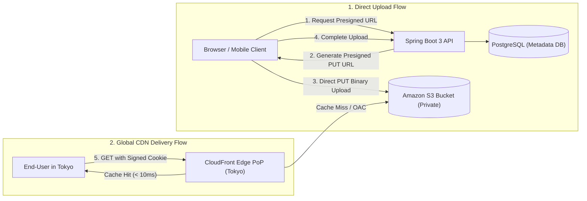

# Module 22: File & Object Storage

Master modern cloud object storage architectures: Object Storage (Amazon S3) vs Block vs File, why storing binary BLOBs in databases is an anti-pattern, direct browser-to-S3 uploads via Presigned URLs, S3 Multipart parallel uploads with orphaned chunk cleanup, relational metadata modeling, automated S3 Lifecycle storage tier transitions, and CloudFront CDN integration with Origin Access Control (OAC) and Signed Cookies.

---

## 🗺️ Master Direct-to-S3 Upload & CDN Delivery Architecture

---

## 📚 Curriculum Lessons

| # | Lesson | Core Focus & Mechanics |
|:---:|---|---|
| **01** | [`01-object-storage-fundamentals-s3-vs-block-vs-file.md`](./01-object-storage-fundamentals-s3-vs-block-vs-file.md) | Object storage (S3) vs Block (EBS) vs File (EFS), and the 5 reasons why storing BLOBs in relational databases destroys performance. |
| **02** | [`02-direct-browser-uploads-and-presigned-urls.md`](./02-direct-browser-uploads-and-presigned-urls.md) | Eliminating application proxying bottlenecks, S3 Presigned URLs (`PUT`), and strict MIME/length cryptographic binding. |
| **03** | [`03-multipart-uploads-and-streaming.md`](./03-multipart-uploads-and-streaming.md) | S3 Multipart parallel uploads for files up to $5\text{TB}$, chunk retry isolation, and S3 Lifecycle incomplete upload cleanup rules. |
| **04** | [`04-metadata-storage-and-lifecycle-policies.md`](./04-metadata-storage-and-lifecycle-policies.md) | Hybrid PostgreSQL metadata modeling, S3 Glacier Deep Archive ($95\%$ savings), and automated XML tier transitions. |
| **05** | [`05-cdn-integration-and-signed-cookies.md`](./05-cdn-integration-and-signed-cookies.md) | CloudFront edge caching, Origin Access Control (OAC), Signed URLs vs Signed Cookies for HLS video streaming, and content hashing. |

---

## ⚡ Key Production Takeaways

1. **Never Store BLOBs in Database**: Store binary files in S3 and rich metadata (size, MIME, checksum) in PostgreSQL.
2. **Use Presigned URLs for Uploads**: Offload binary uploads directly from the browser to S3, bypassing application servers completely.
3. **Abort Incomplete Multipart Uploads**: Always configure an S3 lifecycle rule to purge uncompleted multipart parts after 7 days.
4. **Lock S3 with OAC**: Force all public read traffic through CloudFront CDN using Origin Access Control.
5. **Signed Cookies for Video Streams**: Use CloudFront Signed Cookies to authorize entire HLS `.m3u8` video directories without rewriting URL manifests.
