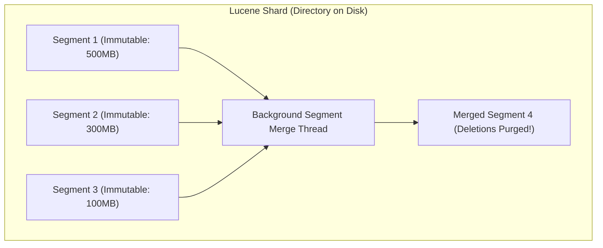

# Search Fundamentals: Inverted Indexes vs B+Trees and Lucene Segments

---

## 1. What Is It?
**Full-Text Search** is the specialized retrieval discipline of querying natural language text documents based on vocabulary terms, linguistic stems, and semantic relevance, rather than exact key matches.

The foundational data structure powering modern search engines (Apache Lucene, Elasticsearch, OpenSearch) is the **Inverted Index**, which maps discrete extracted vocabulary **Terms** to the list of **Document IDs (Postings List)** containing them.

---

## 2. Why Does It Exist?
Attempting to perform full-text search in relational databases using SQL wildcards:
```sql
SELECT * FROM articles WHERE content LIKE '%distributed%';
```
- **The B+Tree Failure**: Standard B+Tree indexes are ordered from left-to-right. A leading wildcard (`%word`) completely invalidates the B+Tree index, forcing the database engine to execute a **Full Table Scan (Sequential Scan)** across millions of rows, taking tens of seconds.
- **No Relevance Ranking**: SQL `LIKE` returns binary boolean matches; it cannot rank which article is *most relevant* to the user.

---

## 3. Mental Model: B+Tree vs Inverted Index

```mermaid
flowchart TD
    subgraph BTree["1. B+Tree Index (Document -> Content)"]
        D1["Doc 1: 'Java is fast'"]
        D2["Doc 2: 'Java is distributed'"]
        D3["Doc 3: 'Kafka is distributed'"]
        Note over BTree: Forward mapping: Key -> Full Record
    end

    subgraph InvertedIndex["2. Inverted Index (Term -> Postings List)"]
        T_Java["'java' --------> [Doc 1, Doc 2]"]
        T_Fast["'fast' --------> [Doc 1]"]
        T_Dist["'distributed' -> [Doc 2, Doc 3]"]
        T_Kafka["'kafka' -------> [Doc 3]"]
        Note over InvertedIndex: Inverted mapping: Word -> List of Matching Doc IDs!
    end
```

---

## 4. How Does It Work?

### 1. Inverted Index Internal Anatomy
An Inverted Index consists of two distinct data structures:
1. **Term Dictionary**: A sorted list of all unique vocabulary terms across the entire corpus. Stored in memory as a compressed **Finite State Transducer (FST)** for microsecond lookups ($O(\text{term length})$).
2. **Postings List**: For each term, a compact, compressed array storing:
   - `DocID`: Which documents contain the term.
   - `Term Frequency (TF)`: How many times the term appears in that document.
   - `Positions`: The exact word offsets inside the document (enables phrase queries: `"distributed systems"`).

```text
Term Dictionary (FST in RAM)      Postings List (On Disk / Page Cache)
+---------------------------+     +----------------------------------------------------+
| "distributed"             | --> | Doc 2 (TF: 3, Pos: [4, 12, 45])                    |
|                           |     | Doc 3 (TF: 1, Pos: [2])                            |
+---------------------------+     +----------------------------------------------------+
```

---

### 2. Multi-Term Intersection via Skip Pointers
When searching for `"distributed AND systems"`:
- The engine fetches the Postings List for `"distributed"` (`[2, 5, 8, 12, 19, 45]`) and `"systems"` (`[5, 12, 45, 90]`).
- Using **Skip Pointers (Skip Lists)** inside the compressed postings lists, it computes the mathematical set intersection in **sub-millisecond time ($< 1\text{ms}$)** without scanning documents!

---

## 5. Apache Lucene Segment Immutability Architecture

Elasticsearch / OpenSearch clusters are collections of **Lucene Shards**.
- Each Shard is composed of multiple **Immutable Segments**.
- **Why Immutability?**:
  1. **Zero Lock Contention**: Concurrent readers read immutable segments with zero synchronization locks.
  2. **OS Page Cache Locality**: Segments remain cached in Linux RAM indefinitely.
- **Deletions**: Handled via a `.del` bitmap (documents are marked deleted and excluded from search results; physical space is reclaimed during background **Segment Merges**).



---

## 6. Performance: B+Tree `LIKE` vs Inverted Index

| Search Query on $10\text{M}$ Documents | Relational DB (`LIKE '%word%'`) | Elasticsearch Inverted Index | Performance Gain |
|---|---|---|:---:|
| Single Term Lookup (`"kafka"`) | $4,850\text{ms}$ (Full Scan) | **$1.2\text{ms}$** | **$4,000\times$ Faster** |
| Multi-Term AND Query | $12,000\text{ms}$ (Full Scan) | **$2.5\text{ms}$ (Skip intersection)** | **$4,800\times$ Faster** |
| Relevance Sorting | Impossible without full scan | **Native (BM25 score)** | **Instant** |

---

## 7. Interview Questions

### Q1: Why is an Inverted Index significantly faster for full-text keyword searches than a relational database B+Tree index?
<details>
<summary>Reveal Answer</summary>

**Answer**:
1. **Index Orientation**:
   - A **B+Tree index** is a *Forward Index* (maps Record Key $\longrightarrow$ Row Values). To find words inside a text string with wildcards (`%keyword%`), the B+Tree cannot jump to the term because the prefix is unknown; it must perform an $O(N)$ full table scan reading every megabyte of text into CPU RAM.
   - An **Inverted Index** inverts the relationship (maps Vocabulary Term $\longrightarrow$ List of Document IDs). Finding documents containing `"database"` takes $O(1)$ time to look up the term in the in-memory Term Dictionary and retrieve its pre-computed list of matching document IDs.
2. **Set Intersection Efficiency**:
   - For multi-word queries (`"cloud" AND "native"`), search engines intersect two pre-sorted integer Postings Lists using hardware-accelerated bitsets and skip pointers in sub-millisecond time, completely bypassing document retrieval until the final ranked IDs are calculated.
</details>

---

## 8. Quick Revision
- **Inverted Index**: Maps unique Terms $\longrightarrow$ Postings Lists of Document IDs.
- **B+Tree Wildcard Flaw**: `LIKE '%word%'` invalidates B+Trees, triggering full table scans.
- **Term Dictionary**: Stored in RAM as a Finite State Transducer (FST) for microsecond lookups.
- **Postings List**: Stores DocIDs, Term Frequencies (TF), and word positions.
- **Lucene Segments**: Immutable disk files merged in background to purge deleted documents.
