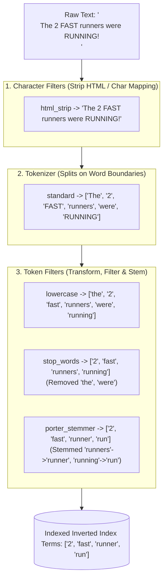

# Text Analysis Pipeline: Tokenization, Stemming, and Elasticsearch Mapping

---

## 1. What Is It?
In search engines, **Text Analysis** is the linguistic and morphological pipeline that transforms raw, unstructured string text into a normalized stream of indexed vocabulary **Tokens (Terms)** stored in the Inverted Index.

The Analysis Pipeline executes in 3 sequential stages:
$$\text{Raw Text} \longrightarrow \mathbf{\text{Character Filters}} \longrightarrow \mathbf{\text{Tokenizer}} \longrightarrow \mathbf{\text{Token Filters}} \longrightarrow \text{Indexed Terms}$$

---

## 2. Why Does It Exist?
Users search with grammatical variations, casing mismatches, punctuation, and typos:
- A user searching for `"run"` expects to find documents containing `"running"`, `"runs"`, and `"RAN"`.
- A user searching for `"microservices"` should match `"Micro-Services"`.

Without text analysis, exact binary string comparisons fail to match natural human search queries.

---

## 3. Mental Model: The 3-Stage Analysis Pipeline



---

## 4. How Does It Work?

### 1. `text` vs `keyword` Field Mapping (The Fundamental Distinction)

| Field Type | Analysis Pipeline | Use Case | Query Type |
|---|---|---|---|
| **`text`** | Full analysis (Tokenized, lowercased, stemmed) | Articles, descriptions, blog posts, comments | `match` / Full-Text search |
| **`keyword`** | **Zero Analysis (Preserved as exact literal string)** | Status strings (`ACTIVE`), tags, emails, IDs | `term` / Exact Filtering, Aggregations |

$$\textbf{Elasticsearch Best Practice: } \text{Use Multi-Fields to index text as both } \texttt{text} \text{ (for search) and } \texttt{keyword} \text{ (for sorting/aggregations).}$$

---

### 2. Stemming vs Lemmatization
- **Stemming (Algorithmic Truncation - Porter/Snowball)**: Uses heuristic rules to chop word endings (e.g. `"arguing"` $\to$ `"argu"`). Fast and lightweight.
- **Lemmatization (Dictionary-Based)**: Uses vocabulary dictionaries to reduce words to their true base lemma (e.g. `"better"` $\to$ `"good"`, `"drove"` $\to$ `"drive"`).

---

## 5. Implementation: Custom Production Analyzer in Elasticsearch

```json
PUT /production_articles
{
  "settings": {
    "analysis": {
      "filter": {
        "english_stop": {
          "type": "stop",
          "stopwords": "_english_"
        },
        "english_stemmer": {
          "type": "stemmer",
          "language": "english"
        },
        "synonym_filter": {
          "type": "synonym",
          "synonyms": [
            "automobile, car",
            "k8s, kubernetes"
          ]
        }
      },
      "analyzer": {
        "custom_english_analyzer": {
          "type": "custom",
          "char_filter": ["html_strip"],
          "tokenizer": "standard",
          "filter": [
            "lowercase",
            "synonym_filter",
            "english_stop",
            "english_stemmer"
          ]
        }
      }
    }
  },
  "mappings": {
    "properties": {
      "title": {
        "type": "text",
        "analyzer": "custom_english_analyzer",
        "fields": {
          "raw": {
            "type": "keyword" // Multi-field: For exact sorting and aggregations!
          }
        }
      },
      "status": {
        "type": "keyword" // Exact match only
      }
    }
  }
}
```

---

## 6. Performance & Search Quality

| User Query | Without Analysis (`keyword`) | With Custom English Analyzer (`text`) |
|---|---|---|
| `"running"` | ❌ No Match (Misses `"Run"`, `"Runner"`) | ✅ **Matches `"Run"`, `"Runs"`, `"Running"`** |
| `"K8S architecture"` | ❌ No Match | ✅ **Matches `"Kubernetes architecture"` via Synonyms** |
| `"<p>FAST</p>"` | ❌ No Match | ✅ **Matches `"fast"` (HTML stripped + lowercased)** |

---

## 7. Interview Questions

### Q1: What is the difference between `match` and `term` queries in Elasticsearch, and why does querying a `text` field with a `term` query usually return zero results?
<details>
<summary>Reveal Answer</summary>

**Answer**:
1. **`match` Query**:
   - Analyzes the search query text through the **exact same analyzer pipeline** used at index time.
   - Searching for `"Running"` lowercases and stems the query to `"run"`, correctly matching the indexed term `"run"`.
2. **`term` Query**:
   - Performs a raw, literal, **un-analyzed exact match** against the Inverted Index.
   - If a field is mapped as `text`, `"Quick Fox"` was analyzed and stored as two lowercase tokens `["quick", "fox"]`.
   - If you execute a `term` query for `{"term": {"title": "Quick"}}`, the query looks for the literal string `"Quick"` with an uppercase 'Q'. Because only lowercase `"quick"` exists in the Inverted Index, the query **fails and returns zero results**.
**Rule**: Always use `term` queries for `keyword` fields and `match` queries for `text` fields.
</details>

---

## 8. Quick Revision
- **The Pipeline**: Character Filters $\to$ Tokenizer $\to$ Token Filters.
- **`text` vs `keyword`**: `text` is analyzed for search; `keyword` is exact for filters/sorting.
- **Stemming**: Normalizes words to grammatical roots (`running` $\to$ `run`).
- **Synonyms**: Expands terms at search time (`k8s` $\to$ `kubernetes`).
- **Multi-Fields**: Map fields as both `text` and `keyword` using `.fields.raw`.
