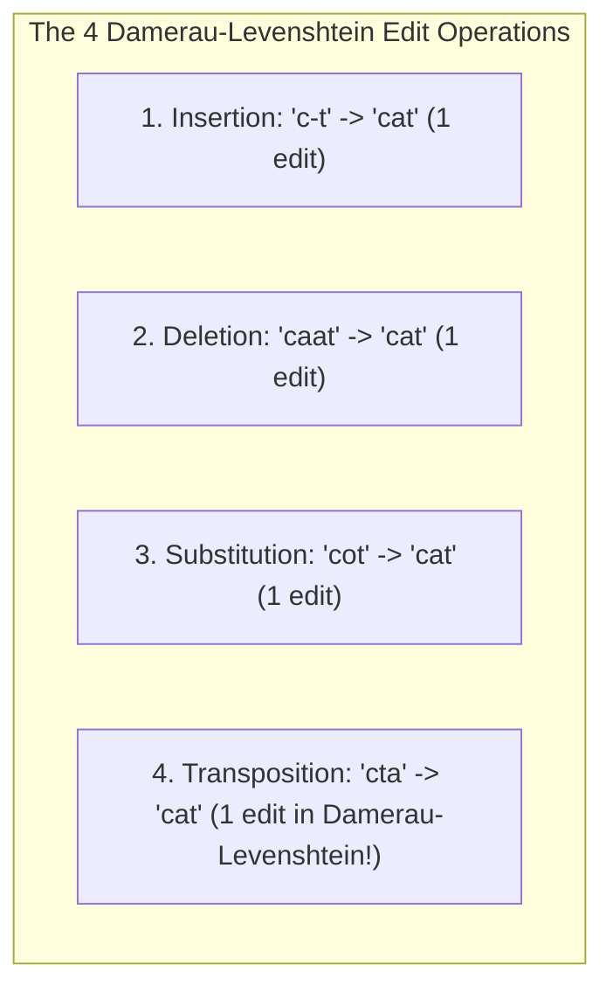
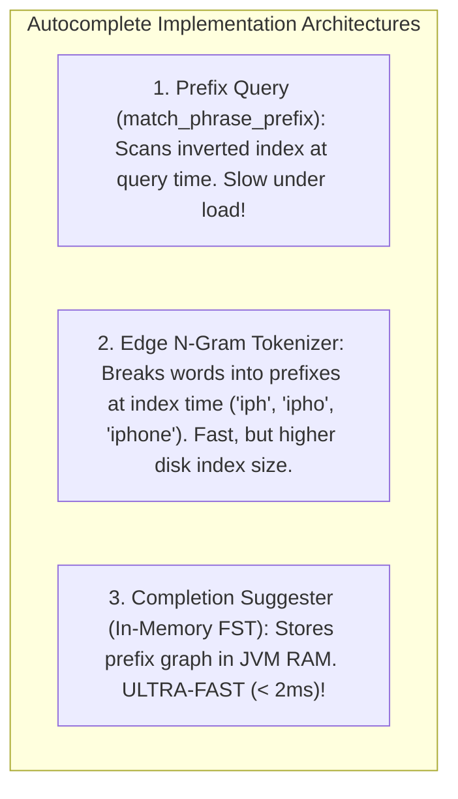

# Fuzzy Search, Levenshtein Automata, and High-Speed Autocomplete

---

## 1. What Is It?
**Fuzzy Search** is the algorithmic capability of a search engine to return relevant search results even when user queries contain typographical errors, character transpositions, or misspelled words.

**Autocomplete (Search-as-you-type)** is the real-time prediction and suggestion of queries or entity titles as the user types individual keystrokes in a search box, requiring sub-$10\text{ms}$ response latencies.

---

## 2. Levenshtein Distance & Damerau-Levenshtein Edit Distance

The mathematical similarity between two words is measured by **Edit Distance** (the minimum number of single-character operations required to transform Word A into Word B).



- **Fuzziness Parameter**:
  - `fuzziness: 0`: Exact match only.
  - `fuzziness: 1`: Allows 1 edit (matches words with length $3-5$).
  - `fuzziness: 2`: Allows 2 edits (matches words with length $> 5$).
  - `fuzziness: "AUTO"`: **Production Standard** (automatically scales edits based on term length to prevent noise on short words).

---

## 3. How Fuzzy Search Works: Lucene Levenshtein Automaton & FSTs

Naive fuzzy matching scans millions of vocabulary terms and computes Levenshtein distance against each word in $O(N \cdot M)$ time (**Disastrously Slow**).

### Lucene's Finite State Transducer (FST) Levenshtein Automaton:
1. Lucene compiles the user's misspelled query (`"aple"`) and max edit distance ($1$) into a **DFA (Deterministic Finite Automaton)** in memory.
2. It intersects this automaton directly with the in-memory **Term Dictionary FST**.
3. It extracts matching terms (`"apple"`, `"ample"`) in **sub-millisecond time ($< 0.5\text{ms}$)** without scanning individual documents!

```mermaid
flowchart LR
    Typo["Misspelled Query: 'aple'"] --> DFA["Compile Levenshtein DFA (Max Edit: 1)"]
    DFA <-->|Intersect in RAM (< 0.5ms)| TermFST[("In-Memory Term Dictionary FST")]
    TermFST --> Matches["Found Terms: ['apple', 'ample', 'apply']"]
```

---

## 4. The 3 Autocomplete Architectures Compared



---

## 5. Implementation: High-Speed Completion Suggester in Elasticsearch

### 1. Index Mapping with `completion` Field Type
```json
PUT /search_products
{
  "mappings": {
    "properties": {
      "name": { "type": "text" },
      "suggest": {
        "type": "completion" // Specialized In-Memory FST data structure!
      }
    }
  }
}
```

---

### 2. Indexing Documents with Weighted Suggestions
```json
POST /search_products/_doc/1
{
  "name": "Apple iPhone 16 Pro Max",
  "suggest": {
    "input": ["Apple iPhone 16", "iPhone 16 Pro", "iphone"],
    "weight": 100 // Higher weight ranks at top of autocomplete dropdown!
  }
}
```

---

### 3. Sub-Millisecond Fuzzy Autocomplete Query
```json
POST /search_products/_search
{
  "suggest": {
    "product_autocomplete": {
      "prefix": "iphne", // Typo in search box!
      "completion": {
        "field": "suggest",
        "size": 5,
        "fuzzy": {
          "fuzziness": "AUTO",
          "min_length": 3
        }
      }
    }
  }
}
```

---

## 6. Performance

| Autocomplete Strategy | Keystroke Latency ($p99$) | Memory / Disk Overhead | Typo Tolerance Support |
|---|---|---|:---:|
| SQL `LIKE 'iph%'` | $250\text{ms}$ | High DB CPU load | ❌ No |
| `match_phrase_prefix` | $45\text{ms}$ | Low | ❌ No |
| Edge N-Gram Indexing | $12\text{ms}$ | High Disk Storage ($3\times$) | ✅ Yes |
| **Completion Suggester (FST)** | **$\mathbf{1.5\text{ms}}$** | **Compact JVM RAM Cache** | ✅ **Yes (Fuzzy FST)** |

---

## 7. Interview Questions

### Q1: Why is the Completion Suggester significantly faster for autocomplete than Edge N-Gram or Prefix queries?
<details>
<summary>Reveal Answer</summary>

**Answer**:
1. **`match_phrase_prefix` and Prefix Queries**:
   - Must scan the on-disk Inverted Index at query time, expand all matching suffix terms, and compute document intersections dynamically. Under high concurrency, this saturates search thread pools.
2. **Edge N-Grams**:
   - Pre-tokenizes words into prefix slices at index time (`"c"`, `"ca"`, `"car"`). While fast for searching, it expands index disk size by $300-500\%$.
3. **Completion Suggester**:
   - Bypasses the Inverted Index entirely.
   - It builds an in-memory **Finite State Transducer (FST)** trie structure during index time and keeps it loaded directly in JVM RAM.
   - When a user types a prefix, traversing the in-memory FST graph requires simple memory pointer jumps, returning suggestions in **less than 2 milliseconds** with zero disk I/O.
</details>

---

## 8. Quick Revision
- **Levenshtein Distance**: Number of insertions, deletions, substitutions, and transpositions.
- **Fuzziness AUTO**: Automatically scales allowed edits based on word length.
- **Lucene Levenshtein Automaton**: Intersects DFA with in-memory FST in $< 0.5\text{ms}$.
- **Completion Suggester**: In-memory FST trie providing sub-2ms as-you-type autocomplete.
- **Weights**: Use integer weights in suggestions to boost popular products to the top.
