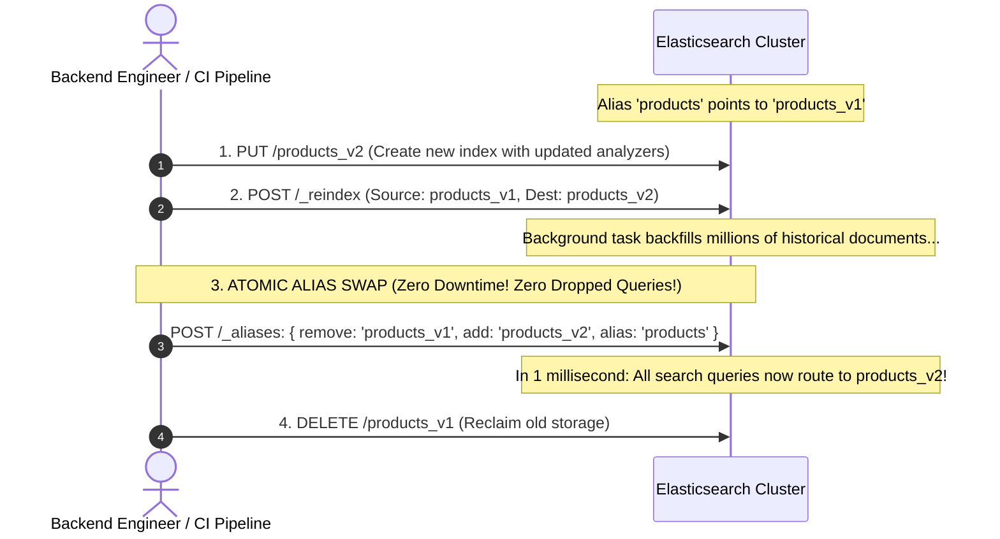

# Syncing Relational Databases to Elasticsearch: CDC, Outbox, and Zero-Downtime Aliases

---

## 1. What Is It?
In modern backend architectures, **Search Index Synchronization** is the operational pipeline that mirrors authoritative state mutations from the primary relational database (PostgreSQL / MySQL) to a secondary search cluster (Elasticsearch / OpenSearch) in near-real-time.

---

## 2. Why Does It Exist?
- **Relational Databases**: Authoritative system of record; ACID transactions; relational normalization; primary keys.
- **Elasticsearch**: Secondary read model; full-text search; BM25 relevance; aggregations; fuzzy matching.

Attempting to update both systems synchronously in application code (**Dual-Writing: `db.save() + es.index()`**) causes severe data corruption:
- If the database write succeeds but the Elasticsearch index fails (or the pod crashes in between), the search index becomes **permanently out of sync with reality**.

---

## 3. Mental Model: The 3 Database-to-Search Sync Architectures

```mermaid
flowchart TD
    subgraph Arch1["1. Debezium CDC + Kafka (THE GOLD STANDARD)"]
        DB1[("PostgreSQL WAL")] --> Deb["Debezium CDC"] --> K1["Kafka Topic: 'db.products'"] --> Sink["Kafka Connect ES Sink"] --> ES1[("Elasticsearch")]
        Note over Arch1: Zero app overhead; sub-50ms streaming lag; zero dual-write bugs!
    end

    subgraph Arch2["2. Transactional Outbox + Async Workers"]
        App2["App Write"] --> Outbox[("DB Table: outbox_events")]
        Outbox --> Worker["Async Indexer Worker"] --> ES2[("Elasticsearch")]
    end

    subgraph Arch3["3. Logstash JDBC Watermark Polling"]
        DB3[("PostgreSQL Table")] -->|SELECT ... WHERE updated_at > :last_time| Logstash["Logstash Runner"] --> ES3[("Elasticsearch")]
        Note over Arch3: Periodic query overhead; does not detect hard DELETES easily
    end
```

---

## 4. How Does It Work?

### 1. Debezium CDC + Kafka Connect Elasticsearch Sink
1. Application updates PostgreSQL within a standard ACID transaction.
2. Debezium captures the committed mutation directly from the PostgreSQL WAL (`pgoutput`).
3. Debezium publishes an event to Kafka.
4. **Kafka Connect Elasticsearch Sink Connector** consumes the event and executes an atomic `BulkRequest` against Elasticsearch.
5. **Advantage**: 100% decoupling, captures hard deletes seamlessly, and survives microservice crashes.

---

### 2. Zero-Downtime Index Reindexing via Blue-Green Aliases

When you need to modify index mappings, change analyzers, or update field types, Lucene **does not allow modifying existing field types in place**.

$$\textbf{Production Reindexing Protocol (Atomic Alias Swap):}$$



---

## 5. Implementation: Atomic Index Alias Swap in Elasticsearch

```json
POST /_aliases
{
  "actions": [
    {
      "remove": {
        "index": "products_v1",
        "alias": "products"
      }
    },
    {
      "add": {
        "index": "products_v2",
        "alias": "products"
      }
    }
  ]
}
```
- Executed as a **single atomic transaction** inside Elasticsearch metadata state.
- Existing queries never experience a 404 or connection drop during the transition.

---

## 6. Performance

| Sync Strategy | Sync Latency | Impact on Primary DB | Detects Hard Deletes? |
|---|---|---|:---:|
| Dual-Writing in App Code | $< 10\text{ms}$ | High (Blocks HTTP thread) | ❌ Buggy on Crash |
| Logstash JDBC Polling | $5 - 60\text{ seconds}$ | Moderate (Periodic SQL polling) | ❌ Requires Soft Deletes |
| **Debezium CDC + Kafka** | **$\mathbf{< 30\text{ms}}$** | **$\mathbf{0\text{ SQL Queries}}$ (WAL-driven)** | ✅ **Native Support** |

---

## 7. Interview Questions

### Q1: Why is an Index Alias mandatory when building production search applications with Elasticsearch?
<details>
<summary>Reveal Answer</summary>

**Answer**:
In Elasticsearch, **Inverted Index structures are immutable**. If you need to change a field mapping (e.g. changing a tokenizer or adding a new English stemmer), you cannot modify the existing index; you must create a brand new index (`products_v2`) and reindex all historical data.
If your application queries the physical index name directly (`/products_v1/_search`):
1. Upgrading the index requires updating application code and restarting all microservice pods.
2. During the transition, search queries fail or return partial results.
**By using an Index Alias (`/products/_search`)**:
Application code always points to the alias `products`. When the new index `products_v2` is fully built and verified, an atomic `_aliases` swap switches the pointer from `v1` to `v2` in **1 millisecond with zero downtime and zero microservice redeployments**.
</details>

---

## 8. Quick Revision
- **Never Dual-Write**: Use CDC (Debezium + Kafka) to sync DB to Elasticsearch reliably.
- **Debezium CDC**: Captures WAL mutations in real time with zero database SQL overhead.
- **Immutable Mappings**: Modifying field analyzers requires creating a new index.
- **Index Aliases**: Enables Blue-Green atomic index swaps (`_aliases`) with zero downtime.
- **`_reindex` API**: Backfills historical documents from old index to new index in background.
