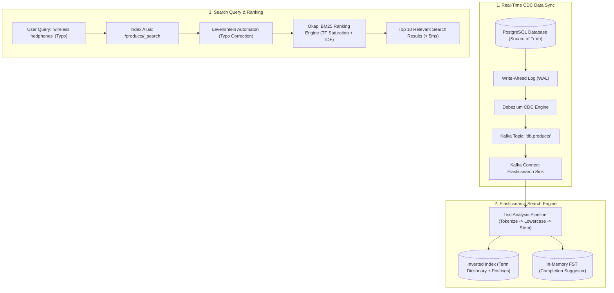

# Module 23: Search & Inverted Indexes

Master modern full-text search and information retrieval architectures: Inverted Indexes vs B+Trees, Apache Lucene segment immutability, Text Analysis pipelines (Tokenizers, Stemmers, Synonyms), Okapi BM25 relevance scoring mathematics, Levenshtein distance fuzzy search, high-speed in-memory FST Completion Suggesters, and syncing PostgreSQL to Elasticsearch via Debezium CDC with zero-downtime Blue-Green index aliases.

---

## 🗺️ Master Search Indexing & Ingestion Architecture

---

## 📚 Curriculum Lessons

| # | Lesson | Core Focus & Mechanics |
|:---:|---|---|
| **01** | [`01-search-fundamentals-inverted-index-vs-btree.md`](./01-search-fundamentals-inverted-index-vs-btree.md) | Inverted Index anatomy (Term Dictionary + Postings Lists), why B+Tree `LIKE` fails, and Lucene immutable segments. |
| **02** | [`02-text-analysis-tokenization-and-stemming.md`](./02-text-analysis-tokenization-and-stemming.md) | The 3-stage analysis pipeline (Char filters $\to$ Tokenizers $\to$ Token filters), Stemmers, Synonyms, and `text` vs `keyword` mapping. |
| **03** | [`03-relevance-ranking-and-the-bm25-algorithm.md`](./03-relevance-ranking-and-the-bm25-algorithm.md) | Okapi BM25 formula, Inverse Document Frequency ($\text{IDF}$), Term Frequency saturation ($k_1$), length penalty ($b$), and boosting. |
| **04** | [`04-fuzzy-search-levenshtein-and-autocomplete.md`](./04-fuzzy-search-levenshtein-and-autocomplete.md) | Levenshtein edit distance, Lucene in-memory FST DFA matching, and sub-2ms Completion Suggesters for as-you-type search. |
| **05** | [`05-syncing-relational-databases-to-elasticsearch.md`](./05-syncing-relational-databases-to-elasticsearch.md) | Eliminating dual-writes via Debezium CDC, Kafka Connect, `_reindex` API, and zero-downtime atomic Index Alias swaps. |

---

## ⚡ Key Production Takeaways

1. **Inverted Index Speed**: Inverted indexes map terms to doc lists, executing keyword searches $4,000\times$ faster than relational SQL wildcards.
2. **`text` vs `keyword` Standard**: Use `text` for full-text search and `keyword` sub-fields (`.raw`) for exact filtering and aggregations.
3. **BM25 Over TF-IDF**: BM25 uses asymptotic saturation curves to prevent keyword stuffing from corrupting relevance scores.
4. **Use Completion Suggesters for Autocomplete**: In-memory FST tries return as-you-type suggestions in $< 2\text{ms}$ with zero disk I/O.
5. **Always Query via Index Aliases**: Never point applications directly to physical index names; use atomic alias swaps (`_aliases`) for zero-downtime index migrations.
