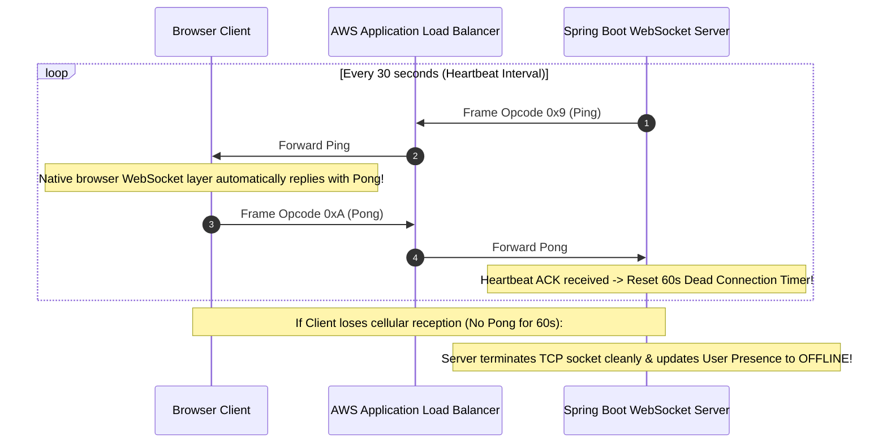

# WebSocket Protocol Framing (RFC 6455), Handshakes, and Heartbeats

---

## 1. What Is It?
The **WebSocket Protocol (RFC 6455)** provides standardized, full-duplex, bidirectional communication channels over a single persistent TCP socket connection between a web client and a backend server.

The connection begins as a standard HTTP/1.1 request that is dynamically negotiated into a WebSocket stream via an **HTTP Upgrade Handshake (`101 Switching Protocols`)**, after which communication transitions entirely to lightweight binary **WebSocket Frames**.

---

## 2. Why Does It Exist?
- **HTTP Header Waste**: After the initial HTTP upgrade handshake, WebSocket frames transmit data with as little as **$2\text{ bytes}$ of framing overhead per message**, compared to $> 800\text{ bytes}$ of HTTP headers per REST request.
- **Idle Socket Severing**: Cloud firewalls and AWS Elastic Load Balancers (ELBs) terminate idle TCP sockets after $60 - 350\text{ seconds}$. **WebSocket Heartbeat Control Frames (`Ping`/`Pong`)** keep connections alive and detect disconnected clients in real time.

---

## 3. Mental Model: The Upgrade Handshake & Frame Layout

```text
CLIENT REQUEST (HTTP/1.1):
GET /chat HTTP/1.1
Host: server.company.com
Upgrade: websocket
Connection: Upgrade
Sec-WebSocket-Key: dGhlIHNhbXBsZSBub25jZQ==
Sec-WebSocket-Version: 13

SERVER RESPONSE (HTTP/1.1):
HTTP/1.1 101 Switching Protocols
Upgrade: websocket
Connection: Upgrade
Sec-WebSocket-Accept: s3pPLMBiTxaQ9kYGzzhZRbK+xOo=
```

---

## 4. How Does It Work?

### 1. The `Sec-WebSocket-Accept` Cryptographic Handshake Calculation
To prevent caching proxy confusion and malicious cross-protocol injection:
1. Server takes the client's `Sec-WebSocket-Key` string.
2. Concatenates the standard RFC 6455 Magic GUID:
   $$\texttt{"dGhlIHNhbXBsZSBub25jZQ=="} + \texttt{"258EAFA5-E914-47DA-95CA-C5AB0DC85B11"}$$
3. Computes the **SHA-1 Hash** and encodes it in **Base64** $\longrightarrow$ Returns as `Sec-WebSocket-Accept`.

---

### 2. Binary Frame Layout (RFC 6455)

```text
 0                   1                   2                   3
 0 1 2 3 4 5 6 7 8 9 0 1 2 3 4 5 6 7 8 9 0 1 2 3 4 5 6 7 8 9 0 1
+-+-+-+-+-------+-+-------------+-------------------------------+
|F|R|R|R| opcode|M| Payload len |    Extended payload length    |
|I|S|S|S|  (4)  |A|     (7)     |             (16/64)           |
|N|V|V|V|       |S|             |   (if payload len==126/127)   |
| |1|2|3|       |K|             |                               |
+-+-+-+-+-------+-+-------------+ - - - - - - - - - - - - - - - +
|     Masking-key (4 bytes: if MASK set to 1)                   |
+-------------------------------+-------------------------------+
|     Payload Data (Unmasked by XORing with Masking-Key)        |
+---------------------------------------------------------------+
```

- **FIN Bit (1 bit)**: Indicates if this is the final fragment in a message.
- **Opcode (4 bits)**:
  - `0x1`: Text frame (UTF-8).
  - `0x2`: Binary frame.
  - `0x8`: Close connection.
  - `0x9`: **Ping** control frame.
  - `0xA`: **Pong** control frame.
- **Masking Key (4 bytes)**: Mandatory for all client-to-server frames to prevent malicious proxy cache poisoning.

---

## 5. Heartbeat & Liveness Mechanics (`Ping` / `Pong`)



---

## 6. Implementation: Native Java 21 WebSocket Handler with Heartbeats

```java
package com.backend.engineering.realtime.websocket;

import org.slf4j.Logger;
import org.slf4j.LoggerFactory;
import org.springframework.stereotype.Component;
import org.springframework.web.socket.*;
import org.springframework.web.socket.handler.TextWebSocketHandler;

import java.io.IOException;
import java.nio.ByteBuffer;
import java.util.Map;
import java.util.concurrent.ConcurrentHashMap;

@Component
public class ResilientChatWebSocketHandler extends TextWebSocketHandler {

    private static final Logger log = LoggerFactory.getLogger(ResilientChatWebSocketHandler.class);
    private final Map<String, WebSocketSession> activeSessions = new ConcurrentHashMap<>();

    @Override
    public void afterConnectionEstablished(WebSocketSession session) {
        activeSessions.put(session.getId(), session);
        log.info("WebSocket connection established. SessionID: {}", session.getId());
    }

    @Override
    protected void handleTextMessage(WebSocketSession session, TextMessage message) throws Exception {
        log.info("Received message from {}: {}", session.getId(), message.getPayload());
        // Echo / Broadcast to other connected sessions
        session.sendMessage(new TextMessage("ACK: " + message.getPayload()));
    }

    @Override
    protected void handlePongMessage(WebSocketSession session, PongMessage message) {
        log.debug("Heartbeat Pong received from session: {}", session.getId());
    }

    @Override
    public void afterConnectionClosed(WebSocketSession session, CloseStatus status) {
        activeSessions.remove(session.getId());
        log.warn("WebSocket closed. SessionID: {}, Reason: {}", session.getId(), status.getReason());
    }

    // Periodic Heartbeat Dispatcher (Invoked by @Scheduled cron every 25 seconds)
    public void sendHeartbeatPings() {
        PingMessage ping = new PingMessage(ByteBuffer.wrap(new byte[]{0x1}));
        activeSessions.values().forEach(session -> {
            if (session.isOpen()) {
                try {
                    session.sendMessage(ping);
                } catch (IOException e) {
                    try { session.close(); } catch (IOException ignored) {}
                }
            }
        });
    }
}
```

---

## 7. Performance

| Protocol Operation | Wire Overhead | Memory per Active Socket | Disconnect Detection |
|---|---|---|---|
| Long Polling | $\approx 850\text{ bytes}$ per poll | High (JVM thread stack) | Minutes (Timeout dependent) |
| **WebSocket Frame** | **$\mathbf{2 - 6\text{ bytes}}$ per message** | **$< 4\text{KB}$ per socket** | **$< 30\text{ seconds}$ (Ping/Pong)** |

---

## 8. Interview Questions

### Q1: Why are client-to-server WebSocket frames masked with a 4-byte random masking key, while server-to-client frames are unmasked?
<details>
<summary>Reveal Answer</summary>

**Answer**:
Client-to-server masking exists specifically to prevent **Cache Poisoning Attacks on Intermediate HTTP Proxies**:
1. Before WebSockets, malicious JavaScript in a browser could construct a payload resembling a valid HTTP `GET /sensitive-file.html` request.
2. If sent unmasked over a raw TCP connection, an intermediate transparent proxy cache might misinterpret the bytes as a genuine HTTP request and cache a malicious response, poisoning the cache for all other corporate users.
3. **The Masking Defense**: RFC 6455 mandates that browsers must XOR-mask every outgoing frame using a randomized 4-byte key generated per frame.
4. Because the bytes are XOR-scrambled, intermediate proxies cannot recognize or parse any HTTP byte patterns in the stream, completely neutralizing proxy cache poisoning.
5. Server-to-client frames do not require masking because servers are trusted entities that do not execute untrusted third-party browser JavaScript.
</details>

---

## 9. Quick Revision
- **Upgrade Handshake**: HTTP `101 Switching Protocols` negotiates TCP transition.
- **Wire Framing**: 2–6 bytes overhead (FIN, Opcode, Length, Mask).
- **Client Masking**: 4-byte random XOR mask prevents intermediate proxy poisoning.
- **Heartbeats**: Ping (`0x9`) / Pong (`0xA`) keep NAT firewalls alive and detect dead clients.
