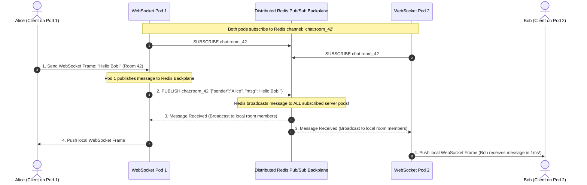

# Horizontal Scaling of WebSockets and the Redis Pub/Sub Backplane

---

## 1. What Is It?
**Horizontal WebSocket Scaling** is the architectural pattern of distributing hundreds of thousands of concurrent persistent WebSocket TCP connections across a horizontally scaled cluster of independent server pods using a centralized **Distributed Messaging Backplane (Redis Pub/Sub / RabbitMQ)** to broadcast messages between users connected to different physical servers.

---

## 2. The WebSocket Multi-Server Scaling Paradox

```mermaid
flowchart LR
    subgraph Server1["WebSocket Server Pod 1"]
        Alice["Alice (Socket A)"]
    end

    subgraph Server2["WebSocket Server Pod 2"]
        Bob["Bob (Socket B)"]
    end

    Alice -->|Sends: 'Hello Bob!'| Server1
    Server1 -.->|PARADOX: Server 1 has NO SOCKET for Bob!| Bob
    Note over Server1,Bob: Server 1 cannot write to Bob's socket on Server 2!
```

### The Problem:
- Unlike stateless HTTP (where any pod can handle any request), a WebSocket is a **Stateful, Long-Lived OS File Descriptor / TCP Socket physically bound to the RAM of a single specific server process**.
- If Alice is connected to Pod 1 and sends a message to Bob (who is connected to Pod 2), Pod 1 cannot deliver the message because **Bob's socket exists only in Pod 2's memory**.

---

## 3. Mental Model: The Redis Pub/Sub Backplane Architecture



---

## 4. How Does It Work?

### 1. The Redis Pub/Sub Backplane Flow
1. When User Alice connects to Pod 1 and joins Room 42:
   - Pod 1 tracks Alice in a local in-memory session map: `localRoomMembers.get("room_42").add(aliceSocket)`.
   - Pod 1 issues `SUBSCRIBE chat:room_42` to the Redis cluster (if not already subscribed).
2. When Alice sends a message:
   - Pod 1 executes `PUBLISH chat:room_42 <jsonPayload>`.
3. Every WebSocket pod in the cluster that has at least one connected user in Room 42 receives the broadcast from Redis.
4. Each pod iterates over its **local socket map** and writes the WebSocket frame directly to its local TCP descriptors.

---

## 5. Implementation: Redis Pub/Sub Backplane in Java 21 Spring Boot

```java
package com.backend.engineering.realtime.scaling;

import com.fasterxml.jackson.databind.ObjectMapper;
import org.slf4j.Logger;
import org.slf4j.LoggerFactory;
import org.springframework.data.redis.connection.Message;
import org.springframework.data.redis.connection.MessageListener;
import org.springframework.data.redis.core.RedisTemplate;
import org.springframework.stereotype.Service;
import org.springframework.web.socket.TextMessage;
import org.springframework.web.socket.WebSocketSession;

import java.io.IOException;
import java.util.Map;
import java.util.Set;
import java.util.concurrent.ConcurrentHashMap;

@Service
public class DistributedWebSocketBackplaneService implements MessageListener {

    private static final Logger log = LoggerFactory.getLogger(DistributedWebSocketBackplaneService.class);
    private final RedisTemplate<String, String> redisTemplate;
    private final ObjectMapper objectMapper = new ObjectMapper();

    // Map: RoomId -> Set of locally connected WebSocketSessions on THIS pod
    private final Map<String, Set<WebSocketSession>> localRoomSockets = new ConcurrentHashMap<>();

    public DistributedWebSocketBackplaneService(RedisTemplate<String, String> redisTemplate) {
        this.redisTemplate = redisTemplate;
    }

    // 1. Client sends message -> Publish to Redis Backplane
    public void publishToRoom(String roomId, String senderId, String messageText) {
        try {
            ChatMessageDto chatMessage = new ChatMessageDto(roomId, senderId, messageText, System.currentTimeMillis());
            String jsonPayload = objectMapper.writeValueAsString(chatMessage);

            // PUBLISH chat:room:<roomId> <payload>
            redisTemplate.convertAndSend("chat:room:" + roomId, jsonPayload);
            log.info("Published message to Redis channel: chat:room:{}", roomId);

        } catch (Exception ex) {
            log.error("Failed to publish to backplane: {}", ex.getMessage());
        }
    }

    // 2. Redis MessageListener: Receives broadcast from ANY pod in the cluster
    @Override
    public void onMessage(Message redisMessage, byte[] pattern) {
        try {
            String json = new String(redisMessage.getBody());
            ChatMessageDto msg = objectMapper.readValue(json, ChatMessageDto.class);

            // Find local sessions on THIS pod subscribed to this room
            Set<WebSocketSession> sessions = localRoomSockets.get(msg.roomId());
            if (sessions != null && !sessions.isEmpty()) {
                TextMessage textMessage = new TextMessage(json);
                for (WebSocketSession session : sessions) {
                    if (session.isOpen()) {
                        session.sendMessage(textMessage); // Write to physical TCP socket!
                    }
                }
            }
        } catch (IOException e) {
            log.error("Failed to deliver broadcast frame: {}", e.getMessage());
        }
    }

    public void registerLocalSession(String roomId, WebSocketSession session) {
        localRoomSockets.computeIfAbsent(roomId, k -> ConcurrentHashMap.newKeySet()).add(session);
    }

    public void unregisterLocalSession(String roomId, WebSocketSession session) {
        Set<WebSocketSession> sessions = localRoomSockets.get(roomId);
        if (sessions != null) {
            sessions.remove(session);
        }
    }

    public record ChatMessageDto(String roomId, String senderId, String text, long timestamp) {}
}
```

---

## 6. Performance

| Architecture Model | Max Concurrent WebSocket Scale | Inter-Server Delivery Latency | Pod Failure Impact |
|---|---|---|---|
| Single WebSocket Node | $\approx 20,000$ Sockets (Memory/FD capped) | $0\text{ms}$ (In-memory) | **100% Platform Outage** |
| **Horizontally Scaled + Redis Backplane** | **$> 1,000,000\text{ Sockets}$ (Linear scale)** | **$< 2\text{ms}$ (Redis Pub/Sub)** | **Isolated to $1/N$ fraction of users** |

---

## 7. Interview Questions

### Q1: Why does scaling a stateful WebSocket cluster horizontally require a distributed backplane like Redis Pub/Sub, while stateless HTTP APIs do not?
<details>
<summary>Reveal Answer</summary>

**Answer**:
1. **Stateless HTTP APIs**:
   - Each HTTP request is completely independent and self-contained. The Load Balancer can route Request 1 to Pod A and Request 2 to Pod B. Neither pod needs to communicate with the other to return a response.
2. **Stateful WebSockets**:
   - WebSockets maintain a continuous, open **TCP socket descriptor in server memory**.
   - When User A connects to Pod 1, their physical TCP connection lives exclusively in Pod 1's memory space.
   - If User A sends a message destined for User B (who is connected to Pod 2), Pod 1 has **no physical way to write bytes to Pod 2's TCP sockets directly**.
   - A **Distributed Backplane (Redis Pub/Sub / RabbitMQ)** connects all independent server pods. Pod 1 publishes the event to a shared Redis channel, Redis broadcasts the event to Pod 2, and Pod 2 writes the message to User B's local socket.
</details>

---

## 8. Quick Revision
- **The Paradox**: WebSockets are persistent TCP sockets bound to single pods.
- **Distributed Backplane**: Redis Pub/Sub connects independent WebSocket pods.
- **Sub-Millisecond Broadcast**: Redis distributes events to all pods with $< 2\text{ms}$ latency.
- **Local Registry**: Each pod maintains an in-memory map of local sockets to push incoming Redis events.
- **Linear Scale**: Enables scaling to millions of concurrent open sockets across hundreds of pods.
