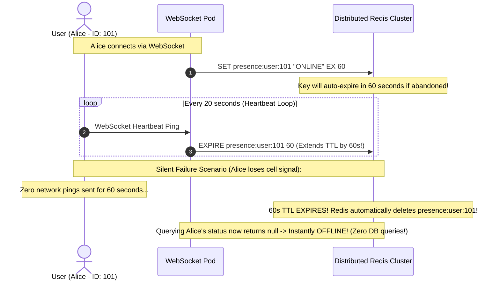

# User Presence Systems: Distributed Heartbeat State Machines in Redis

---

## 1. What Is It?
A **User Presence System** is a real-time distributed tracking service that maintains and exposes the availability status of millions of users (**ONLINE**, **AWAY**, **BUSY**, **OFFLINE**) across collaborative platforms, messaging applications (Slack, Discord, WhatsApp), and gaming networks.

---

## 2. Why Does It Exist?
Attempting to track presence in a relational database:
```sql
UPDATE users SET last_seen_at = CURRENT_TIMESTAMP WHERE id = 101;
```
- **The Database Write Explosion**: If 1,000,000 concurrent active users ping the server every $20\text{ seconds}$ to prove they are online, the primary database is hammered with **$50,000\text{ write transactions/sec}$**, causing severe table lock contention and disk I/O saturation for ephemeral presence data that doesn't even need permanent ACID storage.

---

## 3. Mental Model: Ephemeral TTL Presence in Redis



---

## 4. How Does It Work?

### 1. Ephemeral Key Expiry Design
- Every online user has a key in Redis: `presence:user:<userId>`.
- Set with a **$60\text{-second TTL}$**.
- The client sends a heartbeat every $20\text{ seconds}$. The server refreshes the TTL (`EXPIRE`).
- **Silent Dropouts Handled Automatically**: If the client's laptop battery dies or loses WiFi, **Redis automatically purges the key when the TTL expires**, seamlessly transitioning the user to `OFFLINE` with **zero background database cron sweepers required**!

---

### 2. High-Speed Batch Presence Queries via `MGET`
When Bob opens his friend list of 200 contacts:
$$\texttt{MGET presence:user:101 presence:user:102 ... presence:user:300}$$
- Executed in a **single Redis network round-trip ($< 1.5\text{ms}$)**.
- Non-existing keys evaluate to `null` $\longrightarrow$ Marked as `OFFLINE`.

---

## 5. Implementation: Distributed Presence Service in Java 21

```java
package com.backend.engineering.realtime.presence;

import org.slf4j.Logger;
import org.slf4j.LoggerFactory;
import org.springframework.data.redis.core.RedisTemplate;
import org.springframework.stereotype.Service;

import java.time.Duration;
import java.util.*;

@Service
public class DistributedPresenceService {

    private static final Logger log = LoggerFactory.getLogger(DistributedPresenceService.class);
    private static final String PRESENCE_KEY_PREFIX = "presence:user:";
    private static final Duration PRESENCE_TTL = Duration.ofSeconds(60);

    private final RedisTemplate<String, String> redisTemplate;

    public DistributedPresenceService(RedisTemplate<String, String> redisTemplate) {
        this.redisTemplate = redisTemplate;
    }

    // 1. Mark Online / Refresh Heartbeat
    public void recordHeartbeat(Long userId) {
        String key = PRESENCE_KEY_PREFIX + userId;
        // SET presence:user:<id> "ONLINE" EX 60
        redisTemplate.opsForValue().set(key, "ONLINE", PRESENCE_TTL);
    }

    // 2. Explicit Clean Disconnect (Instant Offline)
    public void recordExplicitDisconnect(Long userId) {
        String key = PRESENCE_KEY_PREFIX + userId;
        redisTemplate.delete(key);
        log.info("User {} disconnected cleanly. Presence key purged.", userId);
    }

    // 3. Batch Check Status for Friend Lists (Sub-Millisecond MGET)
    public Map<Long, String> getPresenceBatch(List<Long> userIds) {
        List<String> keys = userIds.stream()
                .map(id -> PRESENCE_KEY_PREFIX + id)
                .toList();

        // Single atomic multi-key read over network
        List<String> statuses = redisTemplate.opsForValue().multiGet(keys);

        Map<Long, String> presenceMap = new HashMap<>();
        if (statuses != null) {
            for (int i = 0; i < userIds.size(); i++) {
                String status = statuses.get(i);
                presenceMap.put(userIds.get(i), status != null ? status : "OFFLINE");
            }
        }

        return presenceMap;
    }
}
```

---

## 6. Performance

| Presence Architecture | DB Write IOPS ($1\text{M Users}$) | Memory Footprint in Redis | Latency to Fetch 100 Friends |
|---|---|---|---|
| PostgreSQL `UPDATE` | **$50,000\text{ IOPS}$ (Database Collapse)** | N/A | $35\text{ms}$ |
| **Distributed Redis TTL** | **$0\text{ IOPS}$ (Zero DB load!)** | **$\approx 64\text{MB}$ total RAM** | **$< 1.5\text{ms}$ (Single `MGET`)** |

---

## 7. Interview Questions

### Q1: How do you handle sudden network dropouts (e.g. subway tunnels or battery death) in user presence systems without sending explicit disconnect events?
<details>
<summary>Reveal Answer</summary>

**Answer**:
When a client experiences an abrupt network disconnection (such as entering an elevator or phone battery loss), the client cannot execute the TCP 4-way FIN handshake or send an HTTP `disconnect` API call.
**The Sliding TTL Heartbeat Architecture**:
1. Every presence entry in Redis is stored as an **ephemeral key with a strict Time-To-Live (TTL)**, such as 60 seconds.
2. The client application runs a background timer sending a lightweight heartbeat ping every 20 seconds, which extends the Redis TTL back to 60 seconds.
3. When an abrupt dropout occurs, heartbeat pings cease.
4. Exactly 60 seconds after the last received ping, **Redis automatically expires and evicts the key from memory**.
5. Any subsequent check for that user's status returns `null`, seamlessly reflecting that the user is `OFFLINE` with zero custom cleanup worker threads required.
</details>

---

## 8. Quick Revision
- **Never Use DB for Presence**: 1M users hammering DB heartbeats destroys disk IOPS.
- **Ephemeral TTL Keys**: Store presence in Redis with 60-second TTL.
- **Heartbeat Refresh**: Client pings every 20s to extend TTL.
- **Silent Dropout Handling**: Redis key expiration automatically marks dead clients offline.
- **Batch Lookups**: Use Redis `MGET` to fetch 200 friend statuses in a single 1.5ms network call.
