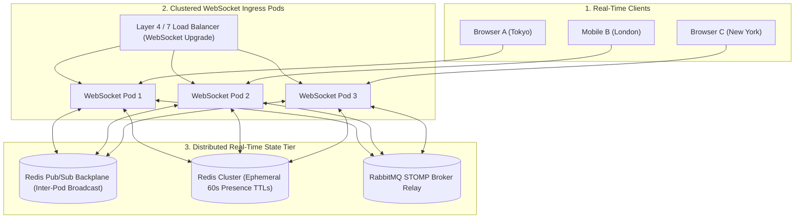

# Module 24: Real-Time Systems

Master high-throughput, low-latency real-time communication architectures: Short Polling vs Long Polling vs Server-Sent Events (SSE) vs WebSockets, RFC 6455 binary frame mechanics and masking, Ping/Pong heartbeats, horizontal scaling of stateful WebSockets using a Redis Pub/Sub distributed backplane, distributed user presence tracking with ephemeral Redis TTLs, and enterprise Spring Boot STOMP with RabbitMQ external broker relays.

---

## 🗺️ Master Clustered Real-Time Architecture

---

## 📚 Curriculum Lessons

| # | Lesson | Core Focus & Mechanics |
|:---:|---|---|
| **01** | [`01-real-time-protocols-polling-vs-sse-vs-websockets.md`](./01-real-time-protocols-polling-vs-sse-vs-websockets.md) | Short polling overhead, Long polling, Server-Sent Events (SSE) over HTTP/2, and full-duplex WebSockets. |
| **02** | [`02-websocket-lifecycle-framing-and-heartbeats.md`](./02-websocket-lifecycle-framing-and-heartbeats.md) | RFC 6455 framing layout, HTTP 101 upgrade handshake, client XOR masking security, and Ping/Pong heartbeats. |
| **03** | [`03-horizontal-scaling-of-websockets-and-redis-pubsub.md`](./03-horizontal-scaling-of-websockets-and-redis-pubsub.md) | The stateful socket scaling paradox and the Redis Pub/Sub distributed backplane architecture. |
| **04** | [`04-user-presence-and-heartbeat-state-machines.md`](./04-user-presence-and-heartbeat-state-machines.md) | Eliminating DB heartbeat writes using ephemeral Redis TTL keys (`EX 60`) and sub-millisecond `MGET` batch lookups. |
| **05** | [`05-spring-boot-websockets-stomp-and-message-ordering.md`](./05-spring-boot-websockets-stomp-and-message-ordering.md) | STOMP sub-protocol framing, `@MessageMapping`, RabbitMQ external broker relays, and monotonic sequence ID ordering. |

---

## ⚡ Key Production Takeaways

1. **Use SSE for Unidirectional Feeds**: For stock tickers, live prices, and AI chat streams, Server-Sent Events (SSE) is simpler and scales better than WebSockets.
2. **Ping/Pong Heartbeat Standard**: Send WebSocket Ping frames every $25-30\text{ seconds}$ to keep intermediate cloud NAT firewalls from dropping idle sockets.
3. **Redis Pub/Sub Backplane**: Connect stateful WebSocket pods via Redis Pub/Sub to allow users on different servers to chat in real time.
4. **Ephemeral Presence Keys**: Track online users in Redis with a 60s TTL; silent disconnects naturally expire to `OFFLINE` with zero DB overhead.
5. **Use RabbitMQ STOMP Relay**: Never use Spring's in-memory `SimpleBroker` in multi-pod clusters; delegate to an external clustered RabbitMQ broker.
