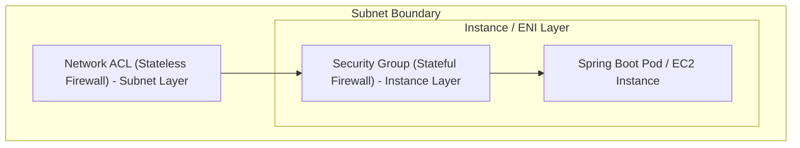
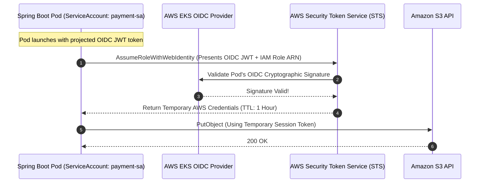

# Cloud Security: Security Groups vs NACLs and IAM Roles (IRSA)

---

## 1. What Is It?
In AWS cloud engineering:
- **Security Groups (SGs)**: Virtual stateful firewalls operating at the Elastic Network Interface (ENI) / instance layer.
- **Network Access Control Lists (NACLs)**: Virtual stateless firewalls operating at the subnet boundary layer.
- **IAM Roles & IRSA (IAM Roles for Service Accounts)**: Temporary, cryptographically rotated credential issuance mechanism that grants Kubernetes pods and microservices least-privilege access to AWS APIs without hardcoding static API keys.

---

## 2. Why Does It Exist?
- **The Hardcoded Key Catastrophe**: Storing static AWS access keys (`AKIA...` and Secret Key) in configuration files or GitHub repositories leads to automated key scraping and catastrophic ransomware cryptomining attacks costing hundreds of thousands of dollars within hours.
- **Defense-in-Depth**: Layering Security Groups and NACLs ensures that even if an attacker misconfigures an EC2 firewall, the subnet-level NACL blocks unauthorized traffic.

---

## 3. Mental Model: Security Groups vs Network ACLs



---

## 4. Comprehensive Firewall Comparison: SG vs NACL

| Dimension | Security Groups (SG) | Network ACLs (NACL) |
|---|---|---|
| **Enforcement Layer** | Instance / Elastic Network Interface (ENI) | Subnet Boundary |
| **State Tracking** | **Stateful** (Return traffic is automatically permitted!) | **Stateless** (Must explicitly permit outbound reply traffic!) |
| **Rule Types** | **ALLOW rules only** (Everything else is implicitly denied) | **ALLOW and DENY rules** |
| **Rule Evaluation Order** | All rules evaluated simultaneously | Rules evaluated in strict **Numerical Order (1 to 32766)** |
| **Ephemeral Port Handling** | Handled automatically | Must explicitly open ports $1024 - 65535$ outbound |

---

## 5. IAM Roles for Service Accounts (IRSA) in Kubernetes

$$\textbf{Production Rule: } \text{NEVER issue long-lived IAM Access Keys (AKIA...). ALWAYS use IAM Roles with IRSA!}$$



---

## 6. Implementation: Least-Privilege IAM Policy & Terraform IRSA

### 1. Scoped Least-Privilege IAM Policy (S3 + SQS only)
```json
{
  "Version": "2012-10-17",
  "Statement": [
    {
      "Sid": "AllowS3UploadsToUserBucketOnly",
      "Effect": "Allow",
      "Action": [
        "s3:PutObject",
        "s3:GetObject"
      ],
      "Resource": "arn:aws:s3:::production-user-uploads/*"
    },
    {
      "Sid": "AllowSQSConsumptionOnly",
      "Effect": "Allow",
      "Action": [
        "sqs:ReceiveMessage",
        "sqs:DeleteMessage",
        "sqs:GetQueueAttributes"
      ],
      "Resource": "arn:aws:sqs:us-east-1:123456789012:payment-processing-queue"
    }
  ]
}
```

---

### 2. Chained Security Group Rule (Least-Privilege Database Access)
Never open database ports to entire CIDR subnets (`10.0.0.0/16`). **Reference the Application Security Group directly**:

```hcl
# PostgreSQL Database Security Group
resource "aws_security_group" "rds_sg" {
  name        = "production-rds-sg"
  vpc_id      = aws_vpc.main.id

  # Allow inbound Port 5432 ONLY from pods possessing the App Security Group!
  ingress {
    from_port       = 5432
    to_port         = 5432
    protocol        = "tcp"
    security_groups = [aws_security_group.app_sg.id]
  }
}
```

---

## 7. Performance & Security Impact

| Security Architecture | Credential Leak Blast Radius | Rotation Frequency | Administrative Overhead |
|---|---|---|:---:|
| Static IAM Keys (`AKIA...`) | **Total Account Compromise** | Manual (Rarely rotated) | High |
| **IAM Roles + IRSA (STS)** | **Zero (Temporary 1-hour token)** | **Automated every 60 mins** | **Zero (Native EKS)** |

---

## 8. Interview Questions

### Q1: What does it mean that Security Groups are "Stateful" while Network ACLs are "Stateless"?
<details>
<summary>Reveal Answer</summary>

**Answer**:
1. **Security Groups (Stateful)**:
   - When an inbound packet is allowed by an ingress rule (e.g. Inbound TCP Port 443 from anywhere), the Security Group automatically tracks the connection state in its state table.
   - Any **outbound response traffic for that specific connection is automatically allowed**, regardless of any outbound security group rules.
2. **Network ACLs (Stateless)**:
   - Network ACLs do not maintain connection state tables.
   - If an inbound rule allows traffic on Port 443, the server accepts the packet, but when it attempts to reply, the response packet uses a random high **Ephemeral Port ($1024 - 65535$)**.
   - If the NACL does not have an explicit **Outbound Rule** permitting TCP traffic on ports $1024 - 65535$, the reply packet is **instantly dropped**, severing the connection.
</details>

---

## 9. Quick Revision
- **Security Groups**: Stateful, ENI-level firewalls with allow rules.
- **NACLs**: Stateless, subnet-level firewalls evaluated in numerical order.
- **Chained SGs**: Whitelist the App SG ID in the Database SG rather than IP CIDR ranges.
- **IRSA**: Grants temporary STS credentials to Kubernetes pods via OIDC federation.
- **Least Privilege**: Explicitly scope IAM permissions to exact resources and actions.
