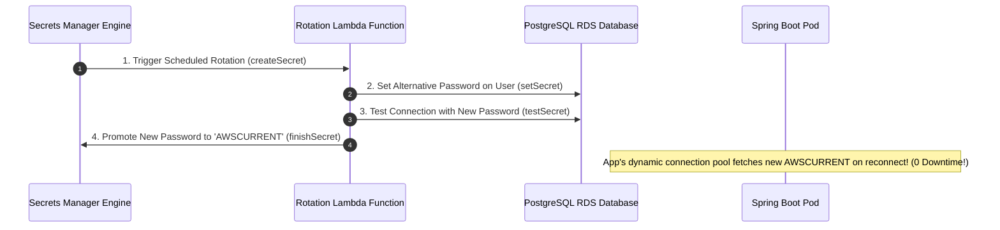

# Cloud Secrets & Config: AWS Secrets Manager vs SSM Parameter Store

---

## 1. What Is It?
In cloud backend architectures:
- **AWS Secrets Manager**: A managed service designed specifically for sensitive cryptographic credentials (database passwords, third-party API keys, OAuth client secrets) featuring **Automated Password Rotation** via AWS Lambda.
- **AWS Systems Manager (SSM) Parameter Store**: A centralized, hierarchical key-value store for application configuration parameters and plaintext/encrypted settings.

---

## 2. Why Does It Exist?
Hardcoding credentials or committing `.env` files into source repositories causes severe security breaches:
- **The Stale Secret Vulnerability**: Static database passwords remain unchanged for years because manually updating them requires coordinating downtime across all microservices.
- **AWS Secrets Manager Automated Rotation**: Automatically rotates database passwords every 30 days, generates new credentials in RDS, updates the secret store, and notifies application pools with **zero downtime**.

---

## 3. Comprehensive Comparison: Secrets Manager vs SSM Parameter Store

| Feature | AWS Secrets Manager | AWS Systems Manager Parameter Store |
|---|---|---|
| **Primary Purpose** | Sensitive secrets requiring automated rotation | General application configuration & parameters |
| **Automated Secret Rotation** | ✅ **Native (Built-in Lambda rotation for RDS/Redshift)** | ❌ Manual (Requires custom scripts) |
| **Hierarchy / Path Support** | Key-Value JSON formatting | **Hierarchical Trees (`/prod/app/db/url`)** |
| **KMS Encryption** | **Mandatory / Default** | Optional (`SecureString` type) |
| **Pricing** | **$\$0.40$ per secret / month** | **FREE** (Standard Tier up to 10,000 parameters) |
| **Cross-Account Access** | ✅ Native resource-based policies | Complex IAM role assumption |

$$\textbf{Architecture Guideline: } \text{Use SSM Parameter Store for application configs and static keys; use Secrets Manager for rotating database passwords.}$$

---

## 4. How Does It Work?

### 1. Hierarchical Parameter Paths in SSM
```text
/production/
  ├── common/
  │   └── logging_level: "INFO"
  └── payment-service/
      ├── database/
      │   ├── host: "aurora-cluster.internal"
      │   └── port: 5432
      └── stripe_api_key (SecureString - KMS Encrypted)
```

---

### 2. Secrets Manager 4-Step Zero-Downtime Password Rotation



---

## 5. Implementation: Spring Boot 3.3.4 Integration via Spring Cloud AWS

### 1. `pom.xml` Dependency
```xml
<dependency>
    <groupId>io.awspring.cloud</groupId>
    <artifactId>spring-cloud-aws-starter-secrets-manager</artifactId>
</dependency>
```

---

### 2. `application.yml`
```yaml
spring:
  config:
    import:
      # Automatically import secrets from AWS Secrets Manager into Spring Environment
      - aws-secretsmanager:/production/payment-service/secrets
```

---

### 3. Injecting Secrets into Spring Beans via `@Value`

```java
package com.backend.engineering.cloud.secrets;

import org.slf4j.Logger;
import org.slf4j.LoggerFactory;
import org.springframework.beans.factory.annotation.Value;
import org.springframework.stereotype.Service;

@Service
public class StripePaymentGatewayService {

    private static final Logger log = LoggerFactory.getLogger(StripePaymentGatewayService.class);

    private final String stripeSecretKey;
    private final String webhookSigningSecret;

    // Secrets injected dynamically at startup from AWS Secrets Manager!
    public StripePaymentGatewayService(
            @Value("${stripe.api-key}") String stripeSecretKey,
            @Value("${stripe.webhook-secret}") String webhookSigningSecret) {
        this.stripeSecretKey = stripeSecretKey;
        this.webhookSigningSecret = webhookSigningSecret;
        log.info("Payment Gateway initialized with dynamic AWS Secrets Manager credentials.");
    }

    public void processCardCharge(long amountCents) {
        // Use stripeSecretKey for API invocation
    }
}
```

---

## 6. Performance & Security Comparison

| Secret Strategy | Startup Latency Impact | Secret Leak Risk | Automated 30-Day Rotation |
|---|---|---|:---:|
| Hardcoded in `application.yml` | $0\text{ms}$ | **Critical (Source code leak)** | ❌ No |
| Environment Variables (`.env`) | $0\text{ms}$ | Moderate (Exposed in container inspect) | ❌ No |
| **AWS Secrets Manager (IRSA)** | **$\approx 35\text{ms}$ at startup** | **Zero (KMS Envelope Encrypted)** | ✅ **Fully Automated** |

---

## 7. Interview Questions

### Q1: How does AWS Secrets Manager perform automated zero-downtime password rotation without breaking active application database connections?
<details>
<summary>Reveal Answer</summary>

**Answer**:
Secrets Manager uses a **4-Step Dual-Password Rotation State Machine** powered by an AWS Lambda function:
1. **`createSecret`**: The Lambda generates a new random password and stores it in Secrets Manager under the staging label `AWSPENDING`.
2. **`setSecret`**: The Lambda alters the database user password (or configures an auxiliary password in databases supporting dual-password authentication) to accept *both* the old and new passwords.
3. **`testSecret`**: The Lambda connects to the database using the new `AWSPENDING` credentials to verify they work.
4. **`finishSecret`**: The Lambda moves the `AWSCURRENT` label to the new password and moves the old password to `AWSPREVIOUS`.
**Why zero downtime?**: Existing application connection pool sockets continue running on their established TCP connections. As pods refresh connection leases, they fetch the new `AWSCURRENT` credentials, ensuring seamless rotation without dropped queries.
</details>

---

## 8. Quick Revision
- **Secrets Manager**: For rotating credentials; $\$0.40/\text{secret/month}$; native Lambda rotation.
- **SSM Parameter Store**: For hierarchical app configurations; standard tier is 100% free.
- **Spring Cloud AWS**: Automatically loads secrets into Spring `@Value` properties at boot.
- **KMS Encryption**: All secrets encrypted at rest using AWS Key Management Service (KMS).
