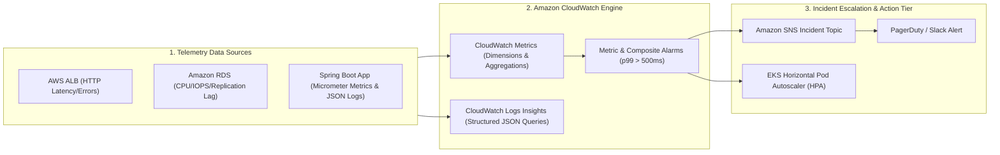
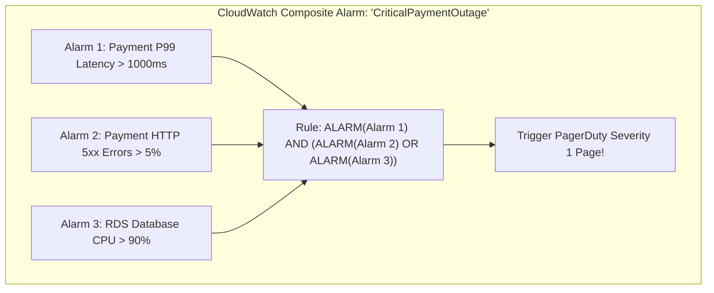

# AWS CloudWatch: Metrics, Logs Insights, Alarms, and Incident Alerting

---

## 1. What Is It?
**Amazon CloudWatch** is AWS's centralized observability, telemetry, and monitoring service that collects operational data across AWS infrastructure and backend applications in the form of **Logs**, **Metrics**, and **Events**, providing automated alerting and diagnostic query capabilities.

---

## 2. Why Does It Exist?
- **Siloed Infrastructure Blindspots**: Without centralized cloud telemetry, diagnosing an incident across 50 EC2 instances, 10 RDS read replicas, and 5 API Gateways requires manual SSH logins and disparate log scraping.
- **Automated Incident Response**: CloudWatch Alarms continuously monitor performance indicators ($p99$ latency, HTTP $5\text{xx}$ error rate, JVM heap usage) and trigger automated **SNS PagerDuty pages**, auto-scaling actions, or self-healing Lambda remediations.

---

## 3. Mental Model: The CloudWatch Telemetry Pipeline



---

## 4. How Does It Work?

### 1. CloudWatch Metric Dimensions & Metric Math
- A **Metric** is a time-ordered set of data points (e.g. `CPUUtilization`).
- A **Dimension** is a key-value pair that acts as a categorical filter (e.g. `InstanceId=i-123456`, `Environment=Production`, `Service=PaymentService`).
- **Metric Math**: Enables combining multiple metric streams to compute real-time operational formulas:

$$\textbf{Error Rate Percentage} = \left( \frac{\text{HTTPCode\_Target\_5XX\_Count}}{\text{RequestCount}} \right) \times 100$$

---

### 2. CloudWatch Logs Insights (High-Speed Structured Log Querying)
CloudWatch Logs Insights provides an interactive, fast SQL-like query syntax to search terabytes of structured JSON application logs in seconds:

```text
fields @timestamp, @message, userId, httpStatus, latencyMs
| filter httpStatus >= 500
| filter service = "payment-service"
| stats count(*) as errorCount, avg(latencyMs) as avgLatency by bin(5m)
| sort errorCount desc
| limit 20
```

---

## 5. Composite Alarms & Anomaly Detection



- **Why Composite Alarms?**: Prevents **Alert Fatigue**. If an entire AZ network goes down, 50 individual alarms fire at once, flooding on-call engineers with 50 SMS alerts. A **Composite Alarm** evaluates the boolean combination of all 50 alarms and fires **1 single concise incident page**.

---

## 6. Implementation: Terraform CloudWatch Alarm with SNS Escalation

```hcl
# 1. CloudWatch Metric Alarm: High API P99 Latency
resource "aws_cloudwatch_metric_alarm" "api_p99_latency_alarm" {
  alarm_name          = "Production-Payment-P99-Latency-High"
  comparison_operator = "GreaterThanThreshold"
  evaluation_periods  = 2   # 2 consecutive evaluation periods
  metric_name         = "TargetResponseTime"
  namespace           = "AWS/ApplicationELB"
  period              = 60  # 1-minute window
  extended_statistic  = "p99"
  threshold           = 0.5 # 500ms threshold

  dimensions = {
    LoadBalancer = "app/production-alb/50dc6c495c0c9188"
    TargetGroup  = "targetgroup/payment-service-tg/73e2d6bc24d8a067"
  }

  alarm_description = "Fires when Payment Service p99 response time exceeds 500ms for 2 consecutive minutes."
  alarm_actions     = [aws_sns_topic.incident_alerts.arn]
  ok_actions        = [aws_sns_topic.incident_alerts.arn]
}

# 2. SNS Topic for Incident Escalation
resource "aws_sns_topic" "incident_alerts" {
  name = "production-sev1-incident-alerts"
}
```

---

## 7. Performance

| Observability Dimension | Telemetry Ingestion Latency | Metric Retention Period | Alert Evaluation Speed |
|---|---|---|:---:|
| CloudWatch Metrics | $< 1\text{ minute}$ ($1\text{s}$ High-Res) | 15 Months | Real-time (Every 60s) |
| CloudWatch Logs Insights | $< 5\text{ seconds}$ | Configurable ($30\text{d}$ to $\infty$) | Scan $10\text{GB/sec}$ |

---

## 8. Interview Questions

### Q1: What is the advantage of using CloudWatch Composite Alarms over standard single-metric alarms in high-scale microservice architectures?
<details>
<summary>Reveal Answer</summary>

**Answer**:
1. **Eliminating Alert Fatigue & Alarm Storms**:
   - In a complex microservice architecture, a single root cause (e.g. database connection pool exhaustion) naturally triggers dozens of secondary alarms simultaneously: High Latency Alarm, CPU Alarm, 5xx Error Alarm, SQS Queue Depth Alarm, and Worker Timeout Alarm.
   - Standard alarms would bombard on-call engineers with dozens of individual PagerDuty alerts, causing confusion.
2. **Deterministic Boolean Logic**:
   - **Composite Alarms** allow engineers to combine multiple alarms using boolean expressions:
     $$\texttt{ALARM(HighLatency) AND ALARM(HighErrorRate) AND NOT ALARM(ScheduledMaintenanceWindow)}$$
   - This ensures alerts fire **only when true system-wide business degradation occurs**, completely filtering out noise and false alarms during scheduled deployments or transient network blips.
</details>

---

## 9. Quick Revision
- **CloudWatch Metrics**: Collects time-series numerical telemetry with dimensions.
- **Metric Math**: Computes formulas (e.g. error rate percentage) across metric streams.
- **Logs Insights**: SQL-like query language for searching terabytes of JSON logs.
- **Composite Alarms**: Boolean logic across multiple alarms to eliminate alert fatigue.
- **SNS Integration**: Direct integration with PagerDuty/Slack for incident escalation.
