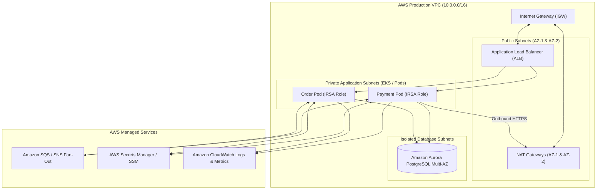

# Module 25: Cloud Backend (AWS Focus)

Master modern AWS cloud backend engineering architectures: Multi-AZ VPC networking topologies (Public, Private, Isolated subnets, NAT Gateways), Cloud Security with Security Groups vs stateless NACLs and IAM Roles with IRSA, Cloud Messaging with SNS-to-SQS Fan-Out and FIFO queues, Secrets & Config management with AWS Secrets Manager automated password rotation and SSM Parameter Store, and enterprise observability using CloudWatch Metrics, Logs Insights, and Composite Alarms.

---

## 🗺️ Master AWS Production Cloud Topology

---

## 📚 Curriculum Lessons

| # | Lesson | Core Focus & Mechanics |
|:---:|---|---|
| **01** | [`01-aws-networking-vpc-subnets-and-nat-gateways.md`](./01-aws-networking-vpc-subnets-and-nat-gateways.md) | Multi-AZ VPC architecture, Public vs Private vs Isolated subnets, Internet Gateways, and NAT Gateways. |
| **02** | [`02-cloud-security-security-groups-vs-nacls-and-iam-roles.md`](./02-cloud-security-security-groups-vs-nacls-and-iam-roles.md) | Stateful Security Groups vs Stateless NACLs, IAM Roles for Service Accounts (IRSA), and Least Privilege policies. |
| **03** | [`03-messaging-and-event-routing-sns-and-sqs-fan-out.md`](./03-messaging-and-event-routing-sns-and-sqs-fan-out.md) | SNS Pub/Sub, SQS Standard vs FIFO queues, the SNS-to-SQS Fan-Out pattern, and 20s Long Polling. |
| **04** | [`04-secrets-and-configuration-secrets-manager-vs-parameter-store.md`](./04-secrets-and-configuration-secrets-manager-vs-parameter-store.md) | AWS Secrets Manager automated 30-day RDS password rotation vs SSM Parameter Store, and Spring Boot 3 integration. |
| **05** | [`05-cloudwatch-metrics-logs-alarms-and-dashboards.md`](./05-cloudwatch-metrics-logs-alarms-and-dashboards.md) | CloudWatch Metrics, Metric Math formulas, Logs Insights structured queries, and Composite Alarms with SNS escalation. |

---

## ⚡ Key Production Takeaways

1. **Isolate Databases in Private Subnets**: Databases must never have public IPs or routes to Internet Gateways; isolate in non-routable private subnets.
2. **Never Hardcode AWS Keys**: Use IAM Roles for Service Accounts (IRSA) to dynamically inject temporary 1-hour STS tokens into Kubernetes pods.
3. **Decouple via SNS-to-SQS Fan-Out**: Broadcast events to an SNS topic and let downstream microservices consume copies independently from their own SQS queues.
4. **Automate Secret Rotation**: Use AWS Secrets Manager to rotate database credentials automatically with zero application downtime.
5. **Composite Alarms Prevent Alarm Storms**: Combine multiple alert metrics using boolean expressions to alert on true customer impact rather than noisy individual component glitches.
