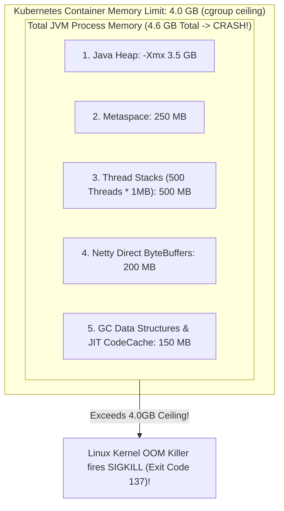

# JVM Container Ergonomics, Memory Sizing, and the Linux OOM Killer

---

## 1. What Is It?
**JVM Container Ergonomics** is the set of JVM runtime optimizations (JEP 191/340) that allow the HotSpot Java Virtual Machine to correctly detect and adapt to CPU core quotas and memory limits enforced by Linux **cgroups v2** inside Docker and Kubernetes containers.

The **Linux OOM Killer (Out-Of-Memory Killer)** is a kernel subsystem that forcefully terminates a container process (`SIGKILL`, **Exit Code 137**) when the total resident memory (RSS) consumed by the container exceeds its assigned Kubernetes cgroup memory limit (`resources.limits.memory`).

---

## 2. Why Hardcoding `-Xmx` Causes OOM Killer Disasters



### The Fatal Misunderstanding:
Many engineers assume: *"If my Kubernetes limit is 4GB, I should set `-Xmx4g` (or `-Xmx3.8g`)."*
- **The Reality**: The Java Heap is **only one component of total JVM process memory**.
- Total Memory consumed by the JVM process is:

$$\text{Total Memory} = \text{Heap} + \text{Metaspace} + (\text{Thread Count} \times \text{Stack Size}) + \text{Direct Off-Heap Buffers} + \text{JIT CodeCache} + \text{Native C++ Libs}$$

- When $\text{Total Memory} > 4.0\text{GB}$, the Linux kernel **instantly terminates the entire container with Exit Code 137**.

---

## 3. The Production Solution: `MaxRAMPercentage`

$$\textbf{Production Invariant: } \text{NEVER use hardcoded } \texttt{-Xmx} \text{ in Kubernetes. ALWAYS use } \texttt{-XX:MaxRAMPercentage=75.0}\text{!}$$

### Why `MaxRAMPercentage = 75.0` Is the Gold Standard:
1. **Dynamic Elasticity**: If DevOps changes the Kubernetes container limit from `2Gi` to `8Gi`, the JVM automatically scales its heap to $6\text{GB}$ ($75\%$) **without modifying application Dockerfiles or startup scripts**.
2. **$25\%$ Off-Heap Safety Buffer**: Reserves $25\%$ of container memory for thread stacks, Metaspace, Netty direct memory buffers, and GC internal metadata, **completely eliminating Linux kernel OOM kills**.

---

## 4. Production JVM Flags Configuration in Kubernetes

```yaml
apiVersion: apps/v1
kind: Deployment
metadata:
  name: payment-service
spec:
  replicas: 3
  template:
    spec:
      containers:
        - name: payment-app
          image: company/payment-service:v2.4.1
          resources:
            requests:
              memory: "2Gi"
              cpu: "1000m"
            limits:
              memory: "2Gi" # Strict cgroup memory ceiling
              cpu: "2000m"
          env:
            - name: JAVA_TOOL_OPTIONS
              value: >-
                -XX:+UseContainerSupport
                -XX:MaxRAMPercentage=75.0
                -XX:InitialRAMPercentage=75.0
                -XX:+UseZGC
                -XX:+ZGenerational
                -XX:+HeapDumpOnOutOfMemoryError
                -XX:HeapDumpPath=/tmp/oom_dump.hprof
```

---

## 5. Debugging Exit Code 137 (`OOMKilled: true`)

When a pod suddenly crashes in Kubernetes:
```bash
kubectl describe pod payment-service-784f697b8-x2q9w
```

### Typical Output:
```text
Containers:
  payment-app:
    State:          Waiting
      Reason:       CrashLoopBackOff
    Last State:     Terminated
      Reason:       OOMKilled       <--- Linux Kernel killed the pod!
      Exit Code:    137             <--- 128 + 9 (SIGKILL) = 137
```

### Diagnostic Decision Tree:
1. Did the JVM throw `java.lang.OutOfMemoryError: Java heap space` before dying?
   - **Yes** $\longrightarrow$ Application leaked heap objects (Analyze `.hprof` heap dump in Eclipse Memory Analyzer / MAT).
   - **No** (Process disappeared abruptly with zero logs) $\longrightarrow$ **Off-Heap / Native Memory Exhaustion** (Reduce `MaxRAMPercentage` from $75\%$ to $65\%$ or increase container `limits.memory`).

---

## 6. Performance

| Memory Sizing Strategy | OOM Killer Risk (Exit 137) | Adaptability to K8s Resource Changes |
|---|---|---|
| Hardcoded `-Xmx3800m` (on 4GB pod) | **Extreme (Crashes on high thread load)** | ❌ None (Requires Docker rebuild) |
| **`-XX:MaxRAMPercentage=75.0`** | **Zero (Safe off-heap headroom)** | ✅ **$100\%$ Dynamic and Elastic** |

---

## 7. Interview Questions

### Q1: What is the difference between a JVM `java.lang.OutOfMemoryError` and a Kubernetes `OOMKilled (Exit Code 137)` event?
<details>
<summary>Reveal Answer</summary>

**Answer**:
1. **`java.lang.OutOfMemoryError` (Application-Level Failure)**:
   - Thrown internally by the JVM when the **Java Heap** runs out of space to allocate new objects and Garbage Collection cannot free any memory.
   - The JVM process does *not* immediately terminate; it throws an exception, executes `finally` blocks, logs the stack trace, and (if configured) dumps an `.hprof` heap file before shutting down gracefully.
2. **Kubernetes `OOMKilled / Exit Code 137` (Kernel-Level Execution)**:
   - Enforced externally by the **Linux Host Kernel OOM Killer**.
   - Occurs when the total combined Resident Set Size (RSS) memory of the container process (Heap + Off-Heap + Metaspace + Native C++ buffers + OS page tables) exceeds the strict Kubernetes `cgroups` memory limit.
   - The Linux kernel instantly sends an uncatchable `SIGKILL (signal 9)` directly to the process. The JVM receives **zero warning, cannot execute shutdown hooks, and cannot log an error**, resulting in an abrupt container restart with Exit Code 137 ($128 + 9$).
</details>

---

## 8. Quick Revision
- **Exit Code 137**: $128 + 9 (\text{SIGKILL})$; Linux Kernel OOM Killer forcefully killed the container.
- **Total JVM Memory**: Heap is only a fraction; Metaspace, thread stacks, and Netty buffers add significant overhead.
- **`MaxRAMPercentage = 75.0`**: Automatically allocates $75\%$ of cgroup limit to heap; reserves $25\%$ for native memory.
- **`UseContainerSupport`**: Tells the JVM to read CPU and RAM limits from Linux cgroups rather than host hardware.
- **Heap Dumps**: Always configure `-XX:+HeapDumpOnOutOfMemoryError` to diagnose memory leaks.
