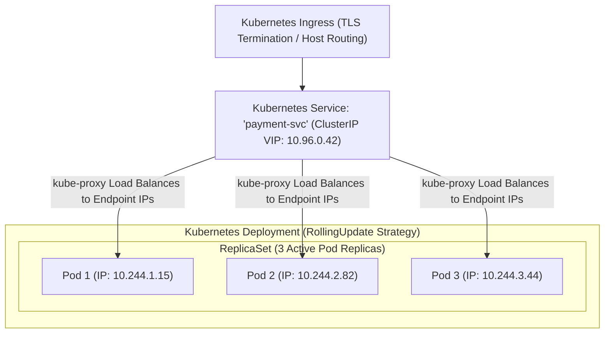
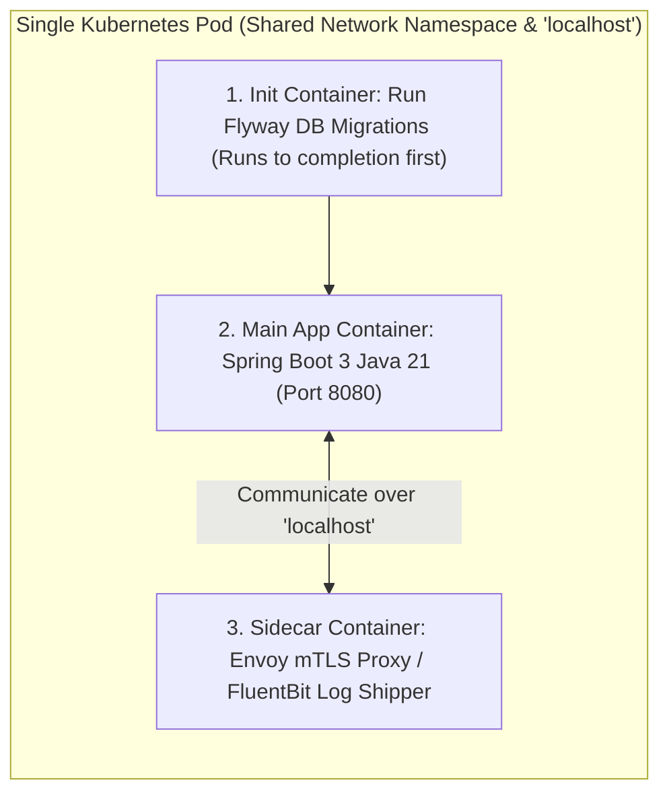

# Kubernetes Core Primitives: Pods, Sidecars, Deployments, and Services

---

## 1. What Is It?
**Kubernetes (K8s)** is an open-source container orchestration platform that automates the deployment, scaling, networking, and lifecycle management of containerized microservices across a distributed cluster of worker nodes.

The foundational Kubernetes primitives are:
1. **Pod**: The smallest deployable atomic unit in Kubernetes, encapsulating one or more tightly coupled containers sharing network and storage.
2. **Deployment**: A declarative controller that manages the automated rollout, scaling, and self-healing of identical Pod replicas (**ReplicaSets**).
3. **Service**: A stable, persistent virtual IP (VIP) and internal DNS abstraction that load balances network traffic across ephemeral Pod IPs.

---

## 2. Why Does It Exist?
- **Ephemeral Pod IPs**: Kubernetes pods are transient. When a pod crashes, auto-scales, or reschedules onto another node, its internal IP address changes.
- **Zero-Downtime Deployments**: Updating a backend service cannot involve shutting down all instances simultaneously. Kubernetes **Deployments coordinate Rolling Updates** to replace pods incrementally with zero downtime.

---

## 3. Mental Model: The Pod, Deployment, Service, and Ingress Hierarchy



---

## 4. How Does It Work?

### 1. Pod Anatomy: App Container + Init Container + Sidecar



- **Init Containers**: Execute sequentially before the main application starts (e.g. running database schema migrations or waiting for Kafka to become available).
- **Sidecar Containers**: Run continuously alongside the application container (e.g. Istio Envoy proxy for mTLS encryption or OpenTelemetry collector).

---

### 2. Zero-Downtime Rolling Update Parameters

$$\texttt{maxUnavailable: 0} \quad \text{and} \quad \texttt{maxSurge: 25\%}$$

- `maxUnavailable: 0`: Kubernetes guarantees that **zero active pods are terminated** before a new version pod has successfully passed its Startup and Readiness probes.
- `maxSurge: 25%`: Spawns $25\%$ extra pods during rollout to absorb traffic before draining old pods.

---

### 3. Kubernetes Service Types & CoreDNS Resolution

| Service Type | Scope & Accessibility | How It Works |
|---|---|---|
| **ClusterIP (Default)** | **Internal Cluster Only** | Assigns a stable virtual IP (VIP). Resolvable via CoreDNS: `payment-service.production.svc.cluster.local`. |
| **NodePort** | External via Node IP + High Port | Exposes a static port ($30000 - 32767$) on every Kubernetes worker node. |
| **LoadBalancer** | **Public Cloud Ingress** | Provisions a cloud provider load balancer (e.g. AWS NLB/ALB) routing directly to pods. |

---

## 5. Implementation: Production Kubernetes Deployment & Service Manifest

```yaml
apiVersion: apps/v1
kind: Deployment
metadata:
  name: payment-service
  namespace: production
  labels:
    app: payment-service
spec:
  replicas: 4
  strategy:
    type: RollingUpdate
    rollingUpdate:
      maxSurge: 1        # Launch 1 new pod before killing any old pods
      maxUnavailable: 0  # Zero downtime guarantee!
  selector:
    matchLabels:
      app: payment-service
  template:
    metadata:
      labels:
        app: payment-service
    spec:
      # 1. Sequential Pre-Flight Init Container
      initContainers:
        - name: wait-for-database
          image: busybox:1.36
          command: ['sh', '-c', 'until nc -z -v -w3 postgres.production.svc.cluster.local 5432; do echo waiting for db...; sleep 2; done;']

      # 2. Main Application Container
      containers:
        - name: payment-app
          image: company/payment-service:v2.4.1
          ports:
            - containerPort: 8080
              name: http
          resources:
            requests:
              cpu: "500m"
              memory: "1Gi"
            limits:
              cpu: "1000m"
              memory: "1Gi"
---
apiVersion: v1
kind: Service
metadata:
  name: payment-service
  namespace: production
spec:
  type: ClusterIP
  selector:
    app: payment-service
  ports:
    - name: http
      port: 80
      targetPort: 8080
```

---

## 6. Performance

| Deployment Strategy | Traffic Drop Risk during Deploy | CPU Surge during Rollout | Rollout Speed |
|---|---|---|:---:|
| Recreate (Kill all then launch) | **100% Downtime (SEV-1)** | $0\%$ | Fast |
| **RollingUpdate (`maxUnavailable: 0`)** | **$0\%$ Downtime (Zero dropped requests!)** | $+25\%$ temporary | Controlled |

---

## 7. Interview Questions

### Q1: How does a Kubernetes Service load balance traffic across multiple Pods without having its own dedicated physical server?
<details>
<summary>Reveal Answer</summary>

**Answer**:
A Kubernetes Service with type `ClusterIP` does not run as a physical process or container; it is a **Virtual IP (VIP) managed by `kube-proxy` inside the Linux host kernel**:
1. When a Service is created, the Kubernetes Control Plane assigns it a stable virtual ClusterIP (e.g. `10.96.0.42`) and tracks the IP addresses of all healthy matching pods as an **`Endpoints` (or `EndpointSlice`) object**.
2. **`kube-proxy` on every node** installs packet-filtering rules into the host Linux kernel using **`iptables`** or **`IPVS (IP Virtual Server)`**.
3. When a client pod sends a TCP packet to `10.96.0.42:80`, the Linux kernel intercepts the packet at the socket layer and performs **DNAT (Destination Network Address Translation)**, rewriting the destination IP to one of the healthy pod IPs (`10.244.1.15`) using randomized round-robin load balancing in **nanosecond kernel time with zero user-space proxy overhead**.
</details>

---

## 8. Quick Revision
- **Pod**: Smallest deployable unit; shares localhost network namespace.
- **Init Container**: Runs pre-flight tasks sequentially before main container starts.
- **RollingUpdate (`maxUnavailable: 0`)**: Guarantees zero dropped user requests during deploys.
- **ClusterIP**: Stable internal Virtual IP (VIP) backed by CoreDNS service discovery.
- **`kube-proxy`**: Implements kernel-level iptables/IPVS DNAT routing to pod endpoints.
