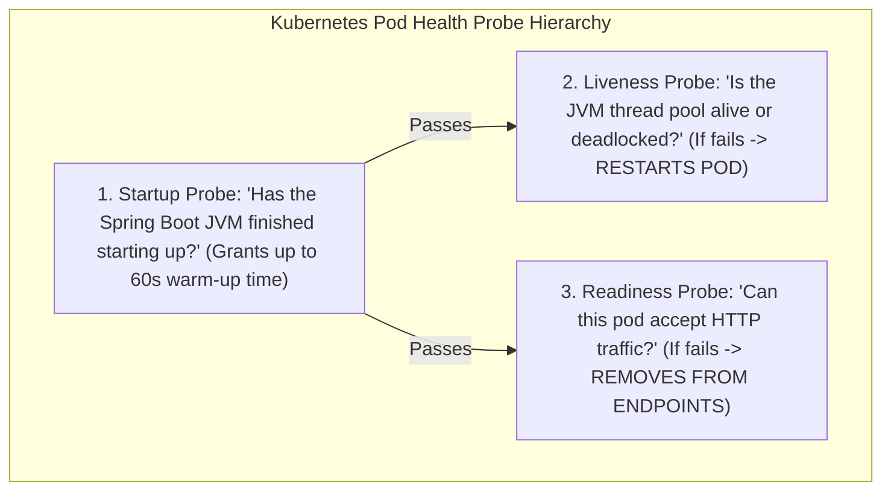

# Kubernetes Config, Health Probes, and Zero-Downtime Graceful Shutdown

---

## 1. What Is It?
In Kubernetes backend engineering:
- **ConfigMaps & Secrets**: Decoupled objects that inject environment-specific configuration and encrypted credentials into pods via environment variables or mounted volume files without rebuilding container images.
- **Kubernetes Health Probes**: Automated kubelet diagnostic hooks (**Startup**, **Liveness**, **Readiness**) that monitor container health.
- **Graceful Shutdown**: The coordinated process of draining in-flight HTTP requests and deregistering network endpoints before a container process is terminated.

---

## 2. The 3 Health Probes Deep Dive



### The Fatal Liveness Probe Mistake:
$$\textbf{Golden Rule: } \text{NEVER check external dependencies (Databases/Redis/Kafka) in a Liveness Probe!}$$
- **The Catastrophe**: If PostgreSQL experiences a transient 3-second connection blip, **every single Spring Boot pod fails its Liveness probe simultaneously**. Kubernetes kills and restarts all 50 pods at once, creating a **Cluster-Wide Cascading Restart Loop (Total Outage)**!
- **The Correction**: Check databases **only in Readiness Probes**. If the DB blips, pods stop receiving traffic until the DB recovers, but **never crash-restart**.

---

## 3. The Zero-Downtime Graceful Shutdown Sequence

When a pod is deleted during a rolling deployment:
1. Kubernetes immediately removes the pod IP from the Service `Endpoints` object.
2. **The Race Condition**: It takes $2 - 5\text{ seconds}$ for `kube-proxy` on all worker nodes to update their Linux kernel `iptables` rules.
3. If the Spring Boot process terminates immediately upon receiving `SIGTERM`, clients whose requests were routed during that 5-second iptables propagation window receive **`502 Bad Gateway` / `Connection Refused` errors**.

```mermaid
sequenceDiagram
    autonumber
    participant K8s as Kubernetes Kubelet
    participant Pod as Spring Boot Container
    participant Net as kube-proxy iptables

    K8s->>Net: 1. Remove Pod from EndpointSlice
    K8s->>Pod: 2. Execute 'preStop: sleep 10' hook!
    Note over Pod,Net: During 10s sleep: iptables rules propagate across all cluster nodes!
    
    K8s->>Pod: 3. Send SIGTERM (Signal 15)
    Note over Pod: Spring Boot enters 'Graceful Shutdown' (Drains active in-flight HTTP requests!)
    Note over Pod: Rejects new connections; finishes in-flight requests in 15s.
    Pod-->>K8s: Process exits cleanly (Exit Code 0 - ZERO DROPPED REQUESTS!)
```

---

## 4. Implementation: Production Kubernetes Probes & Graceful Shutdown Manifest

### 1. `application.yml` (Spring Boot 3.3.4 Actuator)
```yaml
server:
  shutdown: graceful # Enables in-flight HTTP request draining

spring:
  lifecycle:
    timeout-per-shutdown-phase: 20s # Maximum wait time for in-flight requests

management:
  endpoint:
    health:
      probes:
        enabled: true # Exposes /actuator/health/liveness and /actuator/health/readiness
      group:
        liveness:
          include: livenessState
        readiness:
          include: readinessState, db, redis
```

---

### 2. Kubernetes Deployment Manifest
```yaml
apiVersion: apps/v1
kind: Deployment
metadata:
  name: order-service
  namespace: production
spec:
  replicas: 3
  template:
    spec:
      terminationGracePeriodSeconds: 45 # Must be > preStop sleep (10s) + Spring shutdown (20s)
      containers:
        - name: order-app
          image: company/order-service:v1.2.0
          lifecycle:
            preStop:
              exec:
                # Essential: Allows kube-proxy iptables propagation before sending SIGTERM!
                command: ["/bin/sh", "-c", "sleep 10"]

          # 1. Startup Probe (Warm-up allowance: 30 * 2s = 60s)
          startupProbe:
            httpGet:
              path: /actuator/health/liveness
              port: 8080
            failureThreshold: 30
            periodSeconds: 2

          # 2. Liveness Probe (Internal JVM state ONLY!)
          livenessProbe:
            httpGet:
              path: /actuator/health/liveness
              port: 8080
            initialDelaySeconds: 0
            periodSeconds: 10
            timeoutSeconds: 2
            failureThreshold: 3

          # 3. Readiness Probe (Checks DB/Redis readiness)
          readinessProbe:
            httpGet:
              path: /actuator/health/readiness
              port: 8080
            periodSeconds: 5
            timeoutSeconds: 2
            failureThreshold: 2
```

---

## 5. Performance

| Deployment Setting | 502 Bad Gateway Errors during Rolling Update | Recovery from DB Transient Blip |
|---|---|---|
| No `preStop` hook & Default Probes | **High ($\approx 0.5\% - 2\%$ dropped requests)** | Permanent pod restart loop |
| **`preStop: sleep 10` + Spring Graceful** | **$\mathbf{0\text{ Dropped Requests (100\% Clean)}}$** | **Smooth traffic pause & resume** |

---

## 6. Interview Questions

### Q1: Why is a `preStop: sleep 10` lifecycle hook required in Kubernetes deployments even when Spring Boot has `server.shutdown: graceful` enabled?
<details>
<summary>Reveal Answer</summary>

**Answer**:
When Kubernetes deletes a pod (e.g. during a rolling deploy), two asynchronous events occur **simultaneously in parallel**:
1. The Endpoint controller removes the pod IP from the Service endpoints list, which then propagates asynchronously to all `kube-proxy` nodes to update Linux kernel `iptables` routing tables (taking $2-5\text{ seconds}$).
2. The Kubelet sends a `SIGTERM` signal to the container process.
If Spring Boot receives `SIGTERM` immediately, it stops accepting new TCP connections right away. However, because `kube-proxy` has not finished updating `iptables` on other nodes, the Load Balancer continues forwarding new user requests to the pod for the next 3 seconds, resulting in **`502 Bad Gateway` and `Connection Refused` errors**.
**The `preStop: sleep 10` hook** delays sending `SIGTERM` to Spring Boot for 10 seconds. This allows `iptables` rules to fully propagate and traffic routing to stop *before* Spring Boot begins shutting down, guaranteeing zero dropped requests.
</details>

---

## 7. Quick Revision
- **Startup Probe**: Prevents killing slow-starting JVMs during container boot.
- **Liveness Probe**: Restarts deadlocked JVMs; never include external databases.
- **Readiness Probe**: Removes unready/warming pods from the Service load balancer.
- **`preStop: sleep 10`**: Provides time for `iptables` endpoint propagation.
- **`server.shutdown: graceful`**: Drains active in-flight requests before exiting cleanly.
