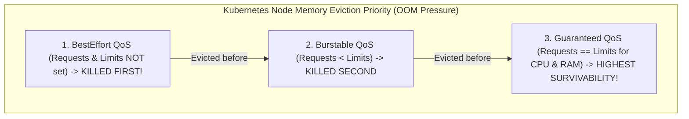

# Kubernetes Autoscaling, QoS Classes, and Pod Disruption Budgets (PDB)

---

## 1. What Is It?
In production Kubernetes infrastructure:
- **Horizontal Pod Autoscaler (HPA)**: An automated controller that dynamically scales the number of pod replicas up or down based on observed CPU utilization, memory consumption, or custom application metrics.
- **Quality of Service (QoS) Classes**: A classification system (**Guaranteed**, **Burstable**, **BestEffort**) used by the Kubelet to prioritize which pods to evict first when a worker node runs out of physical RAM.
- **Pod Disruption Budget (PDB)**: An operational policy that guarantees a minimum number of healthy pod replicas remain available during voluntary disruptions (e.g. node drains, Kubernetes version upgrades, cloud instance termination).

---

## 2. Why Does It Exist?
- **Uncontrolled Node Drains**: When a cloud engineer upgrades an EKS node group, Kubernetes drains nodes by evicting pods. Without a **Pod Disruption Budget**, all 3 replicas of your payment service could be terminated simultaneously, causing a **Self-Inflicted Outage**.
- **Memory Eviction Protection**: If an unconstrained worker node suffers memory pressure, Kubernetes must kill pods. Pods with poorly configured resource requests are assigned the `BestEffort` QoS class and are **summarily killed first**.

---

## 3. Mental Model: Kubernetes Quality of Service (QoS) Hierarchy



---

## 4. How Does It Work?

### 1. HPA Mathematical Scaling Equation

$$\text{Desired Replicas} = \left\lceil \text{Current Replicas} \times \left( \frac{\text{Current Metric Value}}{\text{Target Metric Value}} \right) \right\rceil$$

- *Example*: You currently run $4$ pods with an average CPU utilization of $80\%$. Your target is $50\%$:

$$\text{Desired Replicas} = \left\lceil 4 \times \left(\frac{80}{50}\right) \right\rceil = \lceil 6.4 \rceil = \mathbf{7 \text{ Pods}}$$

- **Scale-Down Stabilization Window**: To prevent rapid scaling oscillation (**Flapping / Thrashing**), HPA enforces a default 5-minute stabilization window before scaling down.

---

### 2. Pod Disruption Budget (PDB) Enforcement
```yaml
apiVersion: policy/v1
kind: PodDisruptionBudget
metadata:
  name: payment-service-pdb
  namespace: production
spec:
  minAvailable: "80%" # Always maintain at least 80% healthy pods during node drains!
  selector:
    matchLabels:
      app: payment-service
```
- When `kubectl drain node-1` is executed during a cluster upgrade, Kubernetes checks the PDB.
- If evicting a pod would drop available capacity below $80\%$, the drain command **blocks and waits** until new pods are fully ready on another node before terminating the old pod.

---

## 5. Implementation: Production HPA & Resource Manifest

```yaml
apiVersion: autoscaling/v2
kind: HorizontalPodAutoscaler
metadata:
  name: payment-service-hpa
  namespace: production
spec:
  scaleTargetRef:
    apiVersion: apps/v1
    kind: Deployment
    name: payment-service
  minReplicas: 3
  maxReplicas: 30
  metrics:
    # 1. Scale on CPU Utilization (Target: 70%)
    - type: Resource
      resource:
        name: cpu
        target:
          type: Utilization
          averageUtilization: 70

    # 2. Scale on Memory Utilization (Target: 80%)
    - type: Resource
      resource:
        name: memory
        target:
          type: Utilization
          averageUtilization: 80
  behavior:
    scaleUp:
      stabilizationWindowSeconds: 0 # Scale up IMMEDIATELY during traffic spikes!
      policies:
        - type: Percent
          value: 100 # Double capacity every 15s if needed
          periodSeconds: 15
    scaleDown:
      stabilizationWindowSeconds: 300 # Wait 5 mins before scaling down to prevent flapping!
      policies:
        - type: Percent
          value: 10
          periodSeconds: 60
```

---

## 6. Performance

| Operational Scenario | Without PDB & HPA | With Production PDB & HPA |
|---|---|---|
| Black Friday Traffic Surge ($10\times$ load) | CPU hits $100\%$; Server drops requests | **HPA scales 3 to 30 pods in 60 seconds** |
| Kubernetes Cluster Worker Node Upgrade | Potential $100\%$ service drop | **$0\%$ Downtime (PDB throttles eviction)** |
| Node Memory Pressure Eviction | Random pod termination | **`Guaranteed` pods survive; lowest evicted** |

---

## 7. Interview Questions

### Q1: What are the three Kubernetes QoS classes and how do they determine pod eviction order during worker node resource pressure?
<details>
<summary>Reveal Answer</summary>

**Answer**:
Kubernetes automatically assigns one of three **Quality of Service (QoS)** classes based on container resource definitions:
1. **`Guaranteed` (Highest Priority / Highest Survivability)**:
   - Assigned when every container in the pod has **both CPU and Memory requests and limits explicitly defined, and `requests == limits`**.
   - These pods are strictly protected and will **never be evicted** unless the node runs completely out of memory and no lower-class pods remain.
2. **`Burstable` (Middle Priority)**:
   - Assigned when requests and limits are defined, but `requests < limits` (or only requests are specified).
   - Evicted only after all `BestEffort` pods have been terminated.
3. **`BestEffort` (Lowest Priority / First to be Killed)**:
   - Assigned when a pod has **zero memory and CPU requests/limits configured**.
   - As soon as a node experiences memory pressure, the Kubelet immediately terminates `BestEffort` pods first to save the node from crashing.
</details>

---

## 8. Quick Revision
- **HPA**: Dynamically scales pod replicas based on CPU/RAM metrics.
- **Flapping Defense**: Use a 5-minute stabilization window on scale-down.
- **QoS Classes**: `Guaranteed` (`requests == limits`) protects mission-critical pods from eviction.
- **PDB (Pod Disruption Budget)**: Guarantees minimum available pods during node drains.
- **Production Sizing**: Always set explicit CPU/Memory requests and limits on all containers.
