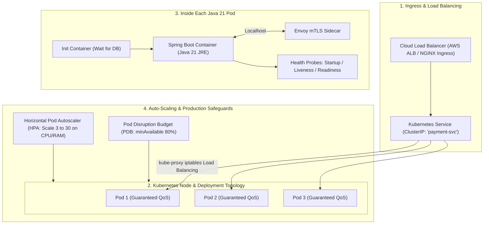

# Module 26: Containers & Kubernetes

Master enterprise cloud-native container and orchestration architectures: Docker internals (Linux Namespaces, cgroups v2, Overlay2 copy-on-write filesystem, Spring Boot 3 multi-stage builds), JVM Container Ergonomics and the Linux OOM Killer (Exit Code 137), Kubernetes core primitives (Pods, Init Containers, Sidecars, Deployments, ClusterIP Services), Health Probes (Startup, Liveness, Readiness) with zero-downtime graceful shutdown (`preStop` hooks), and production resilience with Horizontal Pod Autoscalers (HPA), QoS classes, and Pod Disruption Budgets (PDB).

---

## 🗺️ Master Cloud-Native Kubernetes Architecture

---

## 📚 Curriculum Lessons

| # | Lesson | Core Focus & Mechanics |
|:---:|---|---|
| **01** | [`01-docker-internals-layers-and-multi-stage-builds.md`](./01-docker-internals-layers-and-multi-stage-builds.md) | Linux Namespaces, Overlay2 CoW layers, Spring Boot `layertools` multi-stage Docker builds, and non-root security. |
| **02** | [`02-jvm-container-ergonomics-and-the-linux-oom-killer.md`](./02-jvm-container-ergonomics-and-the-linux-oom-killer.md) | Total JVM memory math, `-XX:MaxRAMPercentage=75.0`, debugging Linux OOM Killer (Exit Code 137), and heap dumps. |
| **03** | [`03-kubernetes-core-primitives-pods-deployments-services.md`](./03-kubernetes-core-primitives-pods-deployments-services.md) | Pods, Init/Sidecar containers, RollingUpdate strategies (`maxUnavailable: 0`), ClusterIP services, and CoreDNS. |
| **04** | [`04-kubernetes-configuration-configmaps-secrets-and-probes.md`](./04-kubernetes-configuration-configmaps-secrets-and-probes.md) | ConfigMaps/Secrets, Startup/Liveness/Readiness probes, and `preStop: sleep 10` zero-downtime graceful shutdown. |
| **05** | [`05-autoscaling-and-production-resilience-hpa-keda-pdb.md`](./05-autoscaling-and-production-resilience-hpa-keda-pdb.md) | HPA scaling formulas and stabilization windows, `Guaranteed` vs `Burstable` QoS classes, and Pod Disruption Budgets (PDB). |

---

## ⚡ Key Production Takeaways

1. **Use `MaxRAMPercentage = 75.0`**: Never hardcode `-Xmx`; dynamic percentages leave safe $25\%$ headroom for thread stacks and off-heap buffers.
2. **Never Check DBs in Liveness Probes**: Checking external databases in Liveness probes causes cluster-wide cascading crash loops; check DBs only in Readiness probes.
3. **Always Add `preStop: sleep 10`**: Delays `SIGTERM` to allow `iptables` endpoint propagation, completely eliminating `502 Bad Gateway` errors during deployments.
4. **Deploy Multi-Stage Distroless Images**: Multi-stage builds with Spring `layertools` shrink image sizes by $80\%$ and accelerate CI build caching.
5. **Protect Deployments with PDBs**: Enforce Pod Disruption Budgets (`minAvailable: 80%`) to prevent node upgrades from terminating all active pod replicas.
